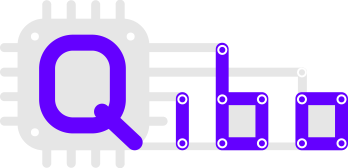

[](https://codecov.io/gh/qiboteam/qibo)
[](https://qibo.readthedocs.io/en/latest/?badge=latest)
[](https://zenodo.org/badge/latestdoi/241307936)

Qibo is an open-source full stack API for quantum simulation and quantum hardware control.

Some of the key features of Qibo are:
- Definition of a standard language for the construction and execution of quantum circuits with device agnostic approach to simulation and quantum hardware control based on plug and play backend drivers.
- A continuously growing code-base of quantum algorithms applications presented with examples and tutorials.
- Efficient simulation backends with GPU, multi-GPU and CPU with multi-threading support.
- Simple mechanism for the implementation of new simulation and hardware backend drivers.

## Documentation

Qibo documentation is available at [qibo.readthedocs.io](https://qibo.readthedocs.io).

- [Overview and installation](https://qibo.readthedocs.io/en/stable/getting-started/index.html)
- [Examples](https://qibo.readthedocs.io/en/stable/code-examples/index.html)
- [API reference](https://qibo.readthedocs.io/en/stable/api-reference/index.html)
- [Benchmarks](https://qibo.readthedocs.io/en/stable/appendix/benchmarks.html)

## Minimum Working Examples

A simple [Quantum Fourier Transform (QFT)](https://en.wikipedia.org/wiki/Quantum_Fourier_transform) example to test your installation:
```python
from qibo.models import QFT

# Create a QFT circuit with 15 qubits
circuit = QFT(15)

# Simulate final state wavefunction default initial state is |00>
final_state = circuit()
```

Here another example with more gates and shots simulation:

```python
import numpy as np
from qibo.models import Circuit
from qibo import gates

c = Circuit(2)
c.add(gates.X(0))

# Add a measurement register on both qubits
c.add(gates.M(0, 1))

# Execute the circuit with the default initial state |00>.
result = c(nshots=100)
```

In both cases, the simulation will run in a single device CPU or GPU in double precision `complex128`.

## Citation policy

If you use the package please refer to [the documentation](https://qibo.readthedocs.io/en/stable/appendix/citing-qibo.html) for citation instructions.
