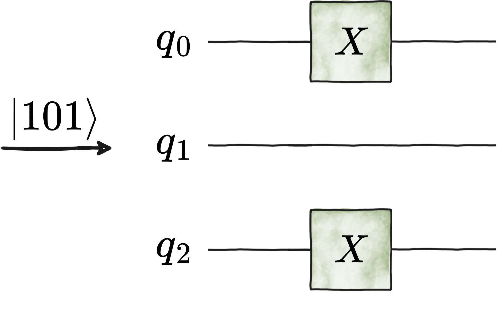
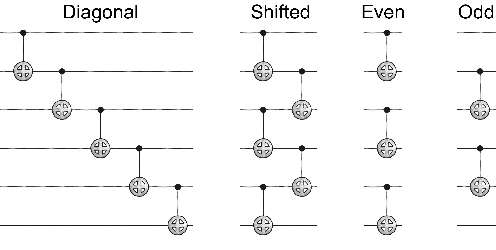
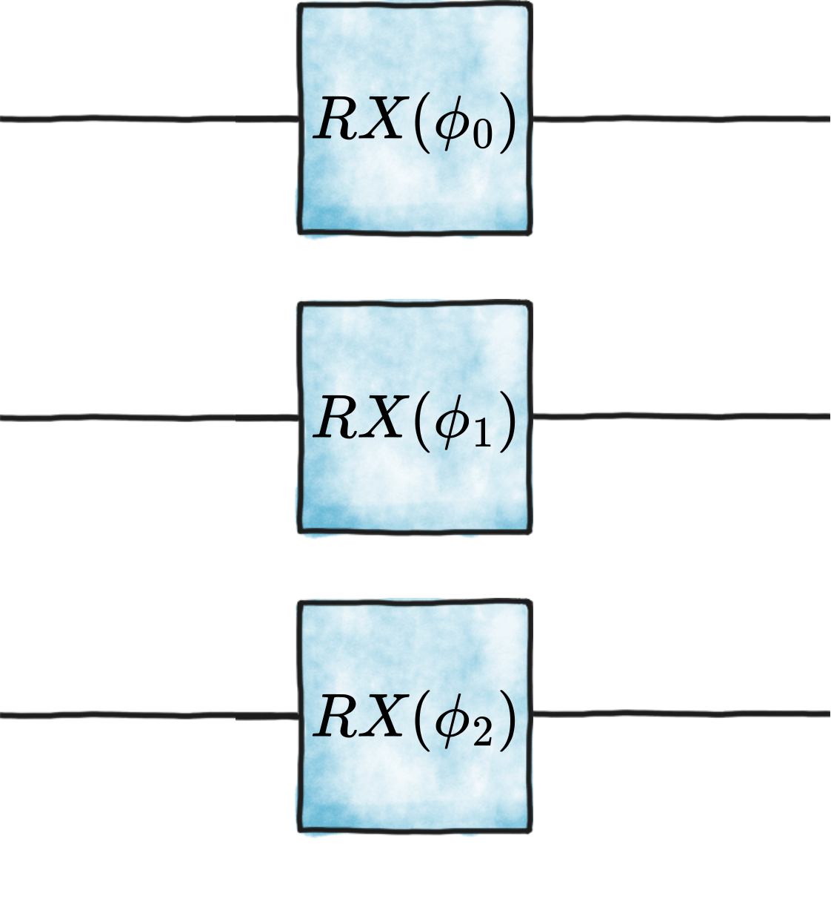
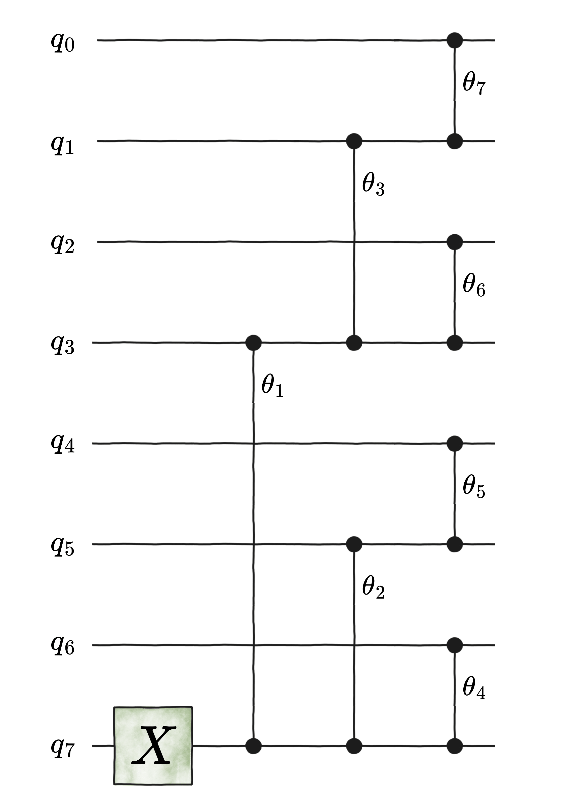
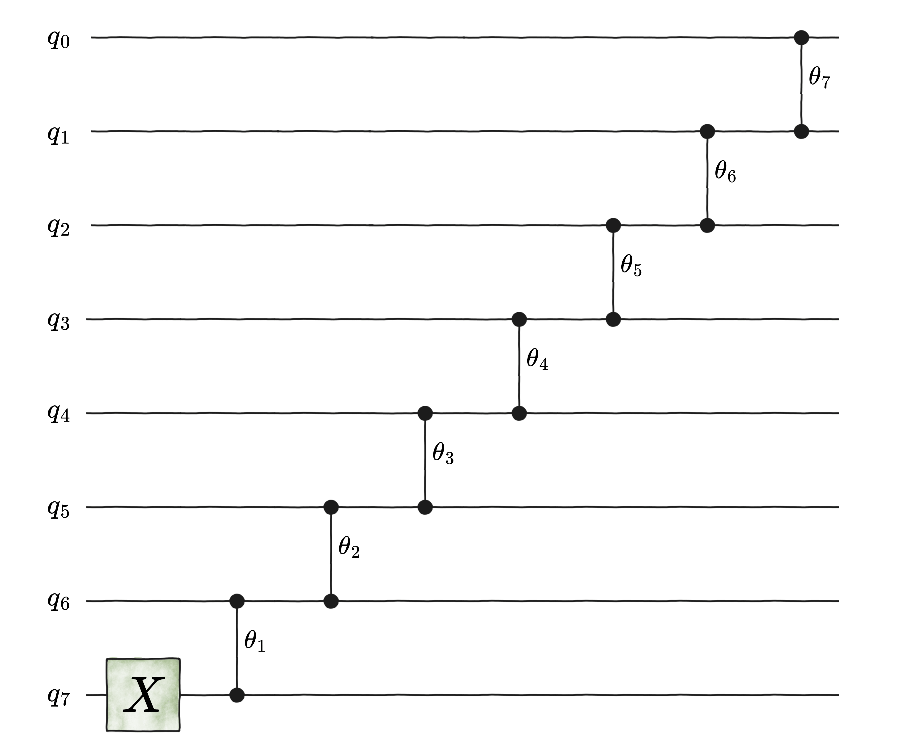

.. _Models:

Models
======

Qibo provides models for both the circuit based and the adiabatic quantum
computation paradigms. Circuit based models include :ref:`generalpurpose` which
allow defining arbitrary circuits and :ref:`applicationspecific` such as the
Quantum Fourier Transform (:class:`qibo.models.QFT`) and the
Variational Quantum Eigensolver (:class:`qibo.models.VQE`).
Adiabatic quantum computation is simulated using the :ref:`timeevolution`
of state vectors.

In order to perform calculations and apply gates to a state vector a backend
has to be used. The backends are defined in ``qibo/backends``.
Circuit and gate objects are backend independent and can be executed with
any of the available backends.

Qibo uses big-endian byte order, which means that the most significant qubit
is the one with index 0, while the least significant qubit is the one with
the highest index.

.. _generalpurpose:

Circuit models
--------------

Circuit
^^^^^^^

.. autoclass:: qibo.models.circuit.Circuit
    :members:
    :member-order: bysource

Circuit addition
^^^^^^^^^^^^^^^^

:class:`qibo.models.circuit.Circuit` objects support addition. For example

.. testsetup::

    from qibo import Circuit, gates
    from qibo.models import QFT

.. testcode::

    circuit_1 = QFT(4)

    circuit_2 = Circuit(4)
    circuit_2.add(gates.RZ(0, 0.1234))
    circuit_2.add(gates.RZ(1, 0.1234))
    circuit_2.add(gates.RZ(2, 0.1234))
    circuit_2.add(gates.RZ(3, 0.1234))

    circuit = circuit_1 + circuit_2

will create a circuit that performs the Quantum Fourier Transform on four qubits
followed by Rotation-Z gates.

Circuit fusion
^^^^^^^^^^^^^^

Gates in a circuit can be fused into a smaller number of
:class:`qibo.gates.special.FusedGate` objects using
:meth:`qibo.models.circuit.Circuit.fuse`. See :doc:`/concepts/circuit-fusion`
for a detailed description of the fusion algorithm and worked examples.

.. _applicationspecific:

Quantum Fourier Transform (QFT)
^^^^^^^^^^^^^^^^^^^^^^^^^^^^^^^

.. autoclass:: qibo.models.qft.QFT
    :members:
    :member-order: bysource

Variational Quantum Eigensolver (VQE)
^^^^^^^^^^^^^^^^^^^^^^^^^^^^^^^^^^^^^

.. autoclass:: qibo.models.variational.VQE
    :members:
    :member-order: bysource

Adiabatically Assisted Variational Quantum Eigensolver (AAVQE)
^^^^^^^^^^^^^^^^^^^^^^^^^^^^^^^^^^^^^^^^^^^^^^^^^^^^^^^^^^^^^^

.. autoclass:: qibo.models.variational.AAVQE
    :members:
    :member-order: bysource

Quantum Approximate Optimization Algorithm (QAOA)
^^^^^^^^^^^^^^^^^^^^^^^^^^^^^^^^^^^^^^^^^^^^^^^^^

.. autoclass:: qibo.models.variational.QAOA
    :members:
    :member-order: bysource

Feedback-based Algorithm for Quantum Optimization (FALQON)
^^^^^^^^^^^^^^^^^^^^^^^^^^^^^^^^^^^^^^^^^^^^^^^^^^^^^^^^^^

.. autoclass:: qibo.models.variational.FALQON
    :members:
    :member-order: bysource

Grover's Algorithm
^^^^^^^^^^^^^^^^^^

.. autoclass:: qibo.models.grover.Grover
    :members:
    :member-order: bysource

Quantum Signal Processing
^^^^^^^^^^^^^^^^^^^^^^^^^

.. autofunction:: qibo.models.qsp.qsp_phases

.. autofunction:: qibo.models.qsp.qsp_circuit

Quantum Singular Value Transformation
^^^^^^^^^^^^^^^^^^^^^^^^^^^^^^^^^^^^^

.. autofunction:: qibo.models.qsvt.qsvt_phases

.. autofunction:: qibo.models.qsvt.qsvt_circuit

Iterative Quantum Amplitude Estimation (IQAE)
^^^^^^^^^^^^^^^^^^^^^^^^^^^^^^^^^^^^^^^^^^^^^

.. autoclass:: qibo.models.iqae.IQAE
    :members:
    :member-order: bysource

.. autoclass:: qibo.models.iqae.IterativeAmplitudeEstimationResult
    :members:
    :member-order: bysource

.. _timeevolution:

Time evolution
--------------

State evolution
^^^^^^^^^^^^^^^

.. autoclass:: qibo.models.evolution.StateEvolution
    :members:
    :member-order: bysource

Adiabatic evolution
^^^^^^^^^^^^^^^^^^^

.. autoclass:: qibo.models.evolution.AdiabaticEvolution
    :members:
    :member-order: bysource

.. _data-encoders:

Data Encoders
-------------

We provide a family of algorithms that encode classical data into quantum circuits.

Binary encoder
^^^^^^^^^^^^^^

.. autofunction:: qibo.models.encodings.binary_encoder

Computational Basis Encoder
^^^^^^^^^^^^^^^^^^^^^^^^^^^

Given a bitstring :math:`b` of length :math:`n`, this encoder generates a layer of Pauli-:math:`X`
gates that creates the quantum state :math:`|\,b\,\rangle`.

For instance, the following two circuit generations are equivalent:

.. testsetup::

    from qibo import Circuit, gates
    from qibo.models.encodings import comp_basis_encoder

.. testcode::

    b = "101"
    circuit_1 = comp_basis_encoder(b)

    circuit_2 = Circuit(3)
    circuit_2.add(gates.X(0))
    circuit_2.add(gates.X(2))

.. autofunction:: qibo.models.encodings.comp_basis_encoder

Dicke state
^^^^^^^^^^^

.. autofunction:: qibo.models.encodings.dicke_state

Entangling layer
^^^^^^^^^^^^^^^^

Generates a layer of nearest-neighbour two-qubit gates, assuming 1-dimensional connectivity.
With the exception of :class:`qibo.gates.gates.GeneralizedfSim`,
any of the two-qubit gates implemented in ``qibo`` can be selected to customize the entangling layer.
If the chosen gate is parametrized, all phases are set to :math:`0.0`.
Note that these phases can be updated a posterior by using
:meth:`qibo.models.Circuit.set_parameters`.
The possible choices of layer ``architecture`` are the following, in alphabetical order:
``diagonal``, ``even_layer``, ``next_nearest``, ``pyramid``, ``odd_layer``, ``shifted``, ``v``, and ``x``.
For instance, we show below an example of four of those architectures for ``nqubits = 6`` and ``entangling_gate = "CNOT"``.

If ``closed_boundary`` is set to ``True``, then an extra gate is added connecting the last and the first qubit,
with the last qubit as the control qubit and the first qubit as a target qubit.

.. autofunction:: qibo.models.encodings.entangling_layer

Greenberger-Horne-Zeilinger (GHZ) state
^^^^^^^^^^^^^^^^^^^^^^^^^^^^^^^^^^^^^^^

.. autofunction:: qibo.models.encodings.ghz_state

Graph state
^^^^^^^^^^^

.. autofunction:: qibo.models.encodings.graph_state

Fanout gate synthesis in log depth
^^^^^^^^^^^^^^^^^^^^^^^^^^^^^^^^^^

.. autofunction:: qibo.models.encodings.fanout_synthesis

Fixed Hamming-weight Encoder
^^^^^^^^^^^^^^^^^^^^^^^^^^^^

.. autofunction:: qibo.models.encodings.hamming_weight_encoder

CNOT ladder synthesis in log depth
^^^^^^^^^^^^^^^^^^^^^^^^^^^^^^^^^^

.. autofunction:: qibo.models.encodings.ladder_synthesis

Permutation synthesis
^^^^^^^^^^^^^^^^^^^^^

.. autofunction:: qibo.models.encodings.permutation_synthesis

Phase Encoder
^^^^^^^^^^^^^

Encodes data of length :math:`n` into the phases of :math:`n` qubits.

For instance, the following two circuit generations are equivalent:

.. testsetup::

    import numpy as np

    from qibo import Circuit, gates
    from qibo.models.encodings import phase_encoder

.. testcode::

    nqubits = 3
    phases = np.random.rand(nqubits)

    circuit_1 = phase_encoder(nqubits, rotation="RX", data=phases)

    circuit_2 = Circuit(3)
    circuit_2.add(gates.RX(qubit, phases[qubit]) for qubit in range(nqubits))

.. autofunction:: qibo.models.encodings.phase_encoder

Sparse encoder
^^^^^^^^^^^^^^

.. autofunction:: qibo.models.encodings.sparse_encoder

Unary Encoder
^^^^^^^^^^^^^

Given a classical ``data`` array :math:`\mathbf{x} \in \mathbb{R}^{d}` such that

.. math::
    \mathbf{x} = (x_{1}, x_{2}, \dots, x_{d}) \, ,

this function generate the circuit that prepares the following quantum state
:math:`\ket{\psi} \in \mathcal{H}`:

.. math::
    \ket{\psi} = \frac{1}{\|\mathbf{x}\|_{\textup{HS}}} \,
        \sum_{k=1}^{d} \, x_{k} \, \ket{k} \, ,

with :math:`\mathcal{H} \cong \mathbb{C}^{d}` being a :math:`d`-qubit Hilbert space,
and :math:`\|\cdot\|_{\textup{HS}}` being the Hilbert-Schmidt norm.

Here, :math:`\ket{k}` is a unary representation of the number :math:`k`.
For instance, for :math:`d = 3`, the final state would be

.. math::
    \ket{\psi} = \frac{1}{\|\mathbf{x}\|_{\textup{HS}}} \,
        \left( x_{1} \ket{001} + x_{2} \ket{010} + x_{3} \ket{100} \right) \, .

There are multiple circuit architechtures that lead to unary encoding of classical data.
For example, to encode a :math:`8`-dimensional data, one could use the so-called
*tree* architechture below:

where the first gate is the :class:`qibo.gates.X`
and the parametrized gates are the :class:`qibo.gates.RBS`.
To know how the angles :math:`\{\theta_{k}\}_{[k]}` are calculated for this architecture,
please refer to S. Johri *et al.*, *Nearest Centroid Classification on a Trapped Ion Quantum Computer*,
`arXiv:2012.04145v2 [quant-ph] <https://arxiv.org/abs/2012.04145>`_.

On the other hand, the same encoding could be performed using the so-called
*diagonal* (also known as *ladder*) architecture below:

This architecture leads to a choice of angles based on
`spherical coordinates in a d-dimensional hypersphere
<https://en.wikipedia.org/wiki/N-sphere#Spherical_coordinates>`_.

.. autofunction:: qibo.models.encodings.unary_encoder

Unary Encoder for Random Gaussian States
^^^^^^^^^^^^^^^^^^^^^^^^^^^^^^^^^^^^^^^^

Performs the same unary encoder as :class:`qibo.models.encodings.unary_encoder`
using the *tree* architecture , with the difference being that now each entry
of the :math:`d`-dimensional array is sampled from a Gaussian distribution
:math:`\mathcal{N}(0, 1)`.

.. autofunction:: qibo.models.encodings.unary_encoder_random_gaussian

Up-to-Hamming-weight-:math:`k` Encoder
^^^^^^^^^^^^^^^^^^^^^^^^^^^^^^^^^^^^^^

.. autofunction:: qibo.models.encodings.up_to_k_hamming_weight_encoder

.. _error-mitigation:

Error Mitigation
----------------

Qibo allows for mitigating noise in circuits via error mitigation methods.
Unlike error correction, error mitigation does not aim to correct qubit errors,
but rather it provides the means to estimate the noise-free expected value of
an observable measured at the end of a noisy circuit.

Readout Mitigation
^^^^^^^^^^^^^^^^^^

A common kind of error happening in quantum circuits is readout error, i.e. the
error in the measurement of the qubits at the end of the computation.
In Qibo there are currently two methods implemented for mitigating readout errors,
and both can be used as standalone functions or in combination with the other
general mitigation methods by setting the paramter `readout`.

Response Matrix
^^^^^^^^^^^^^^^^^^
Given :math:`n` qubits, all the possible :math:`2^n` states are constructed via the
application of the corresponding sequence of :math:`X` gates
:math:`X_0\otimes I_1\otimes\cdot\cdot\cdot\otimes X_{n-1}`.
In the presence of readout errors, we will measure for each state :math:`i` some noisy
frequencies :math:`F_i^{noisy}` different from the ideal ones
:math:`F_i^{ideal}=\delta_{i,j}`.

The effect of the error is modeled by the response matrix composed of the noisy frequencies as
columns :math:`M=\big(F_0^{noisy},...,F_{n-1}^{noisy}\big)`. We have indeed that:

.. math::
   F_i^{noisy} = M \cdot F_i^{ideal}

and, therefore, the calibration matrix obtained as :math:`M_{\text{cal}}=M^{-1}`
can be used to recover the noise-free frequencies.

The calibration matrix :math:`M_{\text{cal}}` lacks stochasticity, resulting in a 'negative probability' issue.
The distributions that arise after applying :math:`M_{\text{cal}}` are quasiprobabilities;
the individual elements can be negative surpass 1, provided they sum to 1.
It is posible to use Iterative Bayesian Unfolding (IBU) to preserve non-negativity.
See `Nachman et al <https://arxiv.org/abs/1910.01969>`_ for more details.

.. autofunction:: qibo.models.error_mitigation.get_response_matrix

.. autofunction:: qibo.models.error_mitigation.iterative_bayesian_unfolding

.. autofunction:: qibo.models.error_mitigation.apply_resp_mat_readout_mitigation

.. autofunction:: qibo.models.error_mitigation.apply_randomized_readout_mitigation

.. autofunction:: qibo.models.error_mitigation.get_expectation_val_with_readout_mitigation

Randomized readout mitigation
^^^^^^^^^^^^^^^^^^^^^^^^^^^^^^
This approach converts the effect of any noise map :math:`A` into a single multiplication
factor for each Pauli observable, that is, diagonalizes the measurement channel.
The multiplication factor :math:`\lambda` can be directly measured even without
the quantum circuit. Dividing the measured value :math:`\langle O\rangle_{noisy}` by these
factor results in the mitigated Pauli expectation value :math:`\langle O\rangle_{ideal}`,

.. math::
   \langle O\rangle_{ideal} = \frac{\langle O\rangle_{noisy}}{\lambda}

This process can be implemented with the aforementioned
:func:`qibo.models.error_mitigation.apply_randomized_readout_mitigation`.

Zero Noise Extrapolation (ZNE)
^^^^^^^^^^^^^^^^^^^^^^^^^^^^^^

Given a noisy circuit :math:`C` and an observable :math:`A`, Zero Noise Extrapolation (ZNE)
consists in running :math:`n+1` versions of the circuit with different noise levels
:math:`\{c_j\}_{j=0..n}` and, for each of them, measuring the expected value of the observable
:math:`E_j=\langle A\rangle_j`.

Then, an estimate for the expected value of the observable in the noise-free condition
is obtained as:

.. math::
   \hat{E} = \sum_{j=0}^n \gamma_jE_j

with :math:`\gamma_j` satisfying:

.. math::
   \sum_{j=0}^n \gamma_j = 1 \qquad \sum_{j=0}^n \gamma_j c_j^k = 0 \quad \text{for}\,\, k=1,..,n

This implementation of ZNE relies on the insertion of gate pairs (that resolve to the
identity in the noise-free case) to realize the different noise levels :math:`\{c_j\}`,
see `He et al <https://journals.aps.org/pra/abstract/10.1103/PhysRevA.102.012426>`_
for more details. Hence, the canonical levels are mapped to the number of inserted pairs
as :math:`c_j\rightarrow 2 c_j + 1`.

.. autofunction:: qibo.models.error_mitigation.ZNE

.. autofunction:: qibo.models.error_mitigation.get_gammas

.. autofunction:: qibo.models.error_mitigation.get_noisy_circuit

Clifford Data Regression (CDR)
^^^^^^^^^^^^^^^^^^^^^^^^^^^^^^

In the Clifford Data Regression (CDR) method, a set of :math:`n` circuits
:math:`S_n=\{C_i\}_{i=1,..,n}` is generated starting from the original circuit
:math:`C_0` by replacing some of the non-Clifford gates with Clifford ones.
Given an observable :math:`A`, all the circuits of :math:`S_n` are both simulated
to obtain the correspondent expected values of :math:`A` in noise-free condition
:math:`\{a_i^{exact}\}_{i=1,..,n}`, and run in noisy conditions to obtain the noisy
expected values :math:`\{a_i^{noisy}\}_{i=1,..,n}`.

Finally a model :math:`f` is trained to minimize the mean squared error:

.. math::
   E = \sum_{i=1}^n \bigg(a_i^{exact}-f(a_i^{noisy})\bigg)^2

and learn the mapping :math:`a^{noisy}\rightarrow a^{exact}`.
The mitigated expected value of :math:`A` at the end of :math:`C_0` is then
obtained simply with :math:`f(a_0^{noisy})`.

In this implementation the initial circuit is expected to be decomposed in the three
Clifford gates :math:`RX(\frac{\pi}{2})`, :math:`CNOT`, :math:`X` and in :math:`RZ(\theta)`
(which is Clifford only for :math:`\theta=\frac{n\pi}{2}`).
By default the set of Clifford gates used for substitution is
:math:`\{RZ(0),RZ(\frac{\pi}{2}),RZ(\pi),RZ(\frac{3}{2}\pi)\}`.
See `Sopena et al <https://arxiv.org/abs/2103.12680>`_ for more details.

.. autofunction:: qibo.models.error_mitigation.CDR

.. autofunction:: qibo.models.error_mitigation.sample_training_circuit_cdr

Variable Noise CDR (vnCDR)
^^^^^^^^^^^^^^^^^^^^^^^^^^

Variable Noise CDR (vnCDR) is an extension of the CDR method described above that factors
in different noise levels as in ZNE. In detail, the set of circuits
:math:`S_n=\{\mathbf{C}_i\}_{i=1,..,n}` is still generated as in CDR, but for each
:math:`\mathbf{C}_i` we have :math:`k` different versions of it with increased noise
:math:`\mathbf{C}_i=C_i^0,C_i^1,...,C_i^{k-1}`.

Therefore, in this case we have a :math:`k`-dimensional predictor variable
:math:`\mathbf{a}_i^{noisy}=\big(a_i^0, a_i^1,..,a_i^{k-1}\big)^{noisy}` for the same
noise-free targets :math:`a_i^{exact}`, and we want to learn the mapping:

.. math::
   f:\mathbf{a}_i^{noisy}\rightarrow a_i^{exact}

via minimizing the same mean squared error:

.. math::
   E = \sum_{i=1}^n \bigg(a_i^{exact}-f(\mathbf{a}_i^{noisy})\bigg)^2

In particular, the default choice is to take :math:`f(\mathbf{x}):=\Gamma\cdot \mathbf{x}\;`,
with :math:`\Gamma=\text{diag}(\gamma_0,\gamma_1,...,\gamma_{k-1})\;`, that corresponds to the
ZNE calculation for the estimate of the expected value.

Here, as in the implementation of the CDR above, the circuit is supposed to be decomposed in
the set of primitive gates :math:`{RX(\frac{\pi}{2}),CNOT,X,RZ(\theta)}`.
See `Sopena et al <https://arxiv.org/abs/2103.12680>`_ for all the details.

.. autofunction:: qibo.models.error_mitigation.vnCDR

Importance Clifford Sampling (ICS)
^^^^^^^^^^^^^^^^^^^^^^^^^^^^^^^^^^

In the Importance Clifford Sampling (ICS) method, a set of :math:`n` circuits
:math:`S_n=\{C_i\}_{i=1,..,n}` that stabilizes a given Pauli observable is generated starting from the original circuit
:math:`C_0` by replacing all the non-Clifford gates with Clifford ones.
Given an observable :math:`A`, all the circuits of :math:`S_n` are both simulated
to obtain the correspondent expected values of :math:`A` in noise-free condition
:math:`\{a_i^{exact}\}_{i=1,..,n}`, and run in noisy conditions to obtain the noisy
expected values :math:`\{a_i^{noisy}\}_{i=1,..,n}`.

Finally, a theoretically inspired model :math:`f` is learned using the training data.

The mitigated expected value of :math:`A` at the end of :math:`C_0` is then
obtained simply with :math:`f(a_0^{noisy})`.

In this implementation the initial circuit is expected to be decomposed in the three
Clifford gates :math:`RX(\frac{\pi}{2})`, :math:`CNOT`, :math:`X` and in :math:`RZ(\theta)`
(which is Clifford only for :math:`\theta=\frac{n\pi}{2}`).
By default the set of Clifford gates used for substitution is
:math:`\{RZ(0),RZ(\frac{\pi}{2}),RZ(\pi),RZ(\frac{3}{2}\pi)\}`.
See `Sopena et al <https://arxiv.org/abs/2103.12680>`_ for more details.

.. autofunction:: qibo.models.error_mitigation.ICS

.. autofunction:: qibo.models.error_mitigation.sample_clifford_training_circuit
