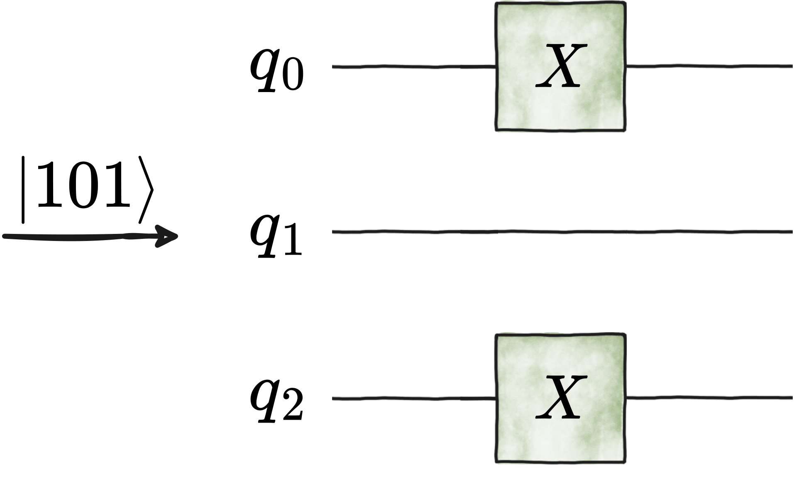
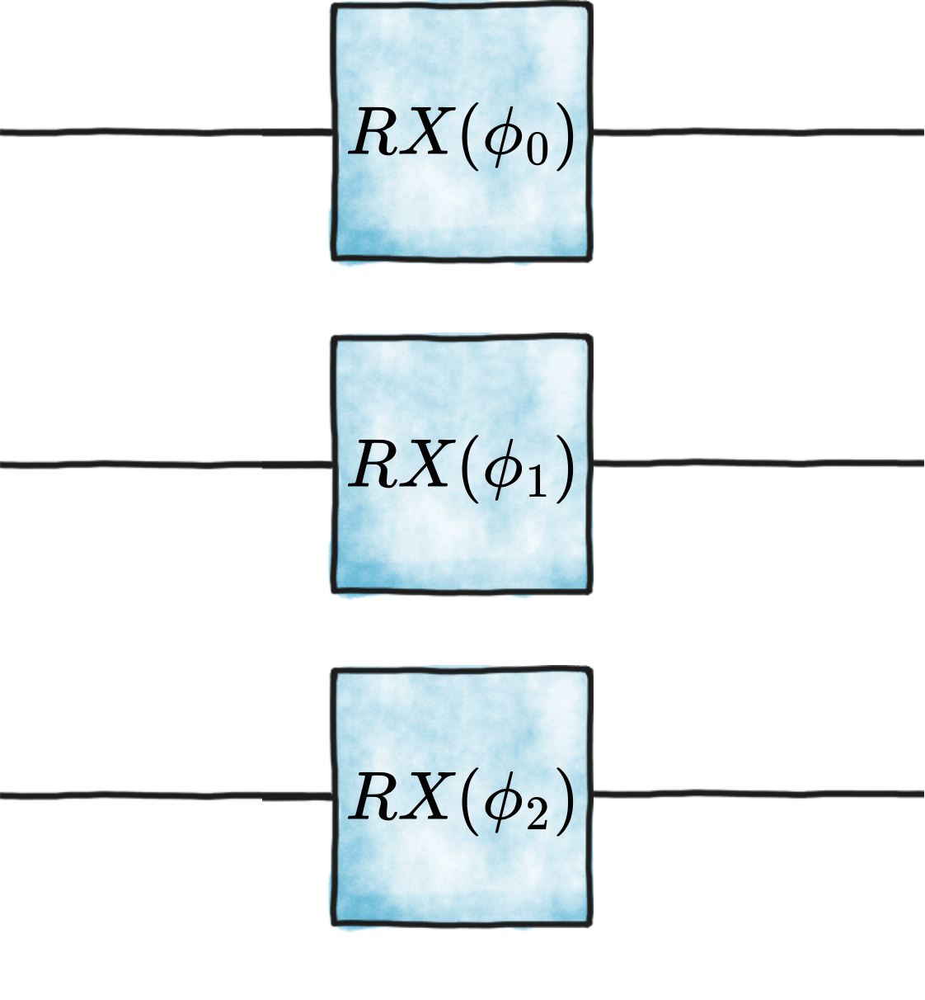
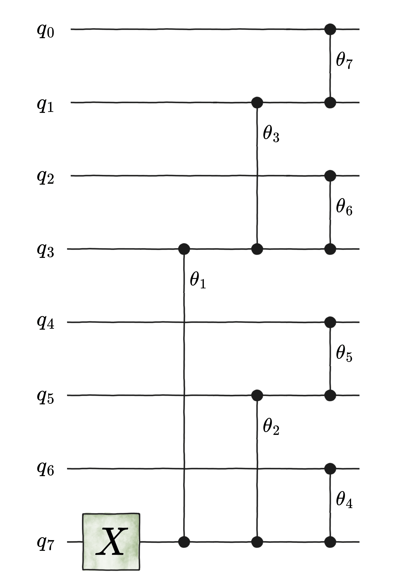
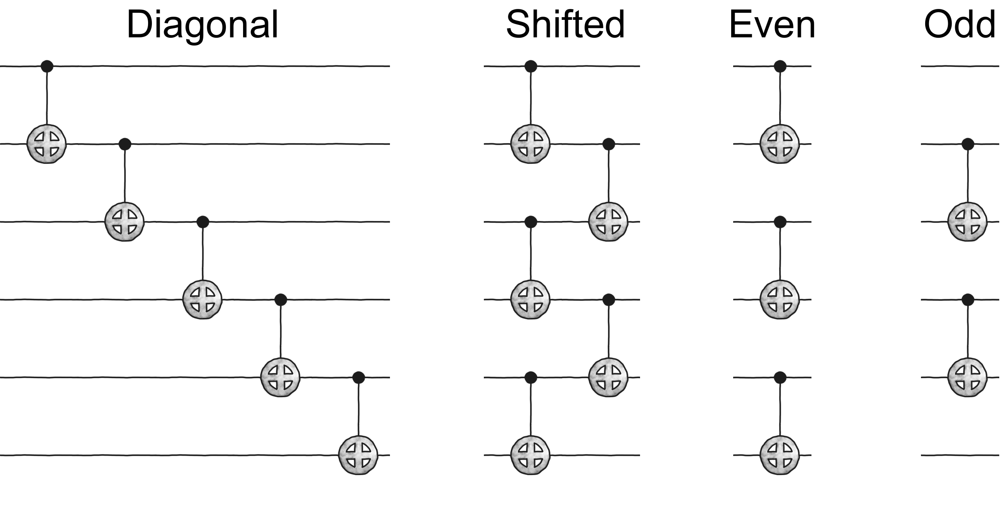
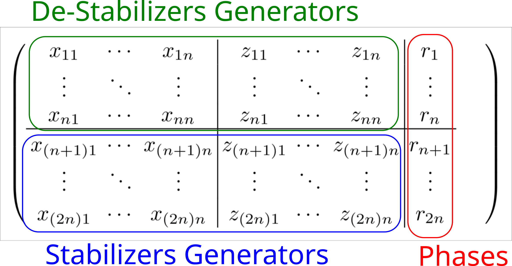

.. _Models:

Models
------

Qibo provides models for both the circuit based and the adiabatic quantum
computation paradigms. Circuit based models include :ref:`generalpurpose` which
allow defining arbitrary circuits and :ref:`applicationspecific` such as the
Quantum Fourier Transform (:class:`qibo.models.QFT`) and the
Variational Quantum Eigensolver (:class:`qibo.models.VQE`).
Adiabatic quantum computation is simulated using the :ref:`timeevolution`
of state vectors.

In order to perform calculations and apply gates to a state vector a backend
has to be used. The backends are defined in ``qibo/backends``.
Circuit and gate objects are backend independent and can be executed with
any of the available backends.

Qibo uses big-endian byte order, which means that the most significant qubit
is the one with index 0, while the least significant qubit is the one with
the highest index.

.. _generalpurpose:

Circuit models
^^^^^^^^^^^^^^

Circuit
"""""""

.. autoclass:: qibo.models.circuit.Circuit
    :members:
    :member-order: bysource

Circuit addition
""""""""""""""""

:class:`qibo.models.circuit.Circuit` objects support addition. For example

.. testsetup::

    import qibo
    from qibo import models
    from qibo import gates

.. testcode::

    c1 = models.QFT(4)

    c2 = models.Circuit(4)
    c2.add(gates.RZ(0, 0.1234))
    c2.add(gates.RZ(1, 0.1234))
    c2.add(gates.RZ(2, 0.1234))
    c2.add(gates.RZ(3, 0.1234))

    c = c1 + c2

will create a circuit that performs the Quantum Fourier Transform on four qubits
followed by Rotation-Z gates.

.. _circuit-fusion:

Circuit fusion
""""""""""""""

The gates contained in a circuit can be fused up to two-qubits using the
:meth:`qibo.models.circuit.Circuit.fuse` method. This returns a new circuit
for which the total number of gates is less than the gates in the original
circuit as groups of gates have been fused to a single
:class:`qibo.gates.special.FusedGate` gate. Simulating the new circuit
is equivalent to simulating the original one but in most cases more efficient
since less gates need to be applied to the state vector.

The fusion algorithm works as follows: First all gates in the circuit are
transformed to unmarked :class:`qibo.gates.special.FusedGate`. The gates
are then processed in the order they were added in the circuit. For each gate
we identify the neighbors forth and back in time and attempt to fuse them to
the gate. Two gates can be fused if their total number of target qubits is
smaller than the fusion maximum qubits (specified by the user) and there are
no other gates between acting on the same target qubits. Gates that are fused
to others are marked. The new circuit queue contains the gates that remain
unmarked after the above operations finish.

Gates are processed in the original order given by user. There are no
additional simplifications performed such as commuting gates acting on the same
qubit or canceling gates even when such simplifications are mathematically possible.
The user can specify the maximum number of qubits in a fused gate using
the ``max_qubits`` flag in :meth:`qibo.models.circuit.Circuit.fuse`.

For example the following:

.. testcode::

    from qibo import models, gates

    c = models.Circuit(2)
    c.add([gates.H(0), gates.H(1)])
    c.add(gates.CZ(0, 1))
    c.add([gates.X(0), gates.Y(1)])
    fused_c = c.fuse()

will create a new circuit with a single :class:`qibo.gates.special.FusedGate`
acting on ``(0, 1)``, while the following:

.. testcode::

    from qibo import models, gates

    c = models.Circuit(3)
    c.add([gates.H(0), gates.H(1), gates.H(2)])
    c.add(gates.CZ(0, 1))
    c.add([gates.X(0), gates.Y(1), gates.Z(2)])
    c.add(gates.CNOT(1, 2))
    c.add([gates.H(0), gates.H(1), gates.H(2)])
    fused_c = c.fuse()

will give a circuit with two fused gates, the first of which will act on
``(0, 1)`` corresponding to

.. code-block::  python

    [H(0), H(1), CZ(0, 1), X(0), H(0)]

and the second will act to ``(1, 2)`` corresponding to

.. code-block::  python

    [Y(1), Z(2), CNOT(1, 2), H(1), H(2)]

.. _applicationspecific:

Quantum Fourier Transform (QFT)
"""""""""""""""""""""""""""""""

.. autoclass:: qibo.models.qft.QFT
    :members:
    :member-order: bysource

Variational Quantum Eigensolver (VQE)
"""""""""""""""""""""""""""""""""""""

.. autoclass:: qibo.models.variational.VQE
    :members:
    :member-order: bysource

Adiabatically Assisted Variational Quantum Eigensolver (AAVQE)
""""""""""""""""""""""""""""""""""""""""""""""""""""""""""""""

.. autoclass:: qibo.models.variational.AAVQE
    :members:
    :member-order: bysource

Quantum Approximate Optimization Algorithm (QAOA)
"""""""""""""""""""""""""""""""""""""""""""""""""

.. autoclass:: qibo.models.variational.QAOA
    :members:
    :member-order: bysource

Feedback-based Algorithm for Quantum Optimization (FALQON)
""""""""""""""""""""""""""""""""""""""""""""""""""""""""""

.. autoclass:: qibo.models.variational.FALQON
    :members:
    :member-order: bysource

Grover's Algorithm
""""""""""""""""""

.. autoclass:: qibo.models.grover.Grover
    :members:
    :member-order: bysource

Travelling Salesman Problem
"""""""""""""""""""""""""""

.. automodule:: qibo.models.tsp
    :members:
    :member-order: bysource

Iterative Quantum Amplitude Estimation (IQAE)
"""""""""""""""""""""""""""""""""""""""""""""

.. autoclass:: qibo.models.iqae.IQAE
    :members:
    :member-order: bysource

.. autoclass:: qibo.models.iqae.IterativeAmplitudeEstimationResult
    :members:
    :member-order: bysource

Double Bracket Iteration algorithm for Diagonalization
""""""""""""""""""""""""""""""""""""""""""""""""""""""

The Double Bracket Flow (DBF) has been presented `here <https://arxiv.org/abs/2206.11772>`_
as a novel strategy for preparing eigenstates of a quantum system. We implement in
Qibo a discretized version of the algorithm, which executes sequential Double
Bracket Iterations.

.. autoclass:: qibo.models.dbi.double_bracket.DoubleBracketGeneratorType
    :members:
    :member-order: bysource

.. autoclass:: qibo.models.dbi.double_bracket.DoubleBracketIteration
    :members:
    :member-order: bysource

.. _timeevolution:

Time evolution
^^^^^^^^^^^^^^

State evolution
"""""""""""""""

.. autoclass:: qibo.models.evolution.StateEvolution
    :members:
    :member-order: bysource

Adiabatic evolution
"""""""""""""""""""

.. autoclass:: qibo.models.evolution.AdiabaticEvolution
    :members:
    :member-order: bysource

.. _data-encoders:

Data Encoders
^^^^^^^^^^^^^

We provide a family of algorithms that encode classical data into quantum circuits.

Computational Basis Encoder
"""""""""""""""""""""""""""

Given a bitstring :math:`b` of length :math:`n`, this encoder generates a layer of Pauli-:math:`X`
gates that creates the quantum state :math:`|\,b\,\rangle`.

For instance, the following two circuit generations are equivalent:

.. testsetup::

    from qibo import Circuit, gates
    from qibo.models.encodings import comp_basis_encoder

.. testcode::

    b = "101"
    circuit_1 = comp_basis_encoder(b)

    circuit_2 = Circuit(3)
    circuit_2.add(gates.X(0))
    circuit_2.add(gates.X(2))

.. autofunction:: qibo.models.encodings.comp_basis_encoder

Phase Encoder
"""""""""""""

Encodes data of length :math:`n` into the phases of :math:`n` qubits.

For instance, the following two circuit generations are equivalent:

.. testsetup::

    import numpy as np

    from qibo import Circuit, gates
    from qibo.models.encodings import phase_encoder

.. testcode::

    nqubits = 3
    phases = np.random.rand(nqubits)

    circuit_1 = phase_encoder(phases, rotation="RX")

    circuit_2 = Circuit(3)
    circuit_2.add(gates.RX(qubit, phases[qubit]) for qubit in range(nqubits))

.. autofunction:: qibo.models.encodings.phase_encoder

Unary Encoder
"""""""""""""

Given a classical ``data`` array :math:`\mathbf{x} \in \mathbb{R}^{d}` such that

.. math::
    \mathbf{x} = (x_{1}, x_{2}, \dots, x_{d}) \, ,

this function generate the circuit that prepares the following quantum state
:math:`\ket{\psi} \in \mathcal{H}`:

.. math::
    \ket{\psi} = \frac{1}{\|\mathbf{x}\|_{\textup{HS}}} \,
        \sum_{k=1}^{d} \, x_{k} \, \ket{k} \, ,

with :math:`\mathcal{H} \cong \mathbb{C}^{d}` being a :math:`d`-qubit Hilbert space,
and :math:`\|\cdot\|_{\textup{HS}}` being the Hilbert-Schmidt norm.

Here, :math:`\ket{k}` is a unary representation of the number :math:`k`.
For instance, for :math:`d = 3`, the final state would be

.. math::
    \ket{\psi} = \frac{1}{\|\mathbf{x}\|_{\textup{HS}}} \,
        \left( x_{1} \ket{001} + x_{2} \ket{010} + x_{3} \ket{100} \right) \, .

There are multiple circuit architechtures that lead to unary encoding of classical data.
For example, to encode a :math:`8`-dimensional data, one could use the so-called
*tree* architechture below:

where the first gate is the :class:`qibo.gates.X`
and the parametrized gates are the :class:`qibo.gates.RBS`.
To know how the angles :math:`\{\theta_{k}\}_{[k]}` are calculated for this architecture,
please refer to S. Johri *et al.*, *Nearest Centroid Classification on a Trapped Ion Quantum Computer*,
`arXiv:2012.04145v2 [quant-ph] <https://arxiv.org/abs/2012.04145>`_.

On the other hand, the same encoding could be performed using the so-called
*diagonal* (also known as *ladder*) architecture below:

.. image:: ../_static/unary_encoder_ladder.png
   :width: 700
   :height: 550
   :align: center

This architecture leads to a choice of angles based on
`spherical coordinates in a d-dimensional hypersphere
<https://en.wikipedia.org/wiki/N-sphere#Spherical_coordinates>`_.

.. autofunction:: qibo.models.encodings.unary_encoder

Unary Encoder for Random Gaussian States
""""""""""""""""""""""""""""""""""""""""

Performs the same unary encoder as :class:`qibo.models.encodings.unary_encoder`
using the *tree* architecture , with the difference being that now each entry
of the :math:`d`-dimensional array is sampled from a Gaussian distribution
:math:`\mathcal{N}(0, 1)`.

.. autofunction:: qibo.models.encodings.unary_encoder_random_gaussian

Entangling layer
""""""""""""""""

Generates a layer of nearest-neighbour two-qubit gates, assuming 1-dimensional connectivity.
With the exception of :class:`qibo.gates.gates.GeneralizedfSim`,
any of the two-qubit gates implemented in ``qibo`` can be selected to customize the entangling layer.
If the chosen gate is parametrized, all phases are set to :math:`0.0`.
Note that these phases can be updated a posterior by using
:meth:`qibo.models.Circuit.set_parameters`.
There are four possible choices of layer ``architecture``:
``diagonal``, ``shifted``, ``even-layer``, and ``odd-layer``.
For instance, we show below an example of each architecture for ``nqubits = 6``.

If ``closed_boundary`` is set to ``True``, then an extra gate is added connecting the last and the first qubit,
with the last qubit as the control qubit and the first qubit as a target qubit.

.. autofunction:: qibo.models.encodings.entangling_layer

.. _error-mitigation:

Error Mitigation
^^^^^^^^^^^^^^^^

Qibo allows for mitigating noise in circuits via error mitigation methods.
Unlike error correction, error mitigation does not aim to correct qubit errors,
but rather it provides the means to estimate the noise-free expected value of
an observable measured at the end of a noisy circuit.

Readout Mitigation
""""""""""""""""""

A common kind of error happening in quantum circuits is readout error, i.e. the
error in the measurement of the qubits at the end of the computation.
In Qibo there are currently two methods implemented for mitigating readout errors,
and both can be used as standalone functions or in combination with the other
general mitigation methods by setting the paramter `readout`.

Response Matrix
""""""""""""""""""
Given :math:`n` qubits, all the possible :math:`2^n` states are constructed via the
application of the corresponding sequence of :math:`X` gates
:math:`X_0\otimes I_1\otimes\cdot\cdot\cdot\otimes X_{n-1}`.
In the presence of readout errors, we will measure for each state :math:`i` some noisy
frequencies :math:`F_i^{noisy}` different from the ideal ones
:math:`F_i^{ideal}=\delta_{i,j}`.

The effect of the error is modeled by the response matrix composed of the noisy frequencies as
columns :math:`M=\big(F_0^{noisy},...,F_{n-1}^{noisy}\big)`. We have indeed that:

.. math::
   F_i^{noisy} = M \cdot F_i^{ideal}

and, therefore, the calibration matrix obtained as :math:`M_{\text{cal}}=M^{-1}`
can be used to recover the noise-free frequencies.

The calibration matrix :math:`M_{\text{cal}}` lacks stochasticity, resulting in a 'negative probability' issue.
The distributions that arise after applying :math:`M_{\text{cal}}` are quasiprobabilities;
the individual elements can be negative surpass 1, provided they sum to 1.
It is posible to use Iterative Bayesian Unfolding (IBU) to preserve non-negativity.
See `Nachman et al <https://arxiv.org/abs/1910.01969>`_ for more details.

.. autofunction:: qibo.models.error_mitigation.get_response_matrix

.. autofunction:: qibo.models.error_mitigation.iterative_bayesian_unfolding

.. autofunction:: qibo.models.error_mitigation.apply_resp_mat_readout_mitigation

.. autofunction:: qibo.models.error_mitigation.apply_randomized_readout_mitigation

.. autofunction:: qibo.models.error_mitigation.get_expectation_val_with_readout_mitigation

Randomized readout mitigation
""""""""""""""""""""""""""""""
This approach converts the effect of any noise map :math:`A` into a single multiplication
factor for each Pauli observable, that is, diagonalizes the measurement channel.
The multiplication factor :math:`\lambda` can be directly measured even without
the quantum circuit. Dividing the measured value :math:`\langle O\rangle_{noisy}` by these
factor results in the mitigated Pauli expectation value :math:`\langle O\rangle_{ideal}`,

.. math::
   \langle O\rangle_{ideal} = \frac{\langle O\rangle_{noisy}}{\lambda}

.. autofunction:: qibo.models.error_mitigation.apply_randomized_readout_mitigation

Zero Noise Extrapolation (ZNE)
""""""""""""""""""""""""""""""

Given a noisy circuit :math:`C` and an observable :math:`A`, Zero Noise Extrapolation (ZNE)
consists in running :math:`n+1` versions of the circuit with different noise levels
:math:`\{c_j\}_{j=0..n}` and, for each of them, measuring the expected value of the observable
:math:`E_j=\langle A\rangle_j`.

Then, an estimate for the expected value of the observable in the noise-free condition
is obtained as:

.. math::
   \hat{E} = \sum_{j=0}^n \gamma_jE_j

with :math:`\gamma_j` satisfying:

.. math::
   \sum_{j=0}^n \gamma_j = 1 \qquad \sum_{j=0}^n \gamma_j c_j^k = 0 \quad \text{for}\,\, k=1,..,n

This implementation of ZNE relies on the insertion of gate pairs (that resolve to the
identity in the noise-free case) to realize the different noise levels :math:`\{c_j\}`,
see `He et al <https://journals.aps.org/pra/abstract/10.1103/PhysRevA.102.012426>`_
for more details. Hence, the canonical levels are mapped to the number of inserted pairs
as :math:`c_j\rightarrow 2 c_j + 1`.

.. autofunction:: qibo.models.error_mitigation.ZNE

.. autofunction:: qibo.models.error_mitigation.get_gammas

.. autofunction:: qibo.models.error_mitigation.get_noisy_circuit

Clifford Data Regression (CDR)
""""""""""""""""""""""""""""""

In the Clifford Data Regression (CDR) method, a set of :math:`n` circuits
:math:`S_n=\{C_i\}_{i=1,..,n}` is generated starting from the original circuit
:math:`C_0` by replacing some of the non-Clifford gates with Clifford ones.
Given an observable :math:`A`, all the circuits of :math:`S_n` are both simulated
to obtain the correspondent expected values of :math:`A` in noise-free condition
:math:`\{a_i^{exact}\}_{i=1,..,n}`, and run in noisy conditions to obtain the noisy
expected values :math:`\{a_i^{noisy}\}_{i=1,..,n}`.

Finally a model :math:`f` is trained to minimize the mean squared error:

.. math::
   E = \sum_{i=1}^n \bigg(a_i^{exact}-f(a_i^{noisy})\bigg)^2

and learn the mapping :math:`a^{noisy}\rightarrow a^{exact}`.
The mitigated expected value of :math:`A` at the end of :math:`C_0` is then
obtained simply with :math:`f(a_0^{noisy})`.

In this implementation the initial circuit is expected to be decomposed in the three
Clifford gates :math:`RX(\frac{\pi}{2})`, :math:`CNOT`, :math:`X` and in :math:`RZ(\theta)`
(which is Clifford only for :math:`\theta=\frac{n\pi}{2}`).
By default the set of Clifford gates used for substitution is
:math:`\{RZ(0),RZ(\frac{\pi}{2}),RZ(\pi),RZ(\frac{3}{2}\pi)\}`.
See `Sopena et al <https://arxiv.org/abs/2103.12680>`_ for more details.

.. autofunction:: qibo.models.error_mitigation.CDR

.. autofunction:: qibo.models.error_mitigation.sample_training_circuit_cdr

Variable Noise CDR (vnCDR)
""""""""""""""""""""""""""

Variable Noise CDR (vnCDR) is an extension of the CDR method described above that factors
in different noise levels as in ZNE. In detail, the set of circuits
:math:`S_n=\{\mathbf{C}_i\}_{i=1,..,n}` is still generated as in CDR, but for each
:math:`\mathbf{C}_i` we have :math:`k` different versions of it with increased noise
:math:`\mathbf{C}_i=C_i^0,C_i^1,...,C_i^{k-1}`.

Therefore, in this case we have a :math:`k`-dimensional predictor variable
:math:`\mathbf{a}_i^{noisy}=\big(a_i^0, a_i^1,..,a_i^{k-1}\big)^{noisy}` for the same
noise-free targets :math:`a_i^{exact}`, and we want to learn the mapping:

.. math::
   f:\mathbf{a}_i^{noisy}\rightarrow a_i^{exact}

via minimizing the same mean squared error:

.. math::
   E = \sum_{i=1}^n \bigg(a_i^{exact}-f(\mathbf{a}_i^{noisy})\bigg)^2

In particular, the default choice is to take :math:`f(\mathbf{x}):=\Gamma\cdot \mathbf{x}\;`,
with :math:`\Gamma=\text{diag}(\gamma_0,\gamma_1,...,\gamma_{k-1})\;`, that corresponds to the
ZNE calculation for the estimate of the expected value.

Here, as in the implementation of the CDR above, the circuit is supposed to be decomposed in
the set of primitive gates :math:`{RX(\frac{\pi}{2}),CNOT,X,RZ(\theta)}`.
See `Sopena et al <https://arxiv.org/abs/2103.12680>`_ for all the details.

.. autofunction:: qibo.models.error_mitigation.vnCDR

Importance Clifford Sampling (ICS)
""""""""""""""""""""""""""""""""""

In the Importance Clifford Sampling (ICS) method, a set of :math:`n` circuits
:math:`S_n=\{C_i\}_{i=1,..,n}` that stabilizes a given Pauli observable is generated starting from the original circuit
:math:`C_0` by replacing all the non-Clifford gates with Clifford ones.
Given an observable :math:`A`, all the circuits of :math:`S_n` are both simulated
to obtain the correspondent expected values of :math:`A` in noise-free condition
:math:`\{a_i^{exact}\}_{i=1,..,n}`, and run in noisy conditions to obtain the noisy
expected values :math:`\{a_i^{noisy}\}_{i=1,..,n}`.

Finally, a theoretically inspired model :math:`f` is learned using the training data.

The mitigated expected value of :math:`A` at the end of :math:`C_0` is then
obtained simply with :math:`f(a_0^{noisy})`.

In this implementation the initial circuit is expected to be decomposed in the three
Clifford gates :math:`RX(\frac{\pi}{2})`, :math:`CNOT`, :math:`X` and in :math:`RZ(\theta)`
(which is Clifford only for :math:`\theta=\frac{n\pi}{2}`).
By default the set of Clifford gates used for substitution is
:math:`\{RZ(0),RZ(\frac{\pi}{2}),RZ(\pi),RZ(\frac{3}{2}\pi)\}`.
See `Sopena et al <https://arxiv.org/abs/2103.12680>`_ for more details.

.. autofunction:: qibo.models.error_mitigation.ICS

.. autofunction:: qibo.models.error_mitigation.sample_clifford_training_circuit

_______________________

.. _Gates:

Gates
-----

All supported gates can be accessed from the ``qibo.gates`` module.
Read below for a complete list of supported gates.

All gates support the ``controlled_by`` method that allows to control
the gate on an arbitrary number of qubits. For example

* ``gates.X(0).controlled_by(1, 2)`` is equivalent to ``gates.TOFFOLI(1, 2, 0)``,
* ``gates.RY(0, np.pi).controlled_by(1, 2, 3)`` applies the Y-rotation to qubit 0 when qubits 1, 2 and 3 are in the ``|111>`` state.
* ``gates.SWAP(0, 1).controlled_by(3, 4)`` swaps qubits 0 and 1 when qubits 3 and 4 are in the ``|11>`` state.

Abstract gate
^^^^^^^^^^^^^

.. autoclass:: qibo.gates.abstract.Gate
    :members:
    :member-order: bysource

Single qubit gates
^^^^^^^^^^^^^^^^^^

Hadamard (H)
""""""""""""

.. autoclass:: qibo.gates.H
   :members:
   :member-order: bysource

Pauli X (X)
"""""""""""

.. autoclass:: qibo.gates.X
   :members:
   :member-order: bysource

Pauli Y (Y)
"""""""""""

.. autoclass:: qibo.gates.Y
    :members:
    :member-order: bysource

Pauli Z (Z)
"""""""""""

.. autoclass:: qibo.gates.Z
    :members:
    :member-order: bysource

Square-root of Pauli X (SX)
"""""""""""""""""""""""""""

.. autoclass:: qibo.gates.SX
    :members:
    :member-order: bysource

S gate (S)
"""""""""""

.. autoclass:: qibo.gates.S
    :members:
    :member-order: bysource

T gate (T)
"""""""""""

.. autoclass:: qibo.gates.T
    :members:
    :member-order: bysource

Identity (I)
""""""""""""

.. autoclass:: qibo.gates.I
    :members:
    :member-order: bysource

Align (A)
"""""""""

.. autoclass:: qibo.gates.Align
    :members:
    :member-order: bysource

Measurement (M)
"""""""""""""""

.. autoclass:: qibo.gates.M
    :members:
    :member-order: bysource

Rotation X-axis (RX)
""""""""""""""""""""

.. autoclass:: qibo.gates.RX
    :members:
    :member-order: bysource

Rotation Y-axis (RY)
""""""""""""""""""""

.. autoclass:: qibo.gates.RY
    :members:
    :member-order: bysource

Rotation Z-axis (RZ)
""""""""""""""""""""

.. autoclass:: qibo.gates.RZ
    :members:
    :member-order: bysource

First general unitary (U1)
""""""""""""""""""""""""""

.. autoclass:: qibo.gates.U1
    :members:
    :member-order: bysource

Second general unitary (U2)
"""""""""""""""""""""""""""

.. autoclass:: qibo.gates.U2
    :members:
    :member-order: bysource

Third general unitary (U3)
""""""""""""""""""""""""""

.. autoclass:: qibo.gates.U3
    :members:
    :member-order: bysource

Two qubit gates
^^^^^^^^^^^^^^^

Controlled-NOT (CNOT)
"""""""""""""""""""""

.. autoclass:: qibo.gates.CNOT
    :members:
    :member-order: bysource

Controlled-Y (CY)
"""""""""""""""""""""

.. autoclass:: qibo.gates.CY
    :members:
    :member-order: bysource

Controlled-phase (CZ)
"""""""""""""""""""""

.. autoclass:: qibo.gates.CZ
    :members:
    :member-order: bysource

Controlled-Square Root of X (CSX)
"""""""""""""""""""""""""""""""""

.. autoclass:: qibo.gates.CSX
    :members:
    :member-order: bysource

Controlled-rotation X-axis (CRX)
""""""""""""""""""""""""""""""""

.. autoclass:: qibo.gates.CRX
    :members:
    :member-order: bysource

Controlled-rotation Y-axis (CRY)
""""""""""""""""""""""""""""""""

.. autoclass:: qibo.gates.CRY
    :members:
    :member-order: bysource

Controlled-rotation Z-axis (CRZ)
""""""""""""""""""""""""""""""""

.. autoclass:: qibo.gates.CRZ
    :members:
    :member-order: bysource

Controlled first general unitary (CU1)
""""""""""""""""""""""""""""""""""""""

.. autoclass:: qibo.gates.CU1
    :members:
    :member-order: bysource

Controlled second general unitary (CU2)
"""""""""""""""""""""""""""""""""""""""

.. autoclass:: qibo.gates.CU2
    :members:
    :member-order: bysource

Controlled third general unitary (CU3)
""""""""""""""""""""""""""""""""""""""

.. autoclass:: qibo.gates.CU3
    :members:
    :member-order: bysource

Swap (SWAP)
"""""""""""

.. autoclass:: qibo.gates.SWAP
    :members:
    :member-order: bysource

iSwap (iSWAP)
"""""""""""""

.. autoclass:: qibo.gates.iSWAP
    :members:
    :member-order: bysource

Square root of iSwap (SiSWAP)
"""""""""""""""""""""""""""""

.. autoclass:: qibo.gates.SiSWAP
    :members:
    :member-order: bysource

f-Swap (FSWAP)
""""""""""""""

.. autoclass:: qibo.gates.FSWAP
    :members:
    :member-order: bysource

fSim
""""

.. autoclass:: qibo.gates.fSim
    :members:
    :member-order: bysource

Sycamore gate
"""""""""""""

.. autoclass:: qibo.gates.SYC
    :members:
    :member-order: bysource

fSim with general rotation
""""""""""""""""""""""""""

.. autoclass:: qibo.gates.GeneralizedfSim
    :members:
    :member-order: bysource

Parametric XX interaction (RXX)
"""""""""""""""""""""""""""""""

.. autoclass:: qibo.gates.RXX
    :members:
    :member-order: bysource

Parametric YY interaction (RYY)
"""""""""""""""""""""""""""""""

.. autoclass:: qibo.gates.RYY
    :members:
    :member-order: bysource

Parametric ZZ interaction (RZZ)
"""""""""""""""""""""""""""""""

.. autoclass:: qibo.gates.RZZ
    :members:
    :member-order: bysource

Parametric ZX interaction (RZX)
"""""""""""""""""""""""""""""""

.. autoclass:: qibo.gates.RZX
    :members:
    :member-order: bysource

Parametric XX-YY interaction (RXXYY)
""""""""""""""""""""""""""""""""""""

.. autoclass:: qibo.gates.RXXYY
    :members:
    :member-order: bysource

Givens gate
"""""""""""

.. autoclass:: qibo.gates.GIVENS
    :members:
    :member-order: bysource

Reconfigurable Beam Splitter gate (RBS)
"""""""""""""""""""""""""""""""""""""""

.. autoclass:: qibo.gates.RBS
    :members:
    :member-order: bysource

Echo Cross-Resonance gate (ECR)
""""""""""""""""""""""""""""""""

.. autoclass:: qibo.gates.ECR
    :members:
    :member-order: bysource

Special gates
^^^^^^^^^^^^^

Toffoli
"""""""

.. autoclass:: qibo.gates.TOFFOLI
    :members:
    :member-order: bysource

CCZ
"""

.. autoclass:: qibo.gates.CCZ
    :members:
    :member-order: bysource

Deutsch
"""""""

.. autoclass:: qibo.gates.DEUTSCH
    :members:
    :member-order: bysource

Arbitrary unitary
"""""""""""""""""

.. autoclass:: qibo.gates.Unitary
    :members:
    :member-order: bysource

Callback gate
"""""""""""""

.. autoclass:: qibo.gates.CallbackGate
    :members:
    :member-order: bysource

Fusion gate
"""""""""""

.. autoclass:: qibo.gates.FusedGate
    :members:
    :member-order: bysource

IONQ Native gates
^^^^^^^^^^^^^^^^^

GPI
"""

.. autoclass:: qibo.gates.GPI
    :members:
    :member-order: bysource

GPI2
""""

.. autoclass:: qibo.gates.GPI2
    :members:
    :member-order: bysource

Mølmer–Sørensen (MS)
""""""""""""""""""""

.. autoclass:: qibo.gates.MS
    :members:
    :member-order: bysource

Quantinuum native gates
^^^^^^^^^^^^^^^^^^^^^^^

U1q
"""

.. autoclass:: qibo.gates.U1q
    :members:
    :member-order: bysource

.. note::
    The other Quantinuum single-qubit and two-qubit native gates are
    implemented in Qibo as:

    - Pauli-:math:`Z` rotation: :class:`qibo.gates.RZ`
    - Arbitrary :math:`ZZ` rotation: :class:`qibo.gates.RZZ`
    - Fully-entangling :math:`ZZ`-interaction: :math:`R_{ZZ}(\pi/2)`

_______________________

.. _Channels:

Channels
--------

Channels are implemented in Qibo as additional gates and can be accessed from
the ``qibo.gates`` module. Channels can be used on density matrices to perform
noisy simulations. Channels that inherit :class:`qibo.gates.UnitaryChannel`
can also be applied to state vectors using sampling and repeated execution.
For more information on the use of channels to simulate noise we refer to
:ref:`How to perform noisy simulation? <noisy-example>`
The following channels are currently implemented:

Kraus channel
^^^^^^^^^^^^^

.. autoclass:: qibo.gates.KrausChannel
    :members:
    :member-order: bysource

Unitary channel
^^^^^^^^^^^^^^^

.. autoclass:: qibo.gates.UnitaryChannel
    :members:
    :member-order: bysource

Pauli noise channel
^^^^^^^^^^^^^^^^^^^

.. autoclass:: qibo.gates.PauliNoiseChannel
    :members:
    :member-order: bysource

Depolarizing channel
^^^^^^^^^^^^^^^^^^^^

.. autoclass:: qibo.gates.DepolarizingChannel
    :members:
    :member-order: bysource

Thermal relaxation channel
^^^^^^^^^^^^^^^^^^^^^^^^^^

.. autoclass:: qibo.gates.ThermalRelaxationChannel
    :members:
    :member-order: bysource

Amplitude damping channel
^^^^^^^^^^^^^^^^^^^^^^^^^

.. autoclass:: qibo.gates.AmplitudeDampingChannel
    :members:
    :member-order: bysource

Phase damping channel
^^^^^^^^^^^^^^^^^^^^^^^^^

.. autoclass:: qibo.gates.PhaseDampingChannel
    :members:
    :member-order: bysource

Readout error channel
^^^^^^^^^^^^^^^^^^^^^

.. autoclass:: qibo.gates.ReadoutErrorChannel
    :members:
    :member-order: bysource

Reset channel
^^^^^^^^^^^^^

.. autoclass:: qibo.gates.ResetChannel
    :members:
    :member-order: bysource

_______________________

Noise
-----

In Qibo it is possible to create a custom noise model using the
class :class:`qibo.noise.NoiseModel`. This enables the user to create
circuits where the noise is gate and qubit dependent.

For more information on the use of :class:`qibo.noise.NoiseModel` see
:ref:`How to perform noisy simulation? <noisemodel-example>`

.. autoclass:: qibo.noise.NoiseModel
    :members:
    :member-order: bysource

Quantum errors
^^^^^^^^^^^^^^

The quantum errors available to build a noise model are the following:

.. autoclass:: qibo.noise.KrausError
    :members:
    :member-order: bysource

.. autoclass:: qibo.noise.UnitaryError
    :members:
    :member-order: bysource

.. autoclass:: qibo.noise.PauliError
    :members:
    :member-order: bysource

.. autoclass:: qibo.noise.DepolarizingError
    :members:
    :member-order: bysource

.. autoclass:: qibo.noise.ThermalRelaxationError
    :members:
    :member-order: bysource

.. autoclass:: qibo.noise.AmplitudeDampingError
    :members:
    :member-order: bysource

.. autoclass:: qibo.noise.PhaseDampingError
    :members:
    :member-order: bysource

.. autoclass:: qibo.noise.ReadoutError
    :members:
    :member-order: bysource

.. autoclass:: qibo.noise.ResetError
    :members:
    :member-order: bysource

.. autoclass:: qibo.noise.CustomError
    :members:
    :member-order: bysource

IBMQ noise model
^^^^^^^^^^^^^^^^

In Qibo, it is possible to build noisy circuits based on IBMQ's reported noise model of
for its quantum computer by using the :class:`qibo.noise.IBMQNoiseModel` class.
The noise model is built using a combination of the
:class:`qibo.gates.ThermalRelaxationChannel` and :class:`qibo.gates.DepolarizingChannel`
channels. . At the end of the circuit, if the qubit is measured,
bitflips errors are set. Moreover, the model handles idle qubits by applying a thermal
relaxation channel for the duration of the idle-time.

For more information on the :class:`qibo.noise.IBMQNoiseModel` class, see the
example on :ref:`Simulating quantum hardware <noise-hardware-example>`.

.. autoclass:: qibo.noise.IBMQNoiseModel
    :members:
    :member-order: bysource

_______________________

.. _Hamiltonians:

Hamiltonians
------------

The main abstract Hamiltonian object of Qibo is:

.. autoclass:: qibo.hamiltonians.abstract.AbstractHamiltonian
    :members:
    :member-order: bysource

Matrix Hamiltonian
^^^^^^^^^^^^^^^^^^

The first implementation of Hamiltonians uses the full matrix representation
of the Hamiltonian operator in the computational basis. This matrix has size
``(2 ** nqubits, 2 ** nqubits)`` and therefore its construction is feasible
only when number of qubits is small.

Alternatively, the user can construct this Hamiltonian using a sparse matrices.
Sparse matrices from the
`scipy.sparse <https://docs.scipy.org/doc/scipy/reference/sparse.html>`_
module are supported by the ``numpy`` and ``qibojit`` backends while the
`tensorflow.sparse <https://www.tensorflow.org/api_docs/python/tf/sparse>`_ can be
used for ``tensorflow``. Scipy sparse matrices support algebraic
operations (addition, subtraction, scalar multiplication), linear algebra
operations (eigenvalues, eigenvectors, matrix exponentiation) and
multiplication to dense or other sparse matrices. All these properties are
inherited by :class:`qibo.hamiltonians.Hamiltonian` objects created
using sparse matrices. Tensorflow sparse matrices support only multiplication
to dense matrices. Both backends support calculating Hamiltonian expectation
values using a sparse Hamiltonian matrix.

.. autoclass:: qibo.hamiltonians.Hamiltonian
    :members:
    :member-order: bysource

Symbolic Hamiltonian
^^^^^^^^^^^^^^^^^^^^

Qibo allows the user to define Hamiltonians using ``sympy`` symbols. In this
case the full Hamiltonian matrix is not constructed unless this is required.
This makes the implementation more efficient for larger qubit numbers.
For more information on constructing Hamiltonians using symbols we refer to the
:ref:`How to define custom Hamiltonians using symbols? <symbolicham-example>` example.

.. autoclass:: qibo.hamiltonians.SymbolicHamiltonian
    :members:
    :member-order: bysource

When a :class:`qibo.hamiltonians.SymbolicHamiltonian` is used for time
evolution then Qibo will automatically perform this evolution using the Trotter
of the evolution operator. This is done by automatically splitting the Hamiltonian
to sums of commuting terms, following the description of Sec. 4.1 of
`arXiv:1901.05824 <https://arxiv.org/abs/1901.05824>`_.
For more information on time evolution we refer to the
:ref:`How to simulate time evolution? <timeevol-example>` example.

In addition to the abstract Hamiltonian models, Qibo provides the following
pre-coded Hamiltonians:

Heisenberg XXZ
^^^^^^^^^^^^^^

.. autoclass:: qibo.hamiltonians.XXZ
    :members:
    :member-order: bysource

Non-interacting Pauli-X
^^^^^^^^^^^^^^^^^^^^^^^

.. autoclass:: qibo.hamiltonians.X
    :members:
    :member-order: bysource

Non-interacting Pauli-Y
^^^^^^^^^^^^^^^^^^^^^^^

.. autoclass:: qibo.hamiltonians.Y
    :members:
    :member-order: bysource

Non-interacting Pauli-Z
^^^^^^^^^^^^^^^^^^^^^^^

.. autoclass:: qibo.hamiltonians.Z
    :members:
    :member-order: bysource

Transverse field Ising model
^^^^^^^^^^^^^^^^^^^^^^^^^^^^

.. autoclass:: qibo.hamiltonians.TFIM
    :members:
    :member-order: bysource

Max Cut
^^^^^^^

.. autoclass:: qibo.hamiltonians.MaxCut
    :members:
    :member-order: bysource

.. note::
    All pre-coded Hamiltonians can be created as
    :class:`qibo.hamiltonians.Hamiltonian` using ``dense=True``
    or :class:`qibo.hamiltonians.SymbolicHamiltonian`
    using the ``dense=False``. In the first case the Hamiltonian is created
    using its full matrix representation of size ``(2 ** n, 2 ** n)``
    where ``n`` is the number of qubits that the Hamiltonian acts on. This
    matrix is used to calculate expectation values by direct matrix multiplication
    to the state and for time evolution by exact exponentiation.
    In contrast, when ``dense=False`` the Hamiltonian contains a more compact
    representation as a sum of local terms. This compact representation can be
    used to calculate expectation values via a sum of the local term expectations
    and time evolution via the Trotter decomposition of the evolution operator.
    This is useful for systems that contain many qubits for which constructing
    the full matrix is intractable.

_______________________

.. _Symbols:

Symbols
-------

Qibo provides a basic set of symbols which inherit the ``sympy.Symbol`` object
and can be used to construct :class:`qibo.hamiltonians.SymbolicHamiltonian`
objects as described in the previous section.

.. autoclass:: qibo.symbols.Symbol
    :members:
    :member-order: bysource

.. autoclass:: qibo.symbols.I
    :members:
    :member-order: bysource

.. autoclass:: qibo.symbols.X
    :members:
    :member-order: bysource

.. autoclass:: qibo.symbols.Y
    :members:
    :member-order: bysource

.. autoclass:: qibo.symbols.Z
    :members:
    :member-order: bysource

_______________________

.. _States:

Execution Outcomes
------------------

Qibo circuits return different objects when executed depending on what the
circuit contains and on the settings of the simulation. The following table
summarizes which outcomes to expect depending on whether:

* the circuit contains noise channels
* the qubits are measured at the end of the execution
* some collapse measurement is present in the circuit
* ``density_matrix`` is set to ``True`` in simulation

.. table::

   +----------+--------------+----------+----------------+------------------------------------------+
   | Noise    | Measurements | Collapse | Density Matrix |      Outcome                             |
   +==========+==============+==========+================+==========================================+
   |    ❌    |      ❌      |    ❌    |   ❌ / ✅      | :class:`qibo.result.QuantumState`        |
   +----------+--------------+----------+----------------+------------------------------------------+
   |    ❌    |      ✅      |    ❌    |   ❌ / ✅      | :class:`qibo.result.CircuitResult`       |
   +----------+--------------+----------+----------------+------------------------------------------+
   | ❌ / ✅  |      ❌      | ❌ / ✅  |       ✅       | :class:`qibo.result.QuantumState`        |
   +----------+--------------+----------+----------------+------------------------------------------+
   | ❌ / ✅  |      ✅      | ❌ / ✅  |       ❌       | :class:`qibo.result.MeasurementOutcomes` |
   +----------+--------------+----------+----------------+------------------------------------------+
   | ❌ / ✅  |      ✅      | ❌ / ✅  |       ✅       | :class:`qibo.result.CircuitResult`       |
   +----------+--------------+----------+----------------+------------------------------------------+

Therefore, one of the three objects :class:`qibo.result.QuantumState`,
:class:`qibo.result.MeasurementOutcomes` or :class:`qibo.result.CircuitResult`
is going to be returned by the circuit execution. The first gives acces to the final
state and probabilities via the :meth:`qibo.result.QuantumState.state` and
:meth:`qibo.result.QuantumState.probabilities` methods, whereas the second
allows to retrieve the final samples, the frequencies and the probabilities (calculated
as ``frequencies/nshots``) with the :meth:`qibo.result.MeasurementOutcomes.samples`,
:meth:`qibo.result.MeasurementOutcomes.frequencies` and
:meth:`qibo.result.MeasurementOutcomes.probabilities` methods respectively. The
:class:`qibo.result.CircuitResult` object includes all the above instead.

Every time some measurement is performed at the end of the execution, the result
will be a ``CircuitResult`` unless the final state could not be represented with the
current simulation settings, i.e. if some stochasticity is present in the ciruit
(via noise channels or collapse measurements) and ``density_matrix=False``. In that
case a simple ``MeasurementOutcomes`` object is returned.

If no measurement is appended at the end of the circuit, the final ``QuantumState``
is going to be provided as output. However, if the circuit is stochastic,
``density_matrix`` should be set to ``True`` in order to recover the final state,
otherwise an error is raised.

The final result of the circuit execution can also be saved to disk and loaded back:

.. testsetup::

   from qibo import gates, Circuit

.. testcode::

   c = Circuit(2)
   c.add(gates.M(0,1))
   # this will be a CircuitResult object
   result = c()
   # save it to final_result.npy
   result.dump('final_result.npy')
   # can be loaded back
   from qibo.result import load_result

   loaded_result = load_result('final_result.npy')

.. autoclass:: qibo.result.QuantumState
    :members:
    :member-order: bysource

.. autoclass:: qibo.result.MeasurementOutcomes
    :members:
    :member-order: bysource

.. autoclass:: qibo.result.CircuitResult
    :members:
    :member-order: bysource

.. _Callbacks:

Callbacks
---------

Callbacks provide a way to calculate quantities on the state vector as it
propagates through the circuit. Example of such quantity is the entanglement
entropy, which is currently the only callback implemented in
:class:`qibo.callbacks.EntanglementEntropy`.
The user can create custom callbacks by inheriting the
:class:`qibo.callbacks.Callback` class. The point each callback is
calculated inside the circuit is defined by adding a :class:`qibo.gates.CallbackGate`.
This can be added similarly to a standard gate and does not affect the state vector.

.. autoclass:: qibo.callbacks.Callback
   :members:
   :member-order: bysource

Entanglement entropy
^^^^^^^^^^^^^^^^^^^^

.. autoclass:: qibo.callbacks.EntanglementEntropy
   :members:
   :member-order: bysource

Norm
^^^^

.. autoclass:: qibo.callbacks.Norm
   :members:
   :member-order: bysource

Overlap
^^^^^^^

.. autoclass:: qibo.callbacks.Overlap
    :members:
    :member-order: bysource

Energy
^^^^^^

.. autoclass:: qibo.callbacks.Energy
    :members:
    :member-order: bysource

Gap
^^^

.. autoclass:: qibo.callbacks.Gap
    :members:
    :member-order: bysource

.. _Solvers:

Solvers
-------

Solvers are used to numerically calculate the time evolution of state vectors.
They perform steps in time by integrating the time-dependent Schrodinger
equation.

.. automodule:: qibo.solvers
   :members:
   :member-order: bysource

.. _Optimizers:

Optimizers
----------

Optimizers are used automatically by the ``minimize`` methods of
:class:`qibo.models.VQE` and :class:`qibo.evolution.AdiabaticEvolution` models.
The user does not have to use any of the optimizer methods included in the
current section, however the required options of each optimization method
can be passed when calling the ``minimize`` method of the respective Qibo
variational model.

.. automodule:: qibo.optimizers
   :members:
   :member-order: bysource
   :exclude-members: ParallelBFGS

.. _Parameter:

Parameter
---------

It can be useful to define custom parameters in an optimization context. For
example, the rotational angles which encodes information in a Quantum Neural Network
are usually built as a combination of features and trainable parameters. For
doing this, the :class:`qibo.parameter.Parameter` class can be used. It allows
to define custom parameters which can be inserted into a :class:`qibo.models.circuit.Circuit`.
Moreover, it automatically precomputes the analytical derivative of the parameter
function, which can be used to calculate the derivatives of a variational model
with respect to its parameters.

.. automodule:: qibo.parameter
    :members:
    :member-order: bysource

.. _Gradients:

Gradients
---------

In the context of optimization, particularly when dealing with Quantum Machine
Learning problems, it is often necessary to calculate the gradients of functions
that are to be minimized (or maximized). Hybrid methods, which are based on the
use of classical techniques for the optimization of quantum computation procedures,
have been presented in the previous section. This approach is very useful in
simulation, but some classical methods cannot be used when using real circuits:
for example, in the context of neural networks, the Back-Propagation algorithm
is used, where it is necessary to know the value of a target function during the
propagation of information within the network. Using a real circuit, we would not
be able to access this information without taking a measurement, causing the state
of the system to collapse and losing the information accumulated up to that moment.
For this reason, in `qibo` we have also implemented methods for calculating the
gradients which can be performed directly on the hardware, such as the
`Parameter Shift Rule`_.

.. automodule:: qibo.derivative
   :members:
   :member-order: bysource

.. _`Parameter Shift Rule`: https://arxiv.org/abs/1811.11184

.. _Quantum Information:

Quantum Information
-------------------

This module provides tools for generation and analysis of quantum (and classical) information.

Basis
^^^^^

Set of functions related to basis and basis transformations.

Pauli basis
"""""""""""

.. autofunction:: qibo.quantum_info.pauli_basis

Computational basis to Pauli basis
""""""""""""""""""""""""""""""""""

.. autofunction:: qibo.quantum_info.comp_basis_to_pauli

Pauli basis to computational basis
""""""""""""""""""""""""""""""""""

.. autofunction:: qibo.quantum_info.pauli_to_comp_basis

Phase-space Representation of Stabilizer States
^^^^^^^^^^^^^^^^^^^^^^^^^^^^^^^^^^^^^^^^^^^^^^^

A *stabilizer state* :math:`\ketbra{\psi}{\psi}` can be uniquely defined by
the set of its *stabilizers*, i.e. those unitary operators :math:`U` that have
:math:`\psi` as an eigenstate with eigenvalue :math:`1`.
In general, :math:`n`-qubit stabilizer states are stabilized by :math:`d = 2^n`
Pauli operators on said :math:`n` qubits.
However, it is known that the set of :math:`d` Paulis can be generated by only
:math:`n` unique members of the set.
In that case, indeed, the number of operators needed to represent a
stabilizer state reduces to :math:`n`.
Each one of these :math:`n` Pauli *generators* takes :math:`2n + 1` bits to specify,
yielding a :math:`n(2n+1)` total number of bits needed.
In particular, `Aaronson and Gottesman (2004) <aaronson_>`_ demonstrated that the application
of Clifford gates on stabilizer states can be efficiently simulated in this representation
at the cost of storing the generators of the *destabilizers*, in addition to the stabilizers.

A :math:`n`-qubit stabilizer state is uniquely defined by a symplectic matrix of the form

where :math:`(x_{kl},z_{kl})` are the bits encoding the :math:`n`-qubits Pauli generator as

.. math::

   P_{k} = \bigotimes_{l=1}^{n} \, i^{x_{kl} \, \oplus \, z_{kl}} \, X_{l}^{x_{kl}} \, Z_{l}^{z_{kl}}.

The :class:`qibo.quantum_info.clifford.Clifford` object is in charge of storing the
phase-space representation of a stabilizer state.
This object is automatically created after the execution of a Clifford circuit through the
:class:`qibo.backends.clifford.CliffordBackend`, but it can also be created by directly
passing a symplectic matrix to the constructor.

.. testsetup::

   from qibo.quantum_info import Clifford
   from qibo.backends import CliffordBackend

   # construct the |00...0> state
   backend = CliffordBackend("numpy")
   symplectic_matrix = backend.zero_state(nqubits=3)
   clifford = Clifford(symplectic_matrix, engine="numpy")

The generators of the stabilizers can be extracted with the
:meth:`qibo.quantum_info.clifford.Clifford.generators` method,
or the complete set of :math:`d = 2^{n}` stabilizers operators can be extracted through the
:meth:`qibo.quantum_info.clifford.Clifford.stabilizers` method.

.. testcode::

   generators, phases = clifford.generators()
   stabilizers = clifford.stabilizers()

The destabilizers can be extracted analogously with :meth:`qibo.quantum_info.clifford.Clifford.destabilizers`.

We provide integration with the `stim <https://github.com/quantumlib/Stim>`_ package.
It is possible to run Clifford circuits using `stim` as an engine:

.. code-block::  python

    from qibo.backends import CliffordBackend
    from qibo.quantum_info import Clifford, random_clifford

    clifford_backend = CliffordBackend(engine="stim")

    circuit = random_clifford(nqubits)
    result = clifford_backend.execute_circuit(circuit)

    ## Note that the execution above is equivalent to the one below

    result = Clifford.from_circuit(circuit, engine="stim")

.. autoclass:: qibo.quantum_info.clifford.Clifford
    :members:
    :member-order: bysource

Entanglement measures
^^^^^^^^^^^^^^^^^^^^^

Set of functions to calculate entanglement measures.

Concurrence
"""""""""""

.. autofunction:: qibo.quantum_info.concurrence

Entanglement of formation
"""""""""""""""""""""""""

.. autofunction:: qibo.quantum_info.entanglement_of_formation

Entanglement fidelity
"""""""""""""""""""""

.. autofunction:: qibo.quantum_info.entanglement_fidelity

Meyer-Wallach entanglement
""""""""""""""""""""""""""

.. autofunction:: qibo.quantum_info.meyer_wallach_entanglement

Entanglement capability
"""""""""""""""""""""""

.. autofunction:: qibo.quantum_info.entangling_capability

Entropy measures
^^^^^^^^^^^^^^^^

Set of functions to calculate entropy measures.

Shannon entropy
"""""""""""""""

.. autofunction:: qibo.quantum_info.shannon_entropy

Classical relative entropy
""""""""""""""""""""""""""

.. autofunction:: qibo.quantum_info.classical_relative_entropy

Classical Rényi entropy
"""""""""""""""""""""""

.. autofunction:: qibo.quantum_info.classical_renyi_entropy

Classical Rényi relative entropy
""""""""""""""""""""""""""""""""

.. autofunction:: qibo.quantum_info.classical_relative_renyi_entropy

Classical Tsallis entropy
"""""""""""""""""""""""""

.. autofunction:: qibo.quantum_info.classical_tsallis_entropy

von Neumann entropy
"""""""""""""""""""

.. autofunction:: qibo.quantum_info.von_neumann_entropy

.. note::
    ``check_hermitian`` flag allows the user to choose if the function will check if input
    ``state`` is Hermitian or not. Default option is ``check_hermitian=False``, i.e. the
    assumption of Hermiticity. This is faster and, more importantly,
    this function are intended to be used on Hermitian inputs. When ``check_hermitian=True``
    and ``state`` is non-Hermitian, an error will be raised when using `cupy` backend.

Relative von Neumann entropy
""""""""""""""""""""""""""""

.. autofunction:: qibo.quantum_info.relative_von_neumann_entropy

.. note::
    ``check_hermitian`` flag allows the user to choose if the function will check if input
    ``state`` is Hermitian or not. Default option is ``check_hermitian=False``, i.e. the
    assumption of Hermiticity. This is faster and, more importantly,
    this function are intended to be used on Hermitian inputs. When ``check_hermitian=True``
    and either ``state`` or ``target`` is non-Hermitian,
    an error will be raised when using `cupy` backend.

Rényi entropy
"""""""""""""

.. autofunction:: qibo.quantum_info.renyi_entropy

Relative Rényi entropy
""""""""""""""""""""""

.. autofunction:: qibo.quantum_info.relative_renyi_entropy

Tsallis entropy
"""""""""""""""

.. autofunction:: qibo.quantum_info.tsallis_entropy

Entanglement entropy
""""""""""""""""""""

.. autofunction:: qibo.quantum_info.entanglement_entropy

.. note::
    ``check_hermitian`` flag allows the user to choose if the function will check if
    the reduced density matrix resulting from tracing out ``bipartition`` from input
    ``state`` is Hermitian or not. Default option is ``check_hermitian=False``, i.e. the
    assumption of Hermiticity. This is faster and, more importantly,
    this function are intended to be used on Hermitian inputs. When ``check_hermitian=True``
    and the reduced density matrix is non-Hermitian, an error will be raised
    when using `cupy` backend.

Metrics
^^^^^^^

Set of functions that are used to calculate metrics of states, (pseudo-)distance measures
between states, and distance measures between quantum channels.

Purity
""""""

.. autofunction:: qibo.quantum_info.purity

Impurity
""""""""

.. autofunction:: qibo.quantum_info.impurity

Trace distance
""""""""""""""

.. autofunction:: qibo.quantum_info.trace_distance

.. note::
    ``check_hermitian`` flag allows the user to choose if the function will check if difference
    between inputs, ``state - target``, is Hermitian or not. Default option is
    ``check_hermitian=False``, i.e. the assumption of Hermiticity, because it is faster and,
    more importantly, the functions are intended to be used on Hermitian inputs.
    When ``check_hermitian=True`` and ``state - target`` is non-Hermitian, an error will be
    raised when using `cupy` backend.

Hilbert-Schmidt distance
""""""""""""""""""""""""

.. autofunction:: qibo.quantum_info.hilbert_schmidt_distance

Fidelity
""""""""

.. autofunction:: qibo.quantum_info.fidelity

Infidelity
""""""""""

.. autofunction:: qibo.quantum_info.infidelity

Bures angle
"""""""""""

.. autofunction:: qibo.quantum_info.bures_angle

Bures distance
""""""""""""""

.. autofunction:: qibo.quantum_info.bures_distance

Process fidelity
""""""""""""""""

.. autofunction:: qibo.quantum_info.process_fidelity

Process infidelity
""""""""""""""""""

.. autofunction:: qibo.quantum_info.process_infidelity

Average gate fidelity
"""""""""""""""""""""

.. autofunction:: qibo.quantum_info.average_gate_fidelity

Gate error
""""""""""

.. autofunction:: qibo.quantum_info.gate_error

Diamond Norm
""""""""""""

.. autofunction:: qibo.quantum_info.diamond_norm

Expressibility of parameterized quantum circuits
""""""""""""""""""""""""""""""""""""""""""""""""

.. autofunction:: qibo.quantum_info.expressibility

Frame Potential
"""""""""""""""

.. autofunction:: qibo.quantum_info.frame_potential

Quantum Networks
^^^^^^^^^^^^^^^^

Quantum network is an object that unifies the representation of quantum states, channels,
observables, and higher-order quantum operators.

For more details, see G. Chiribella *et al.*, *Theoretical framework for quantum networks*,
`Physical Review A 80.2 (2009): 022339
<https://journals.aps.org/pra/abstract/10.1103/PhysRevA.80.022339>`_.

.. autoclass:: qibo.quantum_info.quantum_networks.QuantumNetwork
    :members:
    :member-order: bysource

Random Ensembles
^^^^^^^^^^^^^^^^

Functions that can generate random quantum objects.

Haar-random :math:`U_{3}`
"""""""""""""""""""""""""

.. autofunction:: qibo.quantum_info.uniform_sampling_U3

Random Gaussian matrix
""""""""""""""""""""""

.. autofunction:: qibo.quantum_info.random_gaussian_matrix

Random Hermitian matrix
"""""""""""""""""""""""

.. autofunction:: qibo.quantum_info.random_hermitian

Random unitary matrix
"""""""""""""""""""""

.. autofunction:: qibo.quantum_info.random_unitary

Random quantum channel
""""""""""""""""""""""

.. autofunction:: qibo.quantum_info.random_quantum_channel

Random statevector
""""""""""""""""""

.. autofunction:: qibo.quantum_info.random_statevector

Random density matrix
"""""""""""""""""""""

.. autofunction:: qibo.quantum_info.random_density_matrix

Random Clifford
"""""""""""""""

.. autofunction:: qibo.quantum_info.random_clifford

Random Pauli
""""""""""""

.. autofunction:: qibo.quantum_info.random_pauli

Random Pauli Hamiltonian
""""""""""""""""""""""""

.. autofunction:: qibo.quantum_info.random_pauli_hamiltonian

Random stochastic matrix
""""""""""""""""""""""""

.. autofunction:: qibo.quantum_info.random_stochastic_matrix

Superoperator Transformations
^^^^^^^^^^^^^^^^^^^^^^^^^^^^^

Functions used to convert superoperators among their possible representations.
For more in-depth theoretical description of the representations and transformations,
we direct the reader to
`Wood, Biamonte, and Cory, Quant. Inf. Comp. 15, 0579-0811 (2015) <https://arxiv.org/abs/1111.6950>`_.

Vectorization
"""""""""""""

.. autofunction:: qibo.quantum_info.vectorization

.. note::
    Due to ``numpy`` limitations on handling transposition of tensors,
    this function will not work when the number of qubits :math:`n`
    is such that :math:`n > 16`.

Unvectorization
"""""""""""""""

.. autofunction:: qibo.quantum_info.unvectorization

.. note::
    Due to ``numpy`` limitations on handling transposition of tensors,
    this function will not work when the number of qubits :math:`n`
    is such that :math:`n > 16`.

To Choi
"""""""

.. autofunction:: qibo.quantum_info.to_choi

To Liouville
""""""""""""

.. autofunction:: qibo.quantum_info.to_liouville

To Pauli-Liouville
""""""""""""""""""

.. autofunction:: qibo.quantum_info.to_pauli_liouville

To Chi
"""""""

.. autofunction:: qibo.quantum_info.to_chi

Choi to Liouville
"""""""""""""""""

.. autofunction:: qibo.quantum_info.choi_to_liouville

Choi to Pauli-Liouville
"""""""""""""""""""""""

.. autofunction:: qibo.quantum_info.choi_to_pauli

Choi to Kraus
"""""""""""""

.. autofunction:: qibo.quantum_info.superoperator_transformations.choi_to_kraus

.. note::
    Due to the spectral decomposition subroutine in this function, the resulting Kraus
    operators :math:`\{K_{\alpha}\}_{\alpha}` might contain global phases. That
    implies these operators are not exactly equal to the "true" Kraus operators
    :math:`\{K_{\alpha}^{(\text{ideal})}\}_{\alpha}`. However, since these are
    global phases, the operators' actions are the same, i.e.

    .. math::
        K_{\alpha} \, \rho \, K_{\alpha}^{\dagger} = K_{\alpha}^{\text{(ideal)}} \, \rho \,\,
            (K_{\alpha}^{\text{(ideal)}})^{\dagger} \,\,\,\,\, , \,\, \forall \, \alpha

.. note::
    User can set ``validate_cp=False`` in order to speed up execution by not checking if
    input map ``choi_super_op`` is completely positive (CP) and Hermitian. However, that may
    lead to erroneous outputs if ``choi_super_op`` is not guaranteed to be CP. We advise users
    to either set this flag carefully or leave it in its default setting (``validate_cp=True``).

Choi to Chi-matrix
""""""""""""""""""

.. autofunction:: qibo.quantum_info.choi_to_chi

Choi to Stinespring
"""""""""""""""""""

.. autofunction:: qibo.quantum_info.choi_to_stinespring

Kraus to Choi
"""""""""""""

.. autofunction:: qibo.quantum_info.kraus_to_choi

Kraus to Liouville
""""""""""""""""""

.. autofunction:: qibo.quantum_info.kraus_to_liouville

Kraus to Pauli-Liouville
""""""""""""""""""""""""

.. autofunction:: qibo.quantum_info.kraus_to_pauli

Kraus to Chi-matrix
"""""""""""""""""""

.. autofunction:: qibo.quantum_info.kraus_to_chi

Kraus to Stinespring
""""""""""""""""""""

.. autofunction:: qibo.quantum_info.kraus_to_stinespring

Liouville to Choi
"""""""""""""""""

.. autofunction:: qibo.quantum_info.liouville_to_choi

Liouville to Pauli-Liouville
""""""""""""""""""""""""""""

.. autofunction:: qibo.quantum_info.liouville_to_pauli

Liouville to Kraus
""""""""""""""""""

.. autofunction:: qibo.quantum_info.liouville_to_kraus

.. note::
    Due to the spectral decomposition subroutine in this function, the resulting Kraus
    operators :math:`\{K_{\alpha}\}_{\alpha}` might contain global phases. That
    implies these operators are not exactly equal to the "true" Kraus operators
    :math:`\{K_{\alpha}^{(\text{ideal})}\}_{\alpha}`. However, since these are
    global phases, the operators' actions are the same, i.e.

    .. math::
        K_{\alpha} \, \rho \, K_{\alpha}^{\dagger} = K_{\alpha}^{\text{(ideal)}} \, \rho \,\,
            (K_{\alpha}^{\text{(ideal)}})^{\dagger} \,\,\,\,\, , \,\, \forall \, \alpha

Liouville to Chi-matrix
"""""""""""""""""""""""

.. autofunction:: qibo.quantum_info.liouville_to_chi

Liouville to Stinespring
""""""""""""""""""""""""

.. autofunction:: qibo.quantum_info.liouville_to_stinespring

Pauli-Liouville to Liouville
""""""""""""""""""""""""""""

.. autofunction:: qibo.quantum_info.pauli_to_liouville

Pauli-Liouville to Choi
"""""""""""""""""""""""

.. autofunction:: qibo.quantum_info.pauli_to_choi

Pauli-Liouville to Kraus
""""""""""""""""""""""""

.. autofunction:: qibo.quantum_info.pauli_to_kraus

Pauli-Liouville to Chi-matrix
"""""""""""""""""""""""""""""

.. autofunction:: qibo.quantum_info.pauli_to_chi

Pauli-Liouville to Stinespring
""""""""""""""""""""""""""""""

.. autofunction:: qibo.quantum_info.pauli_to_stinespring

Chi-matrix to Choi
""""""""""""""""""

.. autofunction:: qibo.quantum_info.chi_to_choi

Chi-matrix to Liouville
"""""""""""""""""""""""

.. autofunction:: qibo.quantum_info.chi_to_liouville

Chi-matrix to Pauli-Liouville
"""""""""""""""""""""""""""""

.. autofunction:: qibo.quantum_info.chi_to_pauli

Chi-matrix to Kraus
"""""""""""""""""""

.. autofunction:: qibo.quantum_info.chi_to_kraus

.. note::
    Due to the spectral decomposition subroutine in this function, the resulting Kraus
    operators :math:`\{K_{\alpha}\}_{\alpha}` might contain global phases. That
    implies these operators are not exactly equal to the "true" Kraus operators
    :math:`\{K_{\alpha}^{(\text{ideal})}\}_{\alpha}`. However, since these are
    global phases, the operators' actions are the same, i.e.

    .. math::
        K_{\alpha} \, \rho \, K_{\alpha}^{\dagger} = K_{\alpha}^{\text{(ideal)}} \, \rho \,\,
            (K_{\alpha}^{\text{(ideal)}})^{\dagger} \,\,\,\,\, , \,\, \forall \, \alpha

.. note::
    User can set ``validate_cp=False`` in order to speed up execution by not checking if
    the Choi representation obtained from the input ``chi_matrix`` is completely positive
    (CP) and Hermitian. However, that may lead to erroneous outputs if ``choi_super_op``
    is not guaranteed to be CP. We advise users to either set this flag carefully or leave
    it in its default setting (``validate_cp=True``).

Chi-matrix to Stinespring
"""""""""""""""""""""""""

.. autofunction:: qibo.quantum_info.chi_to_stinespring

Stinespring to Choi
"""""""""""""""""""

.. autofunction:: qibo.quantum_info.stinespring_to_choi

Stinespring to Liouville
""""""""""""""""""""""""

.. autofunction:: qibo.quantum_info.stinespring_to_liouville

Stinespring to Pauli-Liouville
""""""""""""""""""""""""""""""

.. autofunction:: qibo.quantum_info.stinespring_to_pauli

Stinespring to Kraus
""""""""""""""""""""

.. autofunction:: qibo.quantum_info.stinespring_to_kraus

Stinespring to Chi-matrix
"""""""""""""""""""""""""

.. autofunction:: qibo.quantum_info.stinespring_to_chi

Kraus operators as probabilistic sum of unitaries
"""""""""""""""""""""""""""""""""""""""""""""""""

.. autofunction:: qibo.quantum_info.kraus_to_unitaries

.. note::
    It is not guaranteed that a good approximation will be found or that any
    approximation will be found at all. This functions will find good solutions
    for a limited set of operators. We leave to the user to decide how to
    best use this function.

Utility Functions
^^^^^^^^^^^^^^^^^

Functions that can be used to calculate metrics and distance measures
on classical probability arrays.

Hamming weight
""""""""""""""

.. autofunction:: qibo.quantum_info.hamming_weight

Hamming distance
""""""""""""""""

.. autofunction:: qibo.quantum_info.hamming_distance

Hadamard Transform
""""""""""""""""""

.. autofunction:: qibo.quantum_info.hadamard_transform

Hellinger distance
""""""""""""""""""

.. autofunction:: qibo.quantum_info.hellinger_distance

Hellinger fidelity
""""""""""""""""""

.. autofunction:: qibo.quantum_info.hellinger_fidelity

Hellinger shot error
""""""""""""""""""""

.. autofunction:: qibo.quantum_info.hellinger_fidelity

Haar integral
"""""""""""""

.. autofunction:: qibo.quantum_info.haar_integral

Parameterized quantum circuit integral
""""""""""""""""""""""""""""""""""""""

.. autofunction:: qibo.quantum_info.pqc_integral

.. _Parallel:

Parallelism
-----------

We provide CPU multi-processing methods for circuit evaluation for multiple
input states and multiple parameters for fixed input state.

When using the methods below the ``processes`` option controls the number of
processes used by the parallel algorithms through the ``multiprocessing``
library. By default ``processes=None``, in this case the total number of logical
cores are used. Make sure to select the appropriate number of processes for your
computer specification, taking in consideration memory and physical cores. In
order to obtain optimal results you can control the number of threads used by
each process with the ``qibo.set_threads`` method. For example, for small-medium
size circuits you may benefit from single thread per process, thus set
``qibo.set_threads(1)`` before running the optimization.

.. automodule:: qibo.parallel
   :members:
   :member-order: bysource
   :exclude-members: ParallelResources

.. _Backends:

Backends
--------

The main calculation engine is defined in the abstract backend object
:class:`qibo.backends.abstract.Backend`. This object defines the methods
required by all Qibo models to perform simulation.

Qibo currently provides two different calculation backends, one based on
numpy and one based on Tensorflow. It is possible to define new backends by
inheriting :class:`qibo.backends.abstract.Backend` and implementing
its abstract methods.

An additional backend is shipped as the separate library qibojit.
This backend is supplemented by custom operators defined under which can be
used to efficiently apply gates to state vectors or density matrices.

We refer to :ref:`Packages <packages>` section for a complete list of the
available computation backends and instructions on how to install each of
these libraries on top of qibo.

Custom operators are much faster than implementations based on numpy or Tensorflow
primitives, such as ``einsum``, but do not support some features, such as
automatic differentiation for backpropagation of variational circuits which is
only supported by the native ``tensorflow`` backend.

The user can switch backends using

.. code-block::  python

    import qibo
    qibo.set_backend("qibojit")
    qibo.set_backend("numpy")

before creating any circuits or gates. The default backend is the first available
from ``qibojit``, ``pytorch``, ``tensorflow``, ``numpy``.

Some backends support different platforms. For example, the qibojit backend
provides two platforms (``cupy`` and ``cuquantum``) when used on GPU.
The active platform can be switched using

.. code-block::  python

    import qibo
    qibo.set_backend("qibojit", platform="cuquantum")
    qibo.set_backend("qibojit", platform="cupy")

The default backend order is qibojit (if available), tensorflow (if available),
numpy. The default backend can be changed using the ``QIBO_BACKEND`` environment
variable.

.. autoclass:: qibo.backends.abstract.Backend
    :members:
    :member-order: bysource

.. _Clifford:

Clifford Simulation
^^^^^^^^^^^^^^^^^^^

A special backend in qibo supports the simulation of Clifford circuits.
This :class:`qibo.backends.clifford.CliffordBackend` backend implements the phase-space formalism
introduced in `https://arxiv.org/abs/quant-ph/0406196 <aaronson_>`_ to efficiently simulate gate
application and measurements sampling in the stabilizers state representation.
The execution of a circuit through this backend creates a
:class:`qibo.quantum_info.clifford.Clifford` object that gives access to the final measured
samples through the :meth:`qibo.quantum_info.clifford.Clifford.samples` method,
similarly to :class:`qibo.result.CircuitResult`.
The probabilities and frequencies are computed starting from the samples by the
:meth:`qibo.quantum_info.clifford.Clifford.frequencies` and
:meth:`qibo.quantum_info.clifford.Clifford.probabilities` methods.

.. _aaronson: https://arxiv.org/abs/quant-ph/0406196

It is also possible to recover the standard state representation with the
:meth:`qibo.quantum_info.clifford.Clifford.state` method.
Note, however, that this process is inefficient as it involves the construction of all the
stabilizers starting from the generators encoded inside the symplectic matrix.

As for the other backends, the Clifford backend can be set with

.. testcode::  python

    import qibo
    qibo.set_backend("clifford", platform="numpy")

by specifying the engine used for calculation, if not provided the current :class:`qibo.backends.GlobalBackend` is used

.. testcode::  python

    import qibo

    # setting numpy as the global backend
    qibo.set_backend("numpy")
    # the clifford backend will use the numpy backend as engine
    backend = qibo.backends.CliffordBackend()

Alternatively, a Clifford circuit can also be executed starting from the :class:`qibo.quantum_info.clifford.Clifford` object

.. code-block::  python

    from qibo.quantum_info import Clifford, random_clifford

    nqubits = 2
    circuit = random_clifford(nqubits)
    result = Clifford.from_circuit(circuit)

.. autoclass:: qibo.backends.clifford.CliffordBackend
    :members:
    :member-order: bysource

Cloud Backends
^^^^^^^^^^^^^^

Additional backends that support the remote execution of quantum circuits through
cloud service providers, such as IBM and QRC-TII, are provided by the optional qibo plugin
`qibo-cloud-backends <https://github.com/qiboteam/qibo-cloud-backends>`_.
For more information please refer to the
`official documentation <https://qibo.science/qibo-cloud-backends/stable/>`_.
