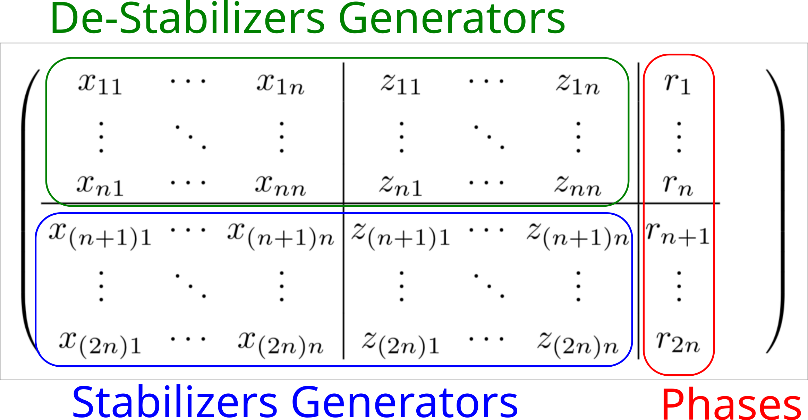

Phase-space Representation of Stabilizer States
===============================================

A *stabilizer state* :math:`\ketbra{\psi}{\psi}` can be uniquely defined by
the set of its *stabilizers*, i.e. those unitary operators :math:`U` that have
:math:`\psi` as an eigenstate with eigenvalue :math:`1`.
In general, :math:`n`-qubit stabilizer states are stabilized by :math:`d = 2^n`
Pauli operators on said :math:`n` qubits.
However, it is known that the set of :math:`d` Paulis can be generated by only
:math:`n` unique members of the set.
In that case, indeed, the number of operators needed to represent a
stabilizer state reduces to :math:`n`.
Each one of these :math:`n` Pauli *generators* takes :math:`2n + 1` bits to specify,
yielding a :math:`n(2n+1)` total number of bits needed.
In particular, `Aaronson and Gottesman (2004) <https://arxiv.org/abs/quant-ph/0406196>`_ demonstrated that the application
of Clifford gates on stabilizer states can be efficiently simulated in this representation
at the cost of storing the generators of the *destabilizers*, in addition to the stabilizers.

A :math:`n`-qubit stabilizer state is uniquely defined by a symplectic matrix of the form

where :math:`(x_{kl},z_{kl})` are the bits encoding the :math:`n`-qubits Pauli generator as

.. math::

   P_{k} = \bigotimes_{l=1}^{n} \, i^{x_{kl} \, \oplus \, z_{kl}} \, X_{l}^{x_{kl}} \, Z_{l}^{z_{kl}}.

The :class:`qibo.quantum_info.clifford.Clifford` object is in charge of storing the
phase-space representation of a stabilizer state.
This object is automatically created after the execution of a Clifford circuit through the
:class:`qibo.backends.clifford.CliffordBackend`, but it can also be created by directly
passing a symplectic matrix to the constructor.

.. testsetup::

   from qibo.quantum_info import Clifford
   from qibo.backends import CliffordBackend

   # construct the |00...0> state
   backend = CliffordBackend("numpy")
   symplectic_matrix = backend.zero_state(nqubits=3)
   clifford = Clifford(symplectic_matrix, platform="numpy")

The generators of the stabilizers can be extracted with the
:meth:`qibo.quantum_info.clifford.Clifford.generators` method,
or the complete set of :math:`d = 2^{n}` stabilizers operators can be extracted through the
:meth:`qibo.quantum_info.clifford.Clifford.stabilizers` method.

.. testcode::

   generators, phases = clifford.generators()
   stabilizers = clifford.stabilizers()

The destabilizers can be extracted analogously with :meth:`qibo.quantum_info.clifford.Clifford.destabilizers`.

We provide integration with the `stim <https://github.com/quantumlib/Stim>`_ package.
It is possible to run Clifford circuits using `stim` as a platform:

.. code-block::  python

    from qibo.backends import CliffordBackend
    from qibo.quantum_info import Clifford, random_clifford

    clifford_backend = CliffordBackend(platform="stim")

    circuit = random_clifford(nqubits)
    result = clifford_backend.execute_circuit(circuit)

    ## Note that the execution above is equivalent to the one below

    result = Clifford.from_circuit(circuit, platform="stim")

.. autoclass:: qibo.quantum_info.clifford.Clifford
    :members:
    :member-order: bysource
