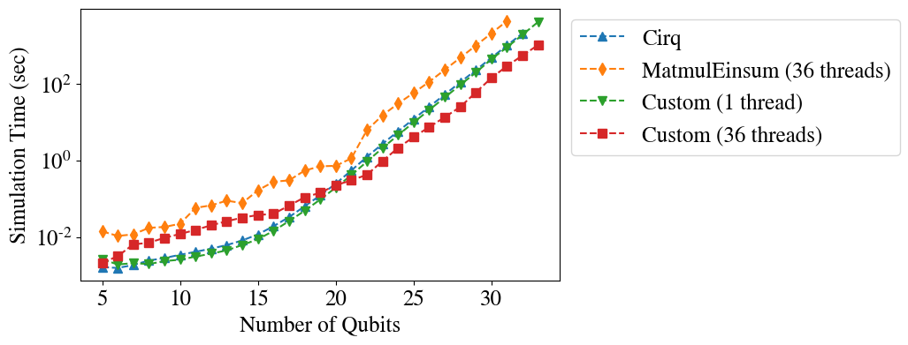

Benchmarks
==========

The performance of Qibo simulator can be verified using the scripts under the
``examples/benchmarks`` folder. In the following plot we compare two different Qibo
backends (the custom tensorflow operators and the ``MatmulEinsum`` backend)
with `Cirq <https://github.com/quantumlib/cirq>`_. The benchmarks are performed
on CPU and task is the Quantum Fourier Transform (QFT) using single
(``complex64``) precision.

|qft benchmark|

How to execute benchmarks?
--------------------------

The main benchmark script is ``examples/benchmarks/main.py``. This can be
executed as ``python main.py (FLAGS)`` where ``(FLAGS)`` supports
the following options:

* ``--nqubits``: Number of qubits in the circuit. Can be a single integer or an interval defined with a dash (``-``) as ``a-b``. For example ``--nqubits 5-10`` will run the benchmark for all ``nqubits`` from 5 to 10 inclusive.

* ``--backend``: Qibo backend to use for the calculation. Available backends are ``"custom"``, ``"matmuleinsum"`` and ``"defaulteinsum"``. ``"custom"`` is the default backend.

* ``--device``: Tensorflow device to use for the benchmarks, for example ``/GPU:0`` or ``/CPU:0``.

* ``--type``: Type of benchmark circuit. Read bellow for available circuit types.

* ``--nshots``: Number of measurement shots. If not given no measurements will be performed and the benchmark will terminate once the final state vector is found.

* ``--compile``: If used, the circuit will be compiled using ``tf.function``. Custom CPU operators do not support compilation.

When a benchmark is executed, the total simulation time will be printed on the
terminal once the simulation finishes. Optionally execution times can be saved
in a ``.h5`` file. This can be enabled by passing the following additional flags:

* ``--directory``: Directory where the ``.h5`` will be saved.

* ``--name``: Name of the ``.h5`` file.

If the file exists in the given directory an error will be raised. The saved file
contains two arrays with the following keys:

  1. ``nqubits``: List with the number of qubits.
  2. ``creation_time``: List with the time required to create the circuit for each number of qubits.
  3. ``simulation_time``: List with the total execution time for each number of qubits.

If ``--compile`` option is used, then the measured simulation time is the second call,
while the execution time of the first call is saved as ``compile_time``.

Available Circuit Types
"""""""""""""""""""""""

As explained above, the circuit to be used in the benchmarks can be selected
using the ``--type`` flag. This accepts one of the following options:

* ``qft``: Circuit for `Quantum Fourier Transform <https://en.wikipedia.org/wiki/Quantum_Fourier_transform>`_.
    This circuit includes the SWAP gates that rearrange output qubits to their original input order.

* ``ghz``: Circuit that prepares the `GHZ state <https://en.wikipedia.org/wiki/Greenberger%E2%80%93Horne%E2%80%93Zeilinger_state>`_.
    .

* ``supremacy``: Circuit with alternating layers of random one qubit gates and layers of ``CZPow`` gates.
    This structure is inspired by the famous `Quantum supremacy experiment <https://www.nature.com/articles/s41586-019-1666-5>`_,
    although the exact circuits used in our benchmarks differ from the original.
    Here one qubit gates are randomly selected among the set ``{RX, RY, RZ}`` and have random phases.
    Each layer of one qubit gates is followed by a layer of ``CZPow`` gates that entangle two different qubits each time.

* ``variational``: Circuit with a layer of parametrized ``RY`` gates followed by a layer of entangling
    ``CZ`` gates. The parameters of ``RY`` gates are sampled randomly in from 0 to 2pi.
    The two layers can be repeated using the ``--nlayers`` flag.

* ``opt-variational``: Same as ``variational`` but defined using the ::class:`qibo.base.gates.VariationalLayer`
    gate. This gate is optimized for such types of circuits by fusing the parametrized with the entangling
    gates before applying them to the state vector.

* ``one-qubit-gate``: Circuit that consists of a single one qubit gate that is applied to every qubit.
    This accepts three additional flags: ``--gate-type`` selects which one qubit gate will be used,
    ``--nlayers`` selects the number layers (number of times the gate is applied to each qubit) and
    ``--theta`` and/or ``--phi`` choose the parameters for the case of parametrized gates (such as rotations).

* ``two-qubit-gate``: Same as the one-qubit gate benchmark but for two qubit gates.
    The same flags as above are supported. A single layer consists of gates between
    all nearest-neighbor pairs.

Gate Benchmark Results
----------------------

The following tables show the time required to run the ``one-qubit-gate`` or
``two-qubit-gate`` benchmark for various gates. Benchmarks were performed on
CPU using single precision (``complex64``).

.. list-table:: Single precision one-qubit gate layer times (sec)
   :widths: 50 20 20 20
   :header-rows: 1

   * - Number of qubits
     - 27
     - 28
     - 29
   * - H (1 thread)
     - 11.031
     - 24.072
     - 53.757
   * - H (36 threads)
     - 4.753
     - 9.516
     - 21.524
   * - X (1 thread)
     - 4.470
     - 9.461
     - 18.939
   * - X (36 threads)
     - 4.503
     - 8.883
     - 17.943
   * - Z (1 thread)
     - 3.624
     - 7.468
     - 15.285
   * - Z (36 threads)
     - 3.965
     - 7.929
     - 16.244

.. list-table:: Single precision two-qubit gate layer times (sec)
   :widths: 50 20 20 20
   :header-rows: 1

   * - Number of qubits
     - 27
     - 28
     - 29
   * - CNOT (1 thread)
     - 2.797
     - 5.750
     - 11.749
   * - CNOT (36 threads)
     - 2.251
     - 4.646
     - 9.413
   * - CZPow (1 thread)
     - 3.160
     - 6.469
     - 13.270
   * - CZPow (36 threads)
     - 2.128
     - 4.165
     - 8.523
   * - SWAP (1 thread)
     - 2.262
     - 4.665
     - 9.515
   * - SWAP (36 threads)
     - 0.704
     - 1.445
     - 2.944

The following table shows times corresponding to the plot presented on top of
the current page:

.. list-table:: Single-precision Quantum Fourier Transform times (sec)
   :widths: 15 30 30 30
   :header-rows: 1

   * - Number of qubits
     - Cirq0.8
     - Qibo (1 thread)
     - Qibo (36 threads)
   * - 27
     - 53.754
     - 45.182
     - 13.766
   * - 28
     - 112.990
     - 96.209
     - 25.553
   * - 29
     - 235.410
     - 203.323
     - 61.558
   * - 30
     - 495.829
     - 455.459
     - 146.890
   * - 31
     - 1044.066
     - 929.243
     - 301.288
   * - 32
     - 2166.683
     - 1993.855
     - 571.500
   * - 33
     -
     - 4308.784
     - 1068.484
