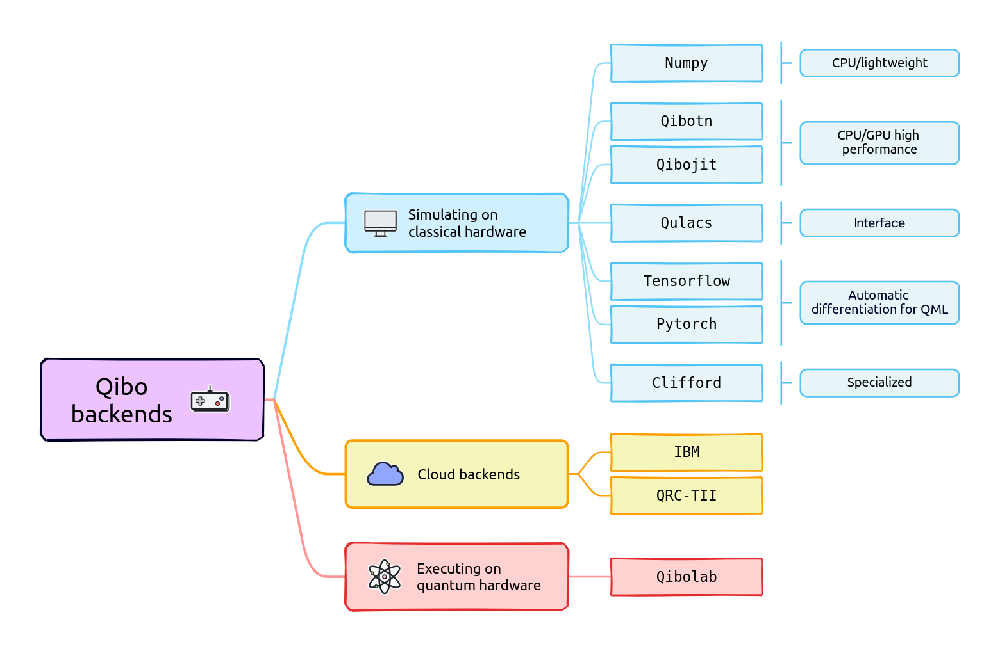

.. _backend-drivers:

Backend drivers
===============

Qibo provides backends for quantum simulation on classical
hardware and quantum hardware management and control. In the image below we
present a schematic view of the currently supported backends.

Quantum simulation is proposed through dedicated backends for single node
multi-GPU and multi-threading CPU setups. Quantum hardware control is supported
for chips based on superconducting qubits.

.. _packages:

Following the overview description above, in this section we present the python
packages for the modules and backends presented.

_______________________

Base package
^^^^^^^^^^^^

* :ref:`installing-qibo` is the base package for coding and using the API. This package contains all primitives and algorithms for start coding quantum circuits, adiabatic evolution and more (see :ref:`Components`). This package comes with a lightweight quantum simulator based on :ref:`installing-numpy` which works on multiple CPU architectures such as x86 and arm64.

.. _simulation-backends:

Simulation backends
^^^^^^^^^^^^^^^^^^^

We provide multiple simulation backends for Qibo, which are automatically loaded
if the corresponding packages are installed, following the hierarchy below:

* :ref:`installing-qibojit`: an efficient simulation backend for CPU, GPU and multi-GPU based on just-in-time (JIT) compiled custom operators. Install this package if you need to simulate quantum circuits with large number of qubits or complex quantum algorithms which may benefit from computing parallelism.
* :ref:`installing-tensorflow`: a pure TensorFlow implementation for quantum simulation which provides access to gradient descent optimization and the possibility to implement classical and quantum architectures together. This backend is not optimized for memory and speed, use :ref:`installing-qibojit` instead.
* :ref:`installing-numpy`: a lightweight quantum simulator shipped with the :ref:`installing-qibo` base package. Use this simulator if your CPU architecture is not supported by the other backends. Please note that the simulation performance is quite poor in comparison to other backends.

The default backend that is used is the first available from the above list.
The user can switch to a different using the ``qibo.set_backend`` method
(see :ref:`Backends <Backends>` section for more details).

The active default backend will be printed as an info message the first time
Qibo is imported in the code. If qibojit is not installed, an additional warning
will appear prompting the user to install one of the two for increased
performance and multi-threading and/or GPU capabilities. The logging level can
be controlled using the ``QIBO_LOG_LEVEL`` environment variable. This can be set
to 3 to hide info messages or 4 to hide both info and warning messages. The
default value is 1 allowing all messages to appear.

.. _hardware-backends:

Hardware backends
^^^^^^^^^^^^^^^^^

We provide the following hardware control backends for Qibo:

* qibolab (*under development*): a module for laboratories.

