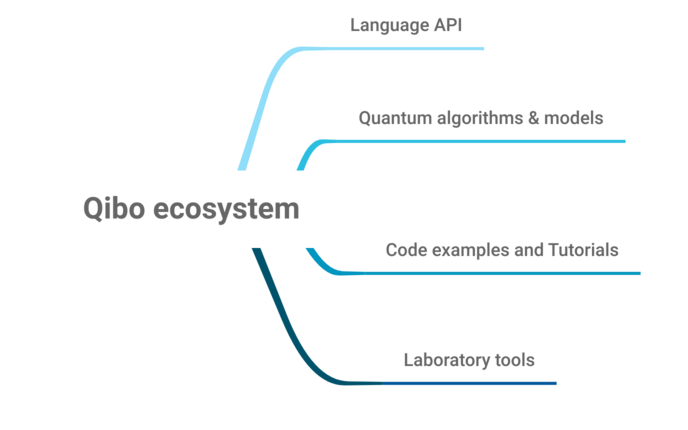

Why Qibo?
=========

The Qibo project targets the development of an open-source full stack API for
quantum simulation and quantum hardware control.

Quantum technologies, such as NISQ devices, are developed by research
institutions and require a high level of knowledge of the physics and electronic
devices used to prepare, execute and retrieve measurements from the experimental
apparatus.

In this context, Qibo proposes an agnostic approach to quantum simulation and
hardware control, providing the required components and standards to quickly
connect the classical hardware and experimental setup into a software stack
which automates all aspects of a quantum computation.

In the picture below, we summarize the major components of the Qibo "ecosystem".

The first component is the language API, based on Python 3, which defines the
interface for the development of quantum applications, models and new
algorithms. We also provide a large code-base of models and algorithms,
presented with code examples and step-by-step tutorials. Finally, we provide
several tools for the laboratory management and quantum hardware control.

Qibo provides a plug and play mechanism of :ref:`backend drivers <backend-drivers>` which
specializes the code for quantum simulation on different classical hardware
configurations, such as multi-threading CPU, single GPU and multi-GPU, and
similarly for quantum hardware control, from superconducting to ion trap
technologies including FPGA and AWG devices.
