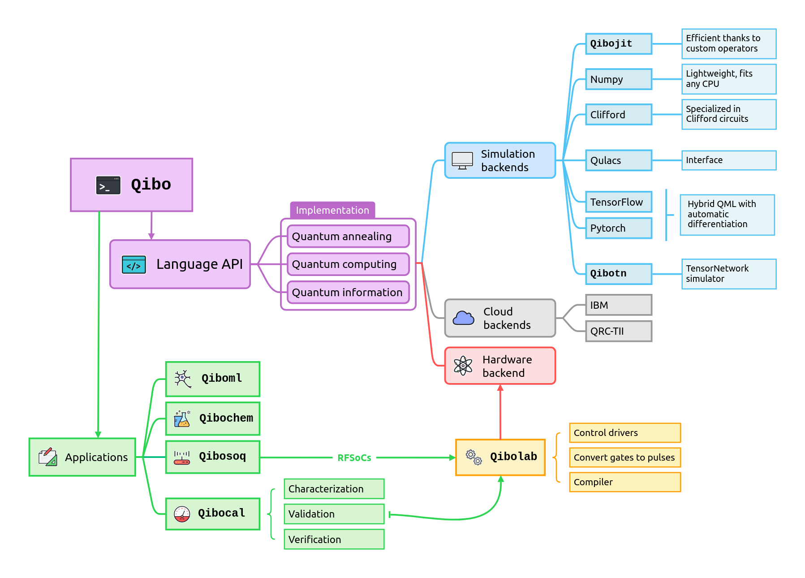

.. title::
      Qibo

What is Qibo?
=============

.. image:: https://zenodo.org/badge/DOI/10.5281/zenodo.3997195.svg
   :target: https://doi.org/10.5281/zenodo.3997195

Qibo is an open-source full stack API for quantum simulation and quantum hardware control.
Qibo aims to contribute as a community driven quantum middleware software with

1. *Simplicity:* agnostic design to quantum primitives.
2. *Flexibility:* transparent mechanism to execute code on classical and quantum hardware.
3. *Community:* a common place where find solutions to accelerate quantum development.
4. *Documentation:* describe all steps required to support new quantum devices or simulators.
5. *Applications:* maintain a large ecosystem of applications, quantum models and algorithms.

Components
----------

The main components of ``Qibo`` are presented in :doc:`getting-started/index`

Key features
------------

* Definition of a standard language for the construction and execution of quantum circuits with device agnostic approach to simulation and quantum hardware control based on plug and play backend drivers.
* A continuously growing code-base of quantum algorithms applications presented with examples and tutorials.
* Efficient simulation backends with GPU, multi-GPU and CPU with multi-threading support.
* Simple mechanism for the implementation of new simulation and hardware backend drivers.

How to Use the Documentation
============================

Welcome to the comprehensive documentation for ``Qibo``! This guide will help
you navigate through the various sections and make the most of the resources
available.

1. **Installation and Setup**: Begin by referring to the
   :doc:`/getting-started/index` and :doc:`/getting-started/backends` guide to
   set up the ``Qibo`` library in your environment.

2. **Tutorials**: Explore the :doc:`/code-examples/index` section for a range of
   tutorials that cater to different levels of expertise. These tutorials cover
   basic examples, advanced examples and tutorials with algorithm for specific
   applications.

3. **API Documentation**: Dive into the :doc:`/api-reference/index` section,
   which offers a detailed overview of the main components that constitute the
   ``Qibo`` API. This section provides a comprehensive understanding of the key
   elements, helping you build a holistic view of the API's capabilities.

4. **Backends**: The documentation present in this document is limited to Qibo's
   high-level API, please visit the external links listed in the left navigation
   bar to learn more about external backends such as ``Qibolab``.

Contents
========

.. toctree::
    :maxdepth: 2
    :caption: Introduction

    getting-started/index
    code-examples/index

.. toctree::
    :maxdepth: 2
    :caption: Main documentation

    api-reference/index
    developer-guides/index

.. toctree::
    :maxdepth: 2
    :caption: Appendix

    appendix/citing-qibo

.. toctree::
    :maxdepth: 1
    :caption: Documentation links

    Qibo docs <https://qibo.science/qibo/stable/>
    Qibolab docs <https://qibo.science/qibolab/stable/>
    Qibocal docs <https://qibo.science/qibocal/stable/>
    Qibosoq docs <https://qibo.science/qibosoq/stable/>
    Qibochem docs <https://qibo.science/qibochem/stable/>
    Qibotn docs <https://qibo.science/qibotn/stable/>
    Qibo-cloud-backends docs <https://qibo.science/qibo-cloud-backends/stable/>

Indices and tables
==================

* :ref:`genindex`
* :ref:`search`

Supporters and collaborators
============================

* Quantum Research Center, Technology Innovation Institute (TII), United Arab Emirates
* Università degli Studi di Milano (UNIMI), Italy.
* Istituto Nazionale di Fisica Nucleare (INFN), Italy.
* Università degli Studi di Milano-Bicocca (UNIMIB), Italy.
* European Organization for Nuclear research (CERN), Switzerland.
* Universitat de Barcelona (UB), Spain.
* Barcelona Supercomputing Center (BSC), Spain.
* Qilimanjaro Quantum Tech, Spain.
* Centre for Quantum Technologies (CQT), Singapore.
* Institute of High Performance Computing (IHPC), Singapore.
* National Supercomputing Centre (NSCC), Singapore.
* RIKEN Center for Computational Science (R-CCS), Japan.
* NVIDIA (cuQuantum), USA.
