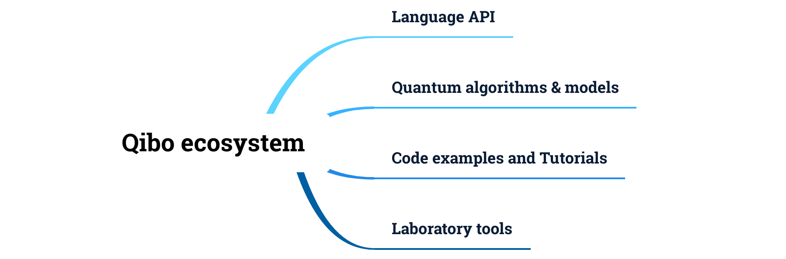

Overview and installation
=========================

The Qibo project targets the development of an open-source full stack API for
quantum simulation and quantum hardware control.

Quantum technologies, such as NISQ devices, are developed by research
institutions and require a high level of knowledge of the physics and electronic
devices used to prepare, execute and retrieve measurements from the experimental
apparatus.

In this context, Qibo proposes an agnostic approach to quantum simulation and
hardware control, providing the required components and standards to quickly
connect the classical hardware and experimental setup into a software stack
which automates all aspects of a quantum computation.

In the picture below, we summarize the major components of the Qibo "ecosystem".

The first component is the language API, based on Python 3, which defines the
interface for the development of quantum applications, models and new
algorithms. We also provide a large code-base of models and algorithms,
presented with code examples and step-by-step tutorials. Finally, we provide
several tools for the laboratory management and quantum hardware control.

Qibo provides a plug and play mechanism of :ref:`backend drivers <backend-drivers>` which
specializes the code for quantum simulation on different classical hardware
configurations, such as multi-threading CPU, single GPU and multi-GPU, and
similarly for quantum hardware control, from superconducting to ion trap
technologies including FPGA and AWG devices.

_______________________

.. _backend-drivers:

Backend drivers
---------------

As mentioned above, we provide backends for quantum simulation on classical
hardware and quantum hardware management and control. In the image below we
present a schematic view of the currently supported backends.

.. image:: backends.png

Quantum simulation is proposed through dedicated backends for single node
multi-GPU and multi-threading CPU setups. Quantum hardware control is supported
for chips based on superconducting qubits.

_______________________

Packages
--------

Following the overview description above, in this section we present the python
packages for the modules and backends presented.

Base package
^^^^^^^^^^^^

* :ref:`installing-qibo` is the base package for coding and using the API. This package contains all primitives and algorithms for start coding quantum circuits, adiabatic evolution and more (see :ref:`Components`). This package comes with a lightweight quantum simulator which works on multiple CPU architectures such as x86 and arm64.

.. _simulation-backends:

Simulation backends
^^^^^^^^^^^^^^^^^^^

We provide multiple simulation backends for Qibo, which are automatically loaded
if the corresponding packages are installed, following the hierarchy below:

* :ref:`installing-qibotf` (*recommended*): an efficient simulation backend for CPU, GPU and multi-GPU based on TensorFlow custom operators. Install this package if you need to simulate quantum circuits with large number of qubits or complex quantum algorithms which may benefit from computing parallelism.
* :ref:`installing-qibojit` (*experimental*): an efficient simulation backend for CPU, GPU and multi-GPU based on just-in-time (JIT) compiled custom operators. Install this package if you need to simulate quantum circuits with large number of qubits or complex quantum algorithms which may benefit from computing parallelism.
* :ref:`installing-tensorflow`: a pure TensorFlow implementation for quantum simulation which provides access to gradient descent optimization and the possibility to implement classical and quantum architectures together. This backend is not optimized for memory and speed, use :ref:`installing-qibotf` instead.
* :ref:`installing-numpy`: a lightweight quantum simulator shipped with the :ref:`installing-qibo` base package. Use this simulator if your CPU architecture is not supported by the other backends. Please note that the simulation performance is quite poor in comparison to other backends.

.. _hardware-backends:

Hardware backends
^^^^^^^^^^^^^^^^^

We provide the following hardware control backends for Qibo:

* :ref:`installing-qiboicarusq`: a module for laboratories, containing the specifics to operate Qibo on chips based on superconducting qubits, designed specifically for the IcarusQ experiment at `CQT <https://https://www.quantumlah.org/>`_.

_______________________

Operating systems support
-------------------------

In the table below we summarize the status of *pre-compiled binaries
distributed with pypi* for the packages listed above.

+------------------+------+------------------+---------+------------+
| Operating System | qibo | qibotf (cpu/gpu) | qibojit | tensorflow |
+==================+======+==================+=========+============+
| Linux x86        | Yes  | Yes/Yes          | Yes     | Yes        |
+------------------+------+------------------+---------+------------+
| MacOS >= 10.15   | Yes  | Yes/No           | Yes     | Yes        |
+------------------+------+------------------+---------+------------+
| Windows          | Yes  | No/No            | Yes     | Yes        |
+------------------+------+------------------+---------+------------+

.. note::
      All packages are supported for Python >= 3.6.

_______________________

Installation instructions
-------------------------

.. _installing-qibo:

qibo
^^^^

The ``qibo`` is the base required package which includes the language API and a
lightweight cross-platform simulator based on ``numpy``. In order to accelerate
simulation please consider specialized backends listed in
:ref:`simulation-backends`.

Installing with pip
"""""""""""""""""""

The installation using ``pip`` is the recommended approach to install Qibo.
Make sure you have Python 3.6 or greater, then use ``pip`` to install ``qibo`` with:

.. code-block:: bash

      pip install qibo

The ``pip`` program will download and install all the required
dependencies for Qibo.

Installing from source
""""""""""""""""""""""

The installation procedure presented in this section is useful when you have to develop the code from source.

In order to install Qibo from source, you can simply clone the GitHub repository with

.. code-block::

      git clone https://github.com/qiboteam/qibo.git
      cd qibo
      pip install . # or pip install -e .

_______________________

.. _installing-qibotf:

qibotf
^^^^^^

The ``qibotf`` package contains a custom simulator implementation based on
TensorFlow and custom operators in CUDA/C++.

This backend is used by default, however, if needed, in order to switch to the
``qibotf`` backend please do:

.. code-block:: python

      import qibo
      qibo.set_backend("qibotf")

Installing with pip
"""""""""""""""""""

The installation using ``pip`` is the recommended approach to install
``qibotf``. We provide precompiled packages for linux x86/64 and macosx 10.15 or
greater for Python 3.6, 3.7, 3.8 and 3.9.

In order to install the package use the following command:

.. code-block:: bash

      pip install qibo[qibotf]

The ``pip`` program will download and install all the required
dependencies.

.. note::
    The ``pip`` packages for linux are compiled with CUDA support, so if your
    system has a NVIDIA GPU, Qibo will perform calculations on GPU. Note that
    ``qibotf`` uses TensorFlow for GPU management, if your system has a NVIDIA
    GPU, make sure TensorFlow runs on GPU, please refer to the `official
    documentation <https://www.tensorflow.org/install/gpu>`_.

Installing from source
""""""""""""""""""""""

The installation procedure presented in this section is useful if the
pre-compiled binary packages for your operating system is not available or if
you have to develop the code from source.

In order to install the package perform the following steps:

.. code-block::

      git clone https://github.com/qiboteam/qibotf.git
      cd qibotf

then proceed with the installation of requirements with:

.. code-block::

      pip install -r requirements.txt

Make sure your system has a GNU ``g++ >= 4`` compiler. If you are working on
macosx make sure the command ``c++`` is ``clang >= 11`` and install the libomp
library with ``brew install libomp`` command.

Optionally, you can use the ``CXX`` environment variable to set then compiler
path. Similarly, the ``PYTHON`` environment variable sets the python interpreter
path.

.. note::
      If your system has a NVIDIA GPU, make sure TensorFlow is installed
      properly and runs on GPU, please refer to the `official
      documentation <https://www.tensorflow.org/install/gpu>`_.

      In that case, you can activate GPU support for Qibo by:

      1. installing the NVCC compiler matching the TensorFlow CUDA version, see the `CUDA documentation <https://docs.nvidia.com/cuda/cuda-installation-guide-linux/index.html>`_.

      2. exporting the ``CUDA_PATH`` variable with the CUDA installation path containing the cuda compiler.

      3. make sure the NVCC compiler is available from ``CUDA_PATH/bin/nvcc``, otherwise the compilation may fail. You can locate it with ``whereis nvcc`` and eventually link/copy to your ``CUDA_PATH/bin`` folder.

      For example, TensorFlow 2.5.0 supports CUDA 11.2. After installing
      TensorFlow proceed with the NVCC 11.2 installation. On linux the
      installation path usually is ``/usr/local/cuda-11.2/``.

      Before installing Qibo do ``export CUDA_PATH=/usr/local/cuda-11.2``.

      Note that Qibo will not enable GPU support if points 1 and 2 are not
      performed.

Then proceed with the ``qibotf`` installation using ``pip``

.. code-block::

      pip install .

or if you prefer to manually execute all installation steps:

.. code-block::

      # builds binaries
      python setup.py build

      # installs the Qibo packages
      python setup.py install # or python setup.py develop

_______________________

.. _installing-qibojit:

qibojit
^^^^^^^

The ``qibojit`` package contains a simulator implementation based on
just-in-time (JIT) custom kernels using `numba <https://numba.pydata.org/>`_
and `cupy <https://cupy.dev/>`_.

This backend is *experimental*, however, if needed, in order to switch to the
``qibojit`` backend please do:

.. code-block:: python

      import qibo
      qibo.set_backend("qibojit")

Installing with pip
"""""""""""""""""""

The installation using ``pip`` is the recommended approach to install
``qibojit``.

In order to install the package use the following command:

.. code-block:: bash

      pip install qibo[qibojit]

The ``pip`` program will download and install all the required
dependencies.

.. note::
      The ``pip`` package requires a cupy pre-compiled version with CUDA
      support, so make sure the `cupy <https://cupy.dev/>`_ version installed
      matches the specifics of your GPU and drivers.

Installing from source
""""""""""""""""""""""

The installation procedure presented in this section is useful if you have to
develop the code from source.

In order to install the package perform the following steps:

.. code-block::

      git clone https://github.com/qiboteam/qibojit.git
      cd qibojit

then proceed with the installation of requirements with:

.. code-block::

      pip install -r requirements.txt

Then proceed with the ``qibojit`` installation using ``pip``

.. code-block::

      pip install .

or if you prefer to manually execute all installation steps:

.. code-block::

      # builds binaries
      python setup.py develop

_______________________

.. _installing-tensorflow:

tensorflow
^^^^^^^^^^

If the `TensorFlow <https://www.tensorflow.org>`_ package is installed Qibo
will detect and provide to the user the possibility to use ``tensorflow``
backend.

This backend is used by default if ``qibotf`` is not installed, however, if
needed, in order to switch to the ``tensorflow`` backend please do:

.. code-block:: python

      import qibo
      qibo.set_backend("tensorflow")

In order to install the package, we recommend the installation using:

.. code-block:: bash

      pip install qibo[tensorflow]

.. note::
      TensorFlow can be installed following its `documentation
      <https://www.tensorflow.org/install>`_.

_______________________

.. _installing-numpy:

numpy
^^^^^

The ``qibo`` base package is distributed with a lightweight quantum simulator
shipped with the qibo base package. No extra packages are required.

This backend is used by default if ``qibotf`` or ``tensorflow`` are not
installed, however, if needed, in order to switch to the ``numpy`` backend
please do:

.. code-block:: python

      import qibo
      qibo.set_backend("numpy")

_______________________

.. _installing-qiboicarusq:

qiboicarusq
^^^^^^^^^^^

The ``qiboicarusq`` package contains the hardware control drivers for chips
based on superconducting qubits. More details are available at the code
`repository <https://github.com/qiboteam/qiboicarusq.git>`_.

This backend is designed for laboratories, in order to switch to the ``qiboicarusq``
backend please do:

.. code-block:: python

      import qibo
      qibo.set_backend("qiboicarusq")

Installing from source
""""""""""""""""""""""

The installation procedure presented in this section is useful if you have to
install and develop the code from source.

In order to install the package perform the following steps:

.. code-block::

      git clone https://github.com/qiboteam/qiboicarusq.git
      cd qiboicarusq

then proceed with the installation of requirements with:

.. code-block::

      pip install -r requirements.txt

Then proceed with the ``qiboicarusq`` installation using ``pip``

.. code-block::

      pip install .

or if you prefer to manually execute all installation steps:

.. code-block::

      # builds binaries
      python setup.py develop
