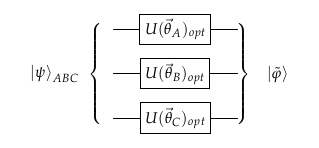
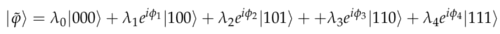
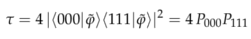
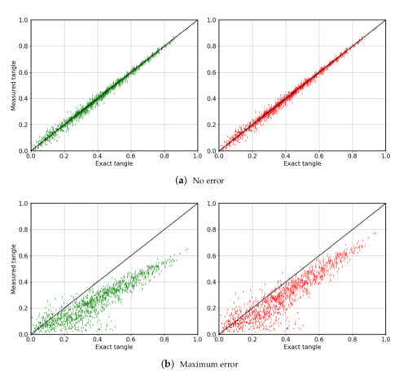

# Measuring the tangle of three-qubit states

Code at: [https://github.com/qiboteam/qibo/tree/master/examples/3_tangle](https://github.com/qiboteam/qibo/tree/master/examples/3_tangle).

Based in the paper [Entropy 2020, 22(4), 436](http://dx.doi.org/10.3390/e22040436). In this `README.md` file you can see a short
set of instructions for the usage of the example and brief explanations.

#### What this example does?

This example provides a variational strategy to compute the tangle of an unknown three-qubit state, given many copies of it.
It is based on the result that local unitary operations cannot affect the entanglement of any quantum state. In particular,
any three-qubit state can be transformed with local operations acting on every qubit into
a canonical form. From this canonical form, it is immediate to perform measurements that return an estimate of the tangle.
See [Phys. Rev. Lett. 85, 1560](https://journals.aps.org/prl/abstract/10.1103/PhysRevLett.85.1560) for more details.

The strategy is simple. An unknown three-qubit state is received, and then one unitary gate is applied in every qubit. The
exact gates are obtained following a minimization procedure. The set of gates chosen is such that minimizes the number
of outcomes of the states |001>, |010> and |011>. It is guaranteed that this quantity can be exactly zero for any state
for noiseless devices. The circuit is just

with

The tangle is computed through

#### Usage
In this example there are only two files
- `canonizator.py` contains all functions that are needed to run the experiment.
- `main.py` is the file calling all other functions. The action of every line of code is commented in the source code.

The parameters to be fixed for a run of the experiment are
- `N`: Number of random states considered
- `p`: probability of occurring an error
- `shots`: shots for measuring the optimized tangle
- `post_selection`: whether we discarded bad outcomes or not, useful for noisy devices

#### Results

This example looks for the difference between the exact and the measured tangles. Plots pop up at the end of the `main.py`
file. For completeness, we present here some results as obtained in the main reference. The black line in the figure below
represents the optimal performance of the algorithm, that is, the measured tangle is equal to the exact one. At the top,
no errors are considered, at the bottom there is noise in the device. Red plots consider post-selection, while green ones
do not. As expected, less noise and post-selection lead to more accurate estimates of the tangle.

_Note_: The number of random state for this example is 100. This may lead to a long run in terms of execution time.
Consider decreasing the number of points.
