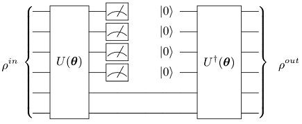
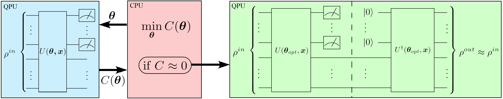
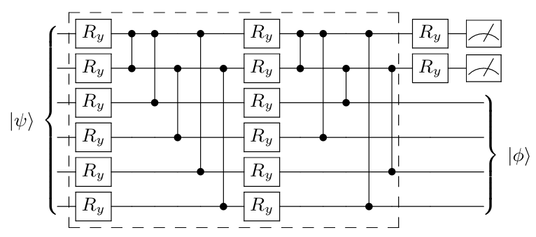
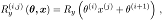
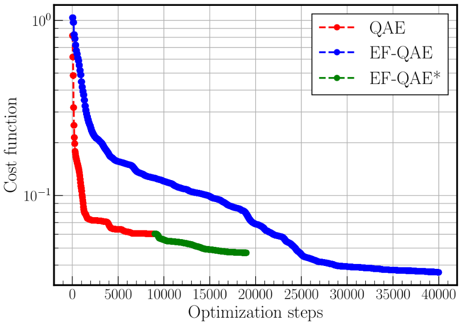
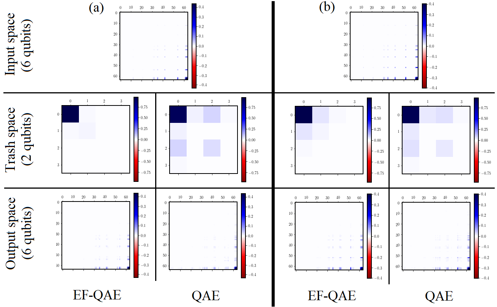
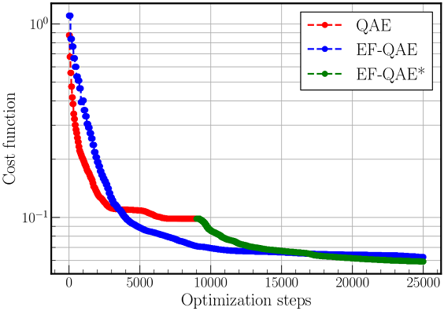
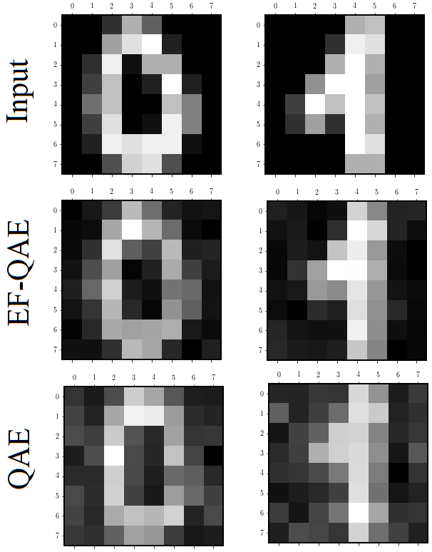

# Quantum autoencoders with enhanced data encoding

Code at: [https://github.com/Quantum-TII/qibo/tree/master/examples/EF_QAE](https://github.com/Quantum-TII/qibo/tree/master/examples/EF_QAE).

## Problem overview

Noisy intermediate-scale quantum computers are limited by coherence times and gate errors. Therefore, any algorithm that reduces quantum computational resources is especially valuable in the near future. Here, we present the enhanced feature quantum autoencoder (EF-QAE). As we will see, its key ingredient is to define a parameterized quantum circuit that depends upon adjustable parameters and a feature vector that characterizes the model we aim to compress. 

Remarkably, EF-QAE achieves better compression than the standard [quantum autoencoder (QAE)](https://iopscience.iop.org/article/10.1088/2058-9565/aa8072) using the same amount of limited quantum resources. In contrast, it needs additional classical optimization.  In this sense, EF-QAE is a step toward what could be done on NISQ computers, shortening the distance between current quantum devices and practical applications.

## Implementing the solution

The code herein aims to implement the EF-QAE, based on the manuscript ["Quantum autoencoders with enhanced data encoding"](https://arxiv.org/abs/2010.?????). A tutorial based on the standard QAE can be found at [https://github.com/Quantum-TII/qibo/tree/master/examples/autoencoder](https://github.com/Quantum-TII/qibo/tree/master/examples/autoencoder).

A graphical depiction of a quantum encoder can be seen in the following figure. In a quantum encoder the information contained in some of the input qubits must be discarded after the initial encoding. Then, fresh qubits (here initialized to the |0> state, but one may consider any other easy-to-construct reference state) are prepared and used to implement the final decoding, which is finally compared to the initial state.



In the following, however, we present the EF-QAE. A schematic diagram of the EF-QAE can be seen in the next figure. The algorithm can be initialized with a set of initial states, a feature vector **x**, and a shallow sequence of quantum gates U. In this scheme, we define a unitary U(**θ**, **x**) acting on the initial state, where **x** is a feature vector that characterizes the set of input states. For instance, as we will see, **x** may be the transverse field λ of the 1D Ising spin chain. Once the trial state is prepared, measurements are performed to evaluate the cost function C(**θ**). This result is then fed into the classical optimizer, where the parameters **θ** are adjusted in a quantum-classical loop until the cost function converges to a value close to 0. When the loop terminates, U(**θ**<sub>opt</sub>, **x**) prepares compressed states of a particular model.



A figure of merit for the wrong answer when training is simply the total amount of non-zero measurement outcomes on the discarded qubits, which shall be minimized. In order to design the cost function to be local, different outcomes may be penalized by their Hamming distance to the |0> state, which is just the number of symbols that are different in the binary representation. Notice that this cost function has a value of zero if and only if the compression is successfully completed.

To implement the quantum autoencoder model on a quantum computer we must define the form of the parametrized unitary, decomposing it into a quantum circuit suitable for optimization. This can be done using a similar structure to that in the following figure.



We now encode the feature vector **x** into each of the single R<sub>y</sub> qubit rotations by using a linear function as



where *i*,*j* simply indicates a component of the vector, and **θ** are the parameters adjusted in the optimization loop.

## How to run an example?

To run a particular instance of the problem we have to set up the initial
arguments:
- `layers` (int): number of ansatz layers.
- `autoencoder` (int): 0 to run the EF-QAE or 1 to run the QAE.
- `example` (int): 0 to run Ising model example or 1 to run the Handwritten digits example.

As an example, in order to use 3 layers in our variational quantum ansatz on the EF-QAE for the Ising model example,
you should execute the following command:

```python
python main.py --layers 3 --autoencoder 0 --example 0
```

## Interpreting results

### Ising model

The EF-QAE can be verified on simulations. In the following, we benchmark both the EF-QAE and the standard QAE in the case of a paradigmatic quantum spin chain with 6 qubits, the transverse field Ising model. The EF-QAE and QAE are optimized over a training set of ground states of the Ising model. Specifically, we have considered N=20 equispaced ground states in between λ=0.5 and λ=1.0, with initial random parameters. We have considered the above variational quantum circuit with 3 layers, and therefore, the resulting compressed state contains 4 qubits. Note that the feature vector **x** for the EF-QAE is simply a scalar that takes the value of the transverse field λ.

In the following figure, we show the cost function value as a function of the number of optimization steps. The EF-QAE* is simply the EF-QAE initialized with the optimal parameters of QAE. This way, the EF-QAE* will always improve the QAE performance. As can be seen, the EF-QAE achieves twice the compression of the QAE using the same quantum resources. Notice, however, that the EF-QAE contains twice as many variational parameters, and therefore, the increase in performance is at the expense of additional classical optimization.



Now, we can play around with the code and assess both EF-QAE and QAE with the optimal parameters against two test ground states of the Ising model, specifically, with λ=0.60 and λ=0.75. This can be done by applying U<sup>†</sup>(**θ**<sub>opt</sub>, **x**) to the compressed test state, initializing two qubits to |00>. The results are shown in the following figure. Here, we show a density matrix visualization of the input, trash, and output state. The EF-QAE achieves better compression to the |00> trash state, and therefore, higher fidelity on the output state. As we change the values of the transverse field, we note that the compression differs. Both cases considered, however, the performance of the EF-QAE is preferable.



### Handwritten digits

Here, we benchmark EF-QAE and QAE models in the case of 8x8 handwritten digit compression with 6 qubits using 4 layers. The data comprising each digit consists of a matrix with values from 0 to 16 corresponding to a gray map. Each value of this matrix is encoded in the amplitude of a 6-qubit state, further restricted to normalization.

The EF-QAE and QAE are optimized over a training set of handwritten digits obtained from the Python package ["Scikit Learn"](https://scikit-learn.org/stable/modules/generated/sklearn.datasets.load_digits.html). Specifically, we have considered N=20 handwritten digits, 10 of each corresponding to **0** or **1**. The simulation details are equivalent to those in the previous section. Here, the feature vector for the EF-QAE corresponds to **x**=(1,2). That is, we simply input a value of x=1 (x=2) if the handwritten digit corresponds to **0** (**1**).

In the following figure, we show the cost function value as a function of the number of optimization steps. Recall that EF-QAE* is simply the EF-QAE initialized with the optimal parameters of QAE. The behavior is similar to the one observed in the case of the Ising model, where the EF-QAE achieves three times the compression of the QAE using the same quantum resources.



Once again, to gain insight into the compression process, we assess both EF-QAE and QAE with the optimal parameters against two handwritten test digits corresponding to **0** and **1**. The results are shown in the following figure. Here, we plot the output digit of the EF-QAE and QAE. Once more, since EF-QAE achieves better compression to the |00> trash state, we obtain higher fidelity on the output state. Remarkably, in both cases, the performance of the EF-QAE is improved with respect to the QAE.


