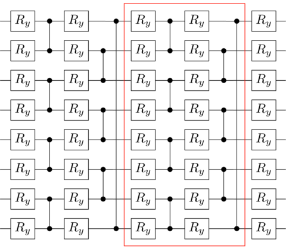
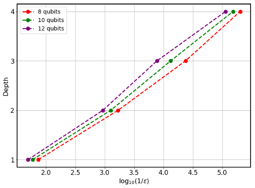
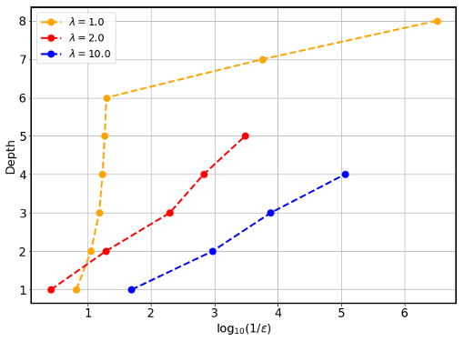

# Scaling of variational quantum circuit depth for condensed matter systems
## Problem
Strongly-correlated many-body systems can give rise to exceptional quantum phenomena. In particular, the Ising model or the XXZ model have fundamental significance in condensed matter physics, and thus the realization of these systems may attract tremendous interest. Indeed, it is then an ambitious goal to prepare the ground state of those systems, and gain some insight into the physics of the problem.

## Implement the solution
The code herein aims to reproduce the results of the manuscript ["Scaling of variational quantum circuit depth for condensed matter systems"](https://quantum-journal.org/papers/q-2020-05-28-272/). The idea is to benchmark the accuracy of the [Variational Quantum Eigensolver (VQE)](https://www.nature.com/articles/ncomms5213) based on a finite-depth variational quantum circuit encoding ground states of local Hamiltonians, namely, the Ising and XXZ models. We focus on a fixed geometry of the network represented in  the following figure. It can either be interpreted as the Floquet evolution of a local Hamiltonian or as a Trotter approximation of continuous evolution by a local Hamiltonian defined on a line.

Notice that any potential advantage of the VQE could be lost without practical approaches to perform the parameter optimization due to the optimization in the high-dimensional parameter landscape. A particular proposal to try to solve this optimization problem is the [Adiabatically Assisted Variational Quantum Eigensolver (AAVQE)](https://arxiv.org/abs/1806.02287). The AAVQE is a strategy circumventing the convergence issue, inspired by the adiabatic theorem. The AAVQE method consists of parametrizing a Hamiltonian as H = (1-s)H0 + sHP where H0 is a Hamiltonian for which ground state can be easily prepared, HP is the problem Hamiltonian, and s = [0,1] is the interpolation parameter. The interpolation parameter is used to adjust the Hamiltonian from one VQE run to the next, and the state preparation parameters at each step are initialized by the optimized parameters of the previous step.

## How to run an example
To run a particular instance of the problem we have to set up the initial arguments:
- nqubits (int): number of quantum bits.
- layers (int): number of ansatz layers.
- maxsteps (int): number of maximum steps on each adiabatic path.
- T_max (int): number of maximum adiabatic paths.
- initial_parameters (array): values of the initial parameters.
- easy_hamiltonian (qibo.hamiltonians.Hamiltonian): initial Hamiltonian object, defined as sz_hamiltonian.
- problem_hamiltonian (qibo.hamiltonians.Hamiltonian): problem Hamiltonian object, namely, the Ising or XXZ hamiltonians.

  `python main.py --nqubits 4 --layers 2 --maxsteps 5000 --T_max 4`

## Results
A legitimate question is how accurate a variational circuit can be, and how close can the state we extract by running a AAVQE on our set of quantum circuits get to exact ground state of the system. Since we are dealing with finite systems, the Hamiltonians we are considering always have a gap (at least proportional to 1/n). We can bound the distance from our trial wave-function to the exact ground state with the difference on the energies ε = (EAAVQE - E0).   We will use this error in the ground state energy as a measure of the quality of the circuit. 

We may begin by considering the results for λ=10 in the Ising model. Notice that we can obtain the ground state in this regime in perturbation theory. Using the perturbation theory in the form of a continuous unitary transformation, we expect that the precision of our ansatz will scale exponentially with the number of layers. Our expectations are confirmed in the numerical results:

If you do not get those results, do not despair. Sometimes, fine-tuning of the arguments, i.e., maxsteps, T_max or the optimizer itself, is required, especially for a large number of qubits. Now we can repeat the same analysis for 12 qubits as we decrease λ towards the phase transition, i.e. at λ=1. 

For λ=2, we still appreciate an exponential scaling of the accuracy, but as expected, the slope of the semi-logarithmic plot is lower.  For λ=1, we appreciate that the behavior of the AAVQE ground state energy accuracy as a function of the number of layers changes drastically from the behavior observed at larger λ. Recall that λ=1 in the thermodynamic limit is the location of the phase transition between the two gapped phases. 

We can now perform numerical simulations of quantum circuits of several layers that are optimized to encode the ground state of systems with different sizes from 6 to 16 qubits with periodic boundary conditions. We can use the two Hamiltonians (Ising and XXZ Hamiltonians). In both cases, the Hamiltonians are tuned to a critical point, choosing λ=1 for the Ising model (left) and Δ=1/2 for the XXZ model (right).

 

The accuracy clearly shows two different regimes. Initially, the accuracy varies very little as we increase the number of layers, and hence the number of variational parameters and the entangling power of the circuit. The error indeed stays constant from one to several layers for the Ising and XXZ model. This behavior seems to be completely independent of the system size since curves obtained by optimizing the energy almost coincide. We thus seem to observe a finite-depth regime, where the precision of the variational scheme depends very little on the number of layers and improves very slowly. This regime changes drastically at a critical number of layers that strongly depends on the size of the system. At that critical number of layers, the precision improves several orders of magnitude abruptly. This improvement is particularly abrupt in the case of the Ising model, whereby just adding one layer, the accuracy can improve several orders of magnitude.  For the XXZ model, we see similar features though the overall accuracy is lower as a consequence of the higher amount of entanglement in the ground state.
