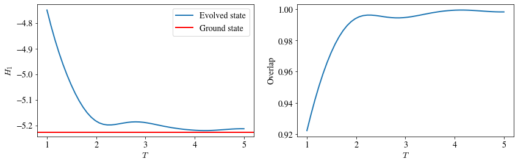

# Simple Adiabatic Evolution Examples

Code at: [https://github.com/Quantum-TII/qibo/tree/master/examples/adiabatic](https://github.com/Quantum-TII/qibo/tree/master/examples/adiabatic)

## Introduction

Qibo provides models for simulating the unitary evolution of state vectors as
well adiabatic evolution. The goal of adiabatic evolution is to find the ground
state of a "hard" Hamiltonian H1. To do so, an "easy" Hamiltonian
H0 is selected and the system is prepared in its ground state. The
system is then left to evolve under the slowly changing Hamiltonian
H(t) = (1 - s(t)) H0 + s(t) H1 for a total time T.
If the scheduling function s(t) and the total time T are chosen appropriately
the state at the end of this evolution will be the ground state of H1.

This example contains two scripts. The first performs the adiabatic evolution
for a given choice of s(t) and T and plots the dynamics of the H1
energy as well as the overlap between the evolved state and the actual ground
state of H1, which can be calculated via exact diagonalization for
small systems. The second script optimizes the total time T and a parametrized
family of s(t). Both scripts a sum of X operators H0 and the transverse field Ising model as H1.

## Adiabatic evolution dynamics

A simple adiabatic evolution example can be run using the `linear.py` script.
This supports the following options:

- `nqubits` (int): Number of qubits in the system.
- `hfield` (float): Transverse field Ising model (`qibo.hamiltonians.TFIM`) h-field h value.
- `T` (int): Total time of the adiabatic evolution.
- `dt` (float): Time step used for integration.
- `solver` (str): Solver used for integration.

The following plots correspond to the adiabatic evolution of N=4 qubits for
total time T=4 using linear scaling s(t)=t/T. At the left we show how the
expectation value of H1 changes during evolution and at the right we
plot the overlap between the evolved state and the ground state of H1.
We see that at the end of evolution the evolved state reaches the ground state.

To gain more insight on the importance of the total evolution time T, we repeat
the evolution for various choices of T and check how it affects the final
energy and overlap. This is shown in the following plot

We see that the best overlap for this example is obtained for T=4.

## Optimizing scheduling

An example of scheduling function optimization can be run using the `optimize.py`
script. This optimizes a polynomial ansatz for s(t) using the H1
energy as the loss function. The total evolution time T is also optimized as an
additional free parameter. The following options are supported:

- `nqubits` (int): Number of qubits in the system.
- `hfield` (float): Transverse field Ising model (`qibo.hamiltonians.TFIM`) h-field h value.
- `params` (str): Initial guess for free parameters. The numbers should be
    seperated using `,`. The last parameter is the initial guess for the total
    time T. The rest parameters are used to define the polynomial for s(t).
- `dt` (float): Time step used for integration.
- `solver` (str): Solver used for integration.
- `method` (str): Which scipy optimizer to use.
- `maxiter` (int): Maximum iterations for scipy optimizer.
- `save` (str): Name to use for saving optimization history.
    If ``None`` history will not be saved.

The following plots show correspond to the optimization of a 3rd order
polynomial for s(t). The first plot shows the final form of s(t) after
optimization. The second plot shows how the loss function changed during
optimization. The second line of plots shows the dynamics of the H1
energy and the overlap with the actual ground state when using the optimized
schedule s(t) and total time T.

Note that the optimized 3rd order polynomial s(t) is capable of reaching a
good approximation of the ground state energy after total time T=2 which is
less than the T=4 required for the linear s(t) analyzed in the previous section.
