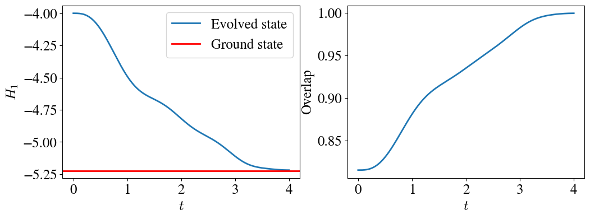
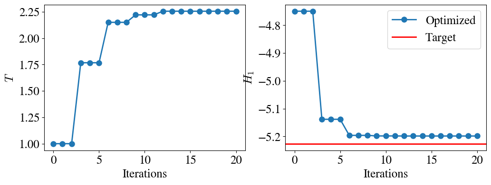
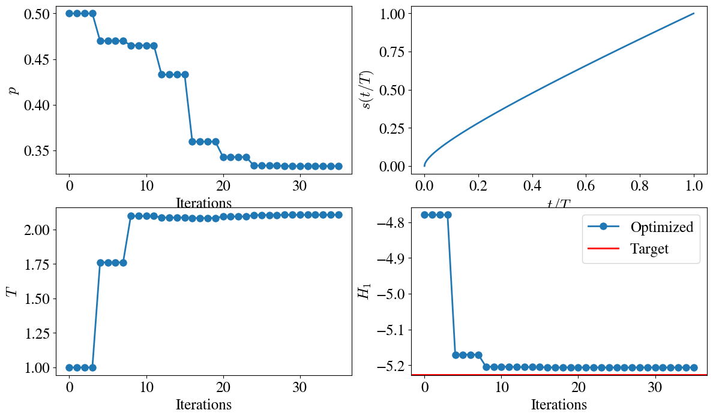

# Simple Adiabatic Evolution Examples

Code at: [https://github.com/Quantum-TII/qibo/tree/master/examples/adiabatic](https://github.com/Quantum-TII/qibo/tree/master/examples/adiabatic)

## Introduction

Qibo provides models for simulating the unitary evolution of state vectors as
well adiabatic evolution. The goal of adiabatic evolution is to find the ground
state of a "hard" Hamiltonian H1. To do so, an "easy" Hamiltonian
H0 is selected and the system is prepared in its ground state. The
system is then left to evolve under the slowly changing Hamiltonian
H(t) = (1 - s(t)) H0 + s(t) H1 for a total time T.
If the scheduling function s(t) and the total time T are chosen appropriately
the state at the end of this evolution will be the ground state of H1.

This example contains two scripts. The first performs the adiabatic evolution
for a given choice of s(t) and T and plots the dynamics of the H1
energy as well as the overlap between the evolved state and the actual ground
state of H1, which can be calculated via exact diagonalization for
small systems. The second script optimizes the total time T and a parametrized
family of s(t). Both scripts a sum of X operators H0 and the transverse field Ising model as H1.

## Adiabatic evolution dynamics

A simple adiabatic evolution example can be run using the `linear.py` script.
This supports the following options:

- `nqubits` (int): Number of qubits in the system.
- `hfield` (float): Transverse field Ising model h-field h value.
- `T` (int): Total time of the adiabatic evolution.
- `dt` (float): Time step used for integration.
- `solver` (str): Solver used for integration.

The following plots correspond to the adiabatic evolution of N=4 qubits for
total time T=4 using linear scaling s(t)=t/T. At the left we show how the
expectation value of H1 changes during evolution and at the right we
plot the overlap between the evolved state and the ground state of H1.
We see that at the end of evolution the evolved state reaches the ground state.

## Optimizing scheduling

An example of scheduling function optimization can be run using the `optimize.py`
script. This assumes a linear scheduling s(t)=t/T and optimizes the total time T
using the H1 energy as the loss function. The following options are
supported:

- `nqubits` (int): Number of qubits in the system.
- `hfield` (float): Transverse field Ising model h-field h value.
- `T` (float): Total time of the adiabatic evolution.
- `dt` (float): Time step used for integration.
- `solver` (str): Solver used for integration.
- `method` (str): Optimization method.
- `maxiter` (int): Maximum iterations for scipy solvers.
- `save` (bool): Whether to save optimization history.

The following plots show how the T parameter (left) and the loss function
change during optimization. We see that when T is increase sufficiently the
energy approximates the target energy of H1 ground state.

The scheduling function s(t) may contain other free parameters that are
optimized together with the total time T. For example the following plots shows
the optimization for a scheduling ansatz of the form
s(t) = p sqrt(t) + (1 - p) t, where p is a free parameter to be optimized.
The left column shows how the free parameters change during optimization while
the right column shows the final form of s(t) (top) and how the loss changes
during optimization (bottom).

