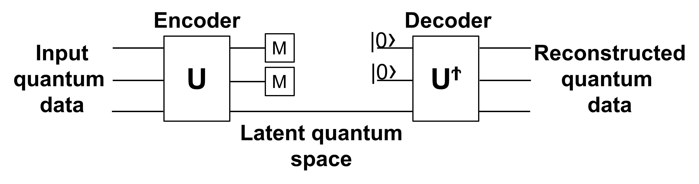

# Anomaly detection with variational quantum circuits

Code at: [https://github.com/qiboteam/qibo/tree/master/examples/anomaly_detection](https://github.com/qiboteam/qibo/tree/master/examples/anomaly_detection).

## Problem overview

With the contemporary peak in interest regarding machine learning algorithms for their many applications in scientific research as well as industrial technology, we also have the simultaneous development of quantum computing. A combination of these two fields has lead to the development of quantum machine learning algorithms.
With this example we want to study the quantum version of a classic machine learning algorithm known as [anomaly detection](https://arxiv.org/abs/2007.02500). This algorithm is implemented with an artificial neural network, in particular an autoencoder. In quantum machine learning, the autoencoder is realised using a variational quantum circuit. The proposed algorithm is not meant to outperform the classical counterpart on classical data. This work aims to demonstrate that it is possible to use quantum variational algorithms for anomaly detection with possible future advantages in the analysis of quantum data.

## Background

In this section we want to explain the main elements to understand the proposed quantum anomaly detection algorithm.

### Anomaly detection

Anomaly detection is a classification algorithm that allows to identify anomalous data. The advantage in using this machine learning technique is that only a dataset with non anomalous (standard) data samples is required for the training.
To achieve this it's necessary to train a particular artificial neural network (ANN) architecture called [autoencoder](https://arxiv.org/abs/2003.05991). An autoencoder is composed of two main parts: encoder and decoder.


The encoder compresses initial data down to a small dimension (called latent dimension). The decoder inverts the process to reconstruct the original data from the compressed one. The parameters of the neural network are trained in order to minimize the difference between the initial and reconstructed data. The loss function (also called reconstruction loss) is therefore a measure of how accurately the reconstructed data resembles the original.

For anomaly detection, the autoencoder is trained only on data samples belonging to the standard class. When the trained model is applied to new samples we expect the loss function to have different values for standard and anomalous data.
By choosing a threshold value for the loss function it is possible to classify an input based on whether its reconstruction loss lands above or below this threshold. The ROC curve (Receiver Operating Characteristic) indicates the true positive rate and false positive rate as a function of the threshold. This can help to set the threshold value in order to maximize true positive classifications and minimize false positives.

### Variational quantum circuits

A Variational Quantum Circuit (VQC), also known as parametrized quantum circuit, can be used as the quantum counterpart of classical ANNs. In this kind of circuits the input information is stored in the initial state of the qubits. It can be stored as the phase (phase encoding) or in the states amplitudes (amplitude encoding). The initial state is transformed using rotation gates and entangling gates, usually controlled-not (C-NOT) gates. These gates can be organised in layers, in this circuit architecture one layer is composed of rotation gates (R_x, R_y, R_z) acting on all qubits followed by a series of C-NOT gates coupling neighbouring qubits. The trainable weights are the angles of rotation gates and can be trained using standard backpropagation (implemented with Tensorflow).


A quantum circuit implements a unitary, thus invertible, transformation on the initial state. This represents a great advantage for the autoencoder architecture, as the decoder can be taken as the inverse of the encoder quantum circuit. In order to compress information the encoder circuit has to disentangle and set to zero state a given number of qubits. The loss function is thus taken as the expected measurement values of these qubits. In this way, for the training of the circuit, it is necessary only the encoder.



## Algorithm implementation

This section refers to the optimal algorithm parameters (default).

Anomaly detection on handwritten digits is carried out on the MNIST dataset using zeros as the standard data and ones as the anomalous data. We compressed the images down to 8X8 pixels, in this way it is possible to encode initial data in six qubits. It is necessary to normalise the initial data array so that it can be encoded as state amplitudes.
The best configuration has been found with six layers and three compressed qubits. For entangling gates we have tested different C-NOT configurations, the one that gave better performance is reported in figure below.
Moreover this configuration requires only nearest neighbour connectivity for six qubits placed in a ring topology. In order to improve the performance, rotation gates with trainable parameters were added at the end of the encoder circuit for the three compressed qubits. A summary of the employed circuit is reported in the next figure.


### Training

For the training of the circuit a dataset of 5000 images of zero handwritten digits has been employed. The loss function is the sum of the probabilities of the ground state for the first three qubits, thus these qubits are forced to the |1> state.
Training has been performed for 20 epochs using [Adam optimizer](https://arxiv.org/pdf/1412.6980.pdf), with a dynamic learning rate that spans from 0.4 in the first epochs to 0.001 in the last ones. This variable learning rate has helped reducing the problem of [barren plateaus](https://arxiv.org/pdf/1803.11173.pdf).

### Performance evaluation

To test the anomaly detection algorithm after the training phase, we have used 2000 standard images not used in the training and 2000 anomalous images. Figure below shows the loss distribution for the two test datasets.


The ROC curve shows the rate of true positive with respect to the rate of false positive by moving the loss value threshold for the binary classification.


## How to run an example?

The code is divided into two parts, training of the circuit (`train.py`) and performance evaluation (`test.py`).

It is possible to define the following hyper-parameters for the training of the circuit (default have good performance):
- `n_layers` (int): number of ansatz circuit layers (default 6).
- `batch_size` (int): number of samples in one training batch (default 20).
- `nepochs` (int): number of training epochs (default 20).
- `train_size` (int): number of samples used for training, the remainings are used for performance evaluation, total samples are 7000 (default 5000).
- `filename` (str): location and file name where trained parameters are saved (default "parameters/trained_params.npy").
- `lr_boundaries` (list): epochs when learning rate is reduced, 6 monotone growing values from 0 to nepochs (default [3,6,9,12,15,18]).

It is possible to define the following hyper-parameters for the performance evaluation of the circuit, `n_layers` must be equal to the one used for training:
- `n_layers` (int): number of ansatz circuit layers (default 6).
- `train_size` (int): number of samples used for training, the remainings are used for performance evaluation, total samples are 7000 (default 5000).
- `filename` (str): location and file name of trained parameters to be tested (default "parameters/trained_params.npy").
- `plot` (bool): make plots of ROC and loss function distribution (default True).
- `save_loss` (bool): save losses for standard and anomalous data (default False).

As an example, in order to use 4 layers in the variational quantum ansatz, you should execute the following command for training:

```python
python train.py --n_layers 4
```
And the following command for performance evaluation:

```python
python test.py --n_layers 4
```
