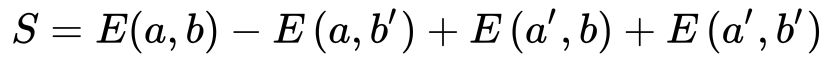
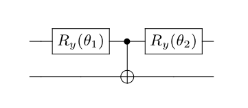

# Maximal violation of Bell inequalities variationally

Code at: [https://github.com/Quantum-TII/qibo/tree/master/examples/bell-variational](https://github.com/Quantum-TII/qibo/tree/master/examples/bell-variational)

## Introduction

During the advent of quantum mechanics, the properties of entanglement, or non-local correlations between quantum systems, were discussed and even doubted by prominent physicists. John Bell proposed an experiment where non-local interactions would be proven using correlations between measurements on two different qubits.

This experiment has been performed and proven multiple times since. Now that quantum computers are available, the proof of quantum non-locality is not only an interesting exercise but also an easy way to quickly gauge how "quantum" a device is.

## Bell's theorem

In his original [paper](https://journals.aps.org/ppf/pdf/10.1103/PhysicsPhysiqueFizika.1.195), John Bell proposed a test for the nature of quantum mechanics in response to Einstein, Podolski and Rosen's famous [thought experiment](https://journals.aps.org/pr/abstract/10.1103/PhysRev.47.777). He argued that if quantum mechanics was a local hidden-variable theory, the correlations of measurements on two entangled bits need to satisfy certain constraints.

These constraints are usually presented with inequalities, the most used of them being the [CHSH inequality](https://journals.aps.org/prl/abstract/10.1103/PhysRevLett.23.880) presented a bit later.

What at the time were but proposals, when tested by real-life experiments it was later found that violation of Bell inequalities existed in nature, proving that quantum mechanics was indeed a non-local theory thaht could not be understood under a local hidden variable formalism.

## CHSH inequality

The CHSH inequality, named after its creators, is usually displayed as:

where a, a', b and b' are the settings of the detectors of qubit A and B respectively, and E(a, b) are the quantum correlations between the measurements of both systems.

If the theory of local hidden variables holds, the absolute value of S is upper-bounded by 2. However, in the case that quantum mechanics is a non-local theory, that is not the case and the absolute value of S goes as high as 2 times sqrt(2).

This maximum violation only occurs on maximally entangled states and with a specific setting of the (a, a', b, b') parameters. These parameters are known, but the aim of this example is to variationally find the optimal parameters in order to fully violate this inequality.

## Setup of the example

This example consists of a very simple parametrized circuit with two variational angles. The first one sets up the state, and the second one sets up the direction of the measurements. Then the circuit is measured in all possible combinations of the Z and X basis.

Ideally, the circuit should prepare a maximally entangled state and set up a direction of measurement of 45 (225) in degrees.

### Aim of the example

This small example is designed to be an early test for small quantum devices, in order to test both the quantum nature of the chip and the device's handling of an easy variational circuit.

## How to run the example?

Run the `main.py` file from the console in order to perform the minimization. 

By modifying the flag `--nshots` one can control the number of samples to take for each quantum circuit. The more samples taken the more costly is the algorithm but the smoother the cost function is in order for the minimization to find the global minima.

The example the returns the final cost function and the optimized angles, as well as the final value of the CHSH inequality as well as the target for maximal violation and relative distance.
