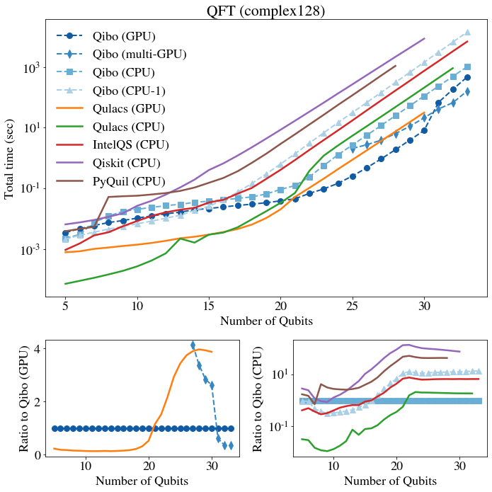

# Benchmark results

We compare Qibo performance with other publicly available libraries for quantum
circuit simulation. We provide results from different hardware configurations.
The libraries used in the benchmarks are shown in the table bellow. The
default precision and hardware configuration is used for all libraries.
Single-thread Qibo numbers were obtained using the `taskset` utility to restrict
the number of threads.

The sections that follow show the results for two different circuit types, the
Quantum Fourier Transform and an example variational circuit.

## Quantum Fourier Transform (`complex64`)

`nqubits` | Qibo (GPU) | Qibo (multi-GPU) | QCGPU (GPU) | Qibo (CPU) | Qibo (CPU-1) | QCGPU (CPU) | Cirq (CPU) | TFQ (CPU)
-- | -- | -- | -- | -- | -- | -- | -- | --
25 | 0.15088 | 1.7333 | 0.33926 | 1.75593 | 28.983 | 2.81661 | 20.04615 | 27.31083
26 | 0.26269 | 2.09426 | 0.70485 | 3.68007 | 62.33386 | 5.98906 | 42.59027 | 57.70737
27 | 0.48103 | 2.79575 | 1.4615 | 7.71366 | 133.49707 | 12.57996 | 88.89556 | 123.62698
28 | 0.93884 | 3.9641 | 3.04468 | 16.36245 | 285.99587 | 26.39612 | 185.83514 | 264.49645
29 | 1.88652 | 6.53928 | 6.32165 | 34.66599 | 616.35557 | 54.92496 | 383.06087 | 558.00182
30 | 3.90816 | 11.76768 | 13.16367 | 73.43444 | 1328.38914 | 116.36015 | 805.87551 | 1179.73661
31 | 8.08614 | 21.9935 | 27.39081 | 155.01974 | 2863.07021 | 245.91649 | 1689.20272 | core dumped        
32 | 67.08172 (2x)  | 42.51865 | OOM | 329.56916 | 6170.86231 | fails | 3550.67372 |        
33 | 182.26496 (4x) | 70.30869 |         | 694.67844 | 13300.37152 |         | fails |        
34 | 464.34191 (8x) | 160.39392 |         | 1465.81645 | 28667.11473 |         |         |     

## Quantum Fourier Transform (`complex128`)

`nqubits` | Qibo (GPU) | Qibo (multi-GPU) | Qulacs (GPU) | Qibo (CPU) | Qibo (CPU-1) | Qulacs (CPU) | IntelQS (CPU) | Qiskit (CPU) | PyQuil (CPU)
-- | -- | -- | -- | -- | -- | -- | -- | -- | --
25 | 0.25463 | 2.06511 | 0.87435 | 2.68645 | 31.42569 | 5.41102 | 17.2777 | 267.32462 | 116.83364
26 | 0.47597 | 2.7348 | 1.78204 | 5.60514 | 67.51781 | 11.11646 | 37.10058 | 537.95522 | 244.95282
27 | 0.93437 | 3.86462 | 3.64287 | 11.78381 | 144.42056 | 23.01487 | 78.81581 | 1075.48524 | 518.42093
28 | 1.87903 | 6.34791 | 7.45497 | 24.84334 | 309.06432 | 47.82596 | 166.74768 | 2156.63058 | 1084.50795
29 | 3.8849 | 11.05362 | 15.27099 | 52.47754 | 663.96249 | 99.40361 | 350.3245 | 4290.20236 | fails        
30 | 8.10977 | 21.21188 | 31.42752 | 110.6095 | 1426.46899 | 207.96072 | 744.3759 | 8564.4294 |        
31 | 68.09852 (2x) | 41.26969 | OOM | 232.35723 | 3064.75608 | 435.65923 | 1553.70923 | fails  |        
32 | 182.78114 (4x) | 66.40625 |         | 488.00321 | 6584.73906 | 912.57703 | 3279.90343 |         |        
33 | 468.13457 (8x) | 161.33294 |         | 1021.06619 | 14147.73073 | fails | 6867.85147 |         |    

## Variational Circuit - 5 layers (`complex64`)

`nqubits` | Qibo (V100) | QCGPU (V100) | Qibo (CPU) | QCGPU (CPU) | Cirq (CPU) | TFQ (CPU)
-- | -- | -- | -- | -- | -- | --
25 | 0.445 | 0.38624 | 1.3471 | 3.65103 | 105.25651 | 11.3111
26 | 0.54765 | 0.79253 | 2.55375 | 7.61292 | 210.74509 | 25.81774
27 | 0.70547 | 1.60987 | 4.99354 | 15.42897 | 427.60195 | 48.05409
28 | 1.08272 | 3.30945 | 10.15224 | 31.70288 | 876.43086 | 107.95146
29 | 1.72881 | 6.7313 | 20.49916 | 64.19206 | 1778.92683 | 204.5487
30 | 3.21179 | 13.82931 | 42.34363 | 133.33737 | 3674.24012 | 454.36985
31 | 5.8706 | 28.10267 | 86.44963 | 272.46449 | 7477.32876 | core dumped
32 | OOM    | OOM      | 179.30808 | fails   | 14950.43044 |
33 |         |         | 366.64664 |         | fails       |        
34 |         |         | 759.29275 |         |         |        

## Variational Circuit - 5 layers (`complex128`)

`nqubits` | Qibo (V100) | Qulacs (V100) | Qibo (CPU) | Qulacs (CPU) | IntelQS (CPU) | Qiskit (CPU) | PyQuil (CPU)
-- | -- | -- | -- | -- | -- | -- | --
25 | 0.50875 | 0.97298 | 1.88217 | 6.6459 | 27.96521 | 265.69477 | 99.8847
26 | 0.68834 | 1.97169 | 3.6478 | 13.33385 | 57.50249 | 533.14815 | 207.44335
27 | 1.00492 | 3.98935 | 7.3389 | 26.44321 | 117.75236 | 1067.66561 | 421.39925
28 | 1.6831 | 8.10374 | 14.84471 | 54.18735 | 242.76708 | 2146.48768 | 869.36062
29 | 3.04162 | 16.42699 | 30.48203 | 110.05296 | 525.83829 | 4275.40255 | fails
30 | 5.827   | 33.46775 | 62.2646 | 225.94718 | 1043.19987 | 9324.27692 |
31 | OOM     | OOM      | 128.6027 | 460.50558 | 2100.28082 | fails     |        
32 |         |          | 263.47171 | 947.05816 | 4365.85043 |         |        
33 |         |          | 544.67465 | fails     | 8946.80753 |         |     

