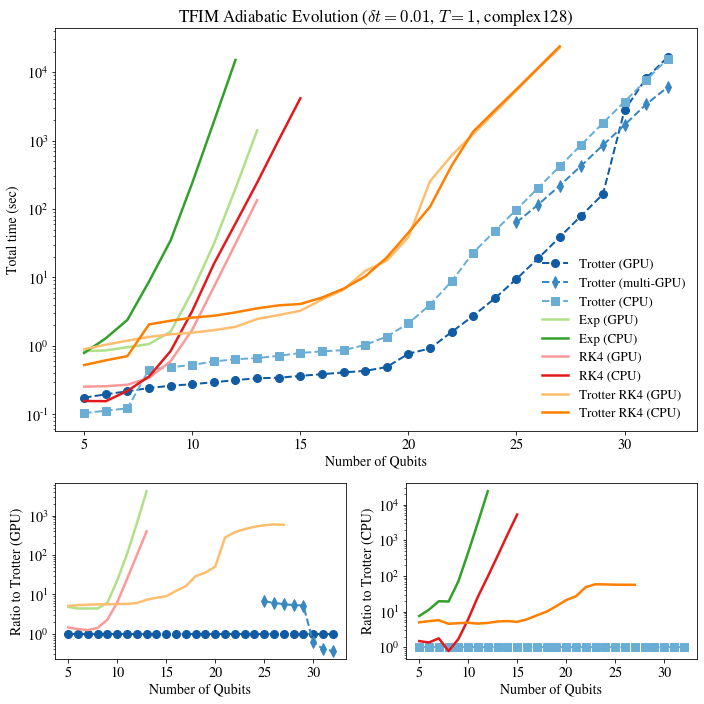

# Adiabatic evolution Benchmark

We use Qibo to simulate adiabatic evolution under the transverse field Ising
Hamiltonians using linear scaling `s(t) = t`. We simulate for a total time
of T=1 using double precision (`complex128`) and different
[solvers](https://qibo.readthedocs.io/en/stable/qibo.html#solvers)
on CPU and GPU. In the first section we provide the scaling of execution time
as a function of the number of qubits in the system and in the second section
as a function of the time step `dt` used to discretize and integrate in time.

## Scaling vs number of qubits

`nqubits` | Trotter (GPU) | Trotter (multi-GPU) | Trotter (CPU) | Exp (GPU) | Exp (CPU) | RK4 (GPU) | RK4 (CPU) | Trotter RK4 (GPU) | Trotter RK4 (CPU)
-- | -- | -- | -- | -- | -- | -- | -- | -- | --
5 | 0.17445 |         | 0.10366 | 0.83614 | 0.78556 | 0.25242 | 0.156 | 0.89121 | 0.5226
6 | 0.19523 |         | 0.11258 | 0.85455 | 1.28687 | 0.25621 | 0.1549 | 1.03522 | 0.61248
7 | 0.21635 |         | 0.12165 | 0.95289 | 2.39186 | 0.2697 | 0.21857 | 1.18833 | 0.70617
8 | 0.24125 |         | 0.44973 | 1.05927 | 8.69052 | 0.33928 | 0.35587 | 1.34537 | 2.05456
9 | 0.26052 |         | 0.4862 | 1.60342 | 34.69458 | 0.59477 | 0.83639 | 1.47065 | 2.32306
10 | 0.27457 |         | 0.52353 | 6.2302 | 240.25221 | 1.71798 | 3.23398 | 1.55437 | 2.57444
11 | 0.2933 |         | 0.5912 | 30.81785 | 1885.62326 | 7.22978 | 15.72184 | 1.69087 | 2.74806
12 | 0.31446 |         | 0.63475 | 198.71525 | 15068.34078 | 31.00997 | 61.33608 | 1.89166 | 3.07578
13 | 0.33565 |         | 0.66254 | 1400.82069 |         | 134.25498 | 242.00017 | 2.46156 | 3.5229
14 | 0.34066 |         | 0.71195 |         |         |         | 1018.38455 | 2.80647 | 3.9003
15 | 0.36345 |         | 0.78478 |         |         |         | 4151.16189 | 3.25374 | 4.07862
16 | 0.38424 |         | 0.82753 |         |         |         |         | 4.72084 | 5.06896
17 | 0.40764 |         | 0.86366 |         |         |         |         | 6.61444 | 6.82558
18 | 0.42951 |         | 1.02822 |         |         |         |         | 12.43154 | 10.31241
19 | 0.48832 |         | 1.3632 |         |         |         |         | 17.55895 | 19.5482
20 | 0.76556 |         | 2.12358 |         |         |         |         | 38.71244 | 45.04425
21 | 0.91476 |         | 3.98938 |         |         |         |         | 253.88249 | 107.72325
22 | 1.59016 |         | 8.75235 |         |         |         |         | 604.18377 | 428.68612
23 | 2.74303 |         | 23.00663 |         |         |         |         | 1243.40607 | 1352.20024
24 | 4.94233 |         | 47.59778 |         |         |         |         | 2577.88493 | 2769.86169
25 | 9.48782 | 63.56629 | 98.07511 |         |         |         |         | 5402.67001 | 5607.38338
26 | 18.90535 | 115.46439 | 202.28142 |         |         |         |         | 11297.93766 | 11523.4246
27 | 38.76025 | 219.39538 | 419.13751 |         |         |         |         | 22595.86618 | 23790.17723
28 | 79.88714 | 429.85937 | 869.88294 |         |         |         |         |         |
29 | 164.25789 | 856.78085 | 1800.57866 |         |         |         |         |         |
30 | 2783.62451 (2x) | 1690.57241 | 3702.52683 |         |         |         |         |         |
31 | 8146.88747 (4x) | 3390.6916 | 7608.61619 |         |         |         |         |         |
32 | 16593.04995 (8x) | 6052.76292 | 15745.90306 |         |         |         |         |         |

## Scaling vs time step

Results are for N=10 qubits.

`dt (1e-3)` | Trotter (GPU) | Trotter (CPU) | Exp (GPU) | Exp (CPU)
-- | -- | -- | -- | --
100.0 | 0.03239 | 0.05764 | 1.83808 | 26.25529
94.79 | 0.03262 | 0.05912 | 1.83009 | 26.31765
89.58 | 0.03714 | 0.06667 | 1.89369 | 28.76947
84.37 | 0.03547 | 0.0615 | 1.96616 | 28.75735
79.16 | 0.03848 | 0.06849 | 1.95164 | 31.09359
73.95 | 0.04137 | 0.07304 | 2.07511 | 33.57253
68.74 | 0.04405 | 0.07813 | 2.06827 | 36.10914
63.53 | 0.04697 | 0.08388 | 2.12316 | 38.70984
58.32 | 0.05231 | 0.09371 | 2.2088 | 43.57428
53.11 | 0.05482 | 0.09903 | 2.191 | 45.9787
47.89 | 0.0605 | 0.10862 | 2.33777 | 50.97479
42.68 | 0.06892 | 0.12416 | 2.47674 | 58.57135
37.47 | 0.0764 | 0.14047 | 2.70509 | 66.2002
32.26 | 0.08562 | 0.15811 | 2.81736 | 75.97506
27.05 | 0.10267 | 0.19317 | 3.14004 | 90.25913
21.84 | 0.12787 | 0.23906 | 3.62534 | 112.58938
16.63 | 0.17028 | 0.3146 | 4.339 | 150.19589
11.42 | 0.24472 | 0.45362 | 5.62884 | 217.54051
6.21 | 0.44506 | 0.82831 | 9.2002 | 403.11168
1.0 | 2.75154 | 5.08593 | 50.19016 | 2418.04262

