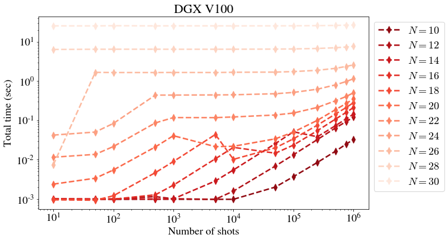

# Measurement shots

`nshots` | CPU N=12 | GPU N=12 | CPU N=22 | GPU N=22
-- | -- | -- | -- | --
10 | 0.00222 | 0.001 | 0.06738 | 0.01154
50 | 0.00216 | 0.00099 | 0.06737 | 0.01367
100 | 0.00227 | 0.00099 | 0.06743 | 0.0216
500 | 0.00227 | 0.00115 | 0.06756 | 0.08641
1000 | 0.00236 | 0.00101 | 0.06785 | 0.11819
5000 | 0.00342 | 0.00098 | 0.06934 | 0.11781
10000 | 0.00452 | 0.00158 | 0.07157 | 0.12264
50000 | 0.01242 | 0.0069 | 0.08722 | 0.13751
100000 | 0.01939 | 0.01337 | 0.10656 | 0.15444
250000 | 0.04117 | 0.03254 | 0.16497 | 0.21442
500000 | 0.07463 | 0.06422 | 0.26315 | 0.31621
750000 | 0.11058 | 0.09289 | 0.35994 | 0.40627
1000000 | 0.13462 | 0.12177 | 0.46654 | 0.50615

