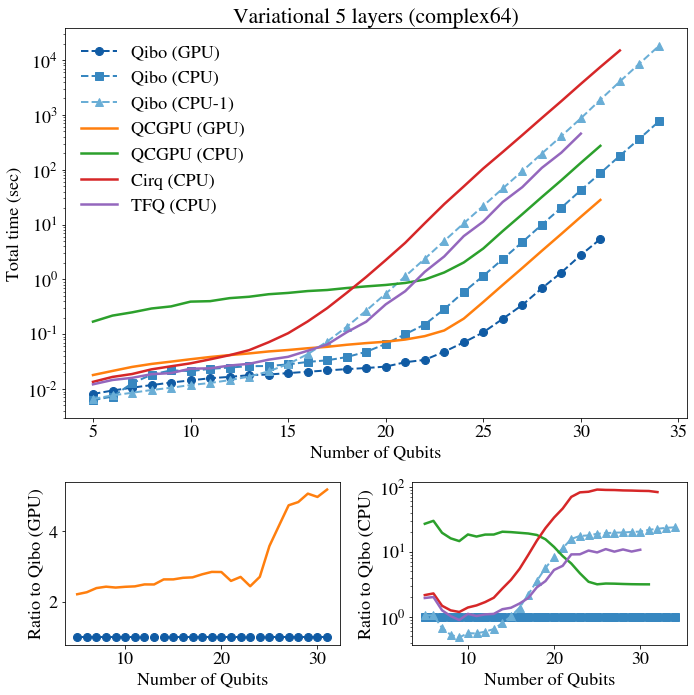

# Variational circuit (5 layers)

Variational circuits are typically used in quantum machine learning and similar
applications and constitute a good candidate for applications of near-term
quantum computers due to their short depth and.
The circuit used in the benchmark consists of a layer of RY rotations followed
by a layer of CZ gates that entangle neighbouring qubits, as shown in the
figure below:

The configuration is repeated for five layers and the variational parameters
are chosen randomly from 0 to 2pi in all benchmarks.

## Variational circuit (`complex64`)

`nqubits` | Qibo (V100) | QCGPU (V100) | Qibo (CPU) | QCGPU (CPU) | Cirq (CPU) | TFQ (CPU)
-- | -- | -- | -- | -- | -- | --
25 | 0.445 | 0.38624 | 1.3471 | 3.65103 | 105.25651 | 11.3111
26 | 0.54765 | 0.79253 | 2.55375 | 7.61292 | 210.74509 | 25.81774
27 | 0.70547 | 1.60987 | 4.99354 | 15.42897 | 427.60195 | 48.05409
28 | 1.08272 | 3.30945 | 10.15224 | 31.70288 | 876.43086 | 107.95146
29 | 1.72881 | 6.7313 | 20.49916 | 64.19206 | 1778.92683 | 204.5487
30 | 3.21179 | 13.82931 | 42.34363 | 133.33737 | 3674.24012 | 454.36985
31 | 5.8706 | 28.10267 | 86.44963 | 272.46449 | 7477.32876 | core dumped
32 | OOM    | OOM      | 179.30808 | fails   | 14950.43044 |
33 |         |         | 366.64664 |         | fails       |        
34 |         |         | 759.29275 |         |         |        

## Variational circuit (`complex128`)

`nqubits` | Qibo (V100) | Qulacs (V100) | Qibo (CPU) | Qulacs (CPU) | IntelQS (CPU) | Qiskit (CPU) | PyQuil (CPU)
-- | -- | -- | -- | -- | -- | -- | --
25 | 0.50875 | 0.97298 | 1.88217 | 6.6459 | 27.96521 | 265.69477 | 99.8847
26 | 0.68834 | 1.97169 | 3.6478 | 13.33385 | 57.50249 | 533.14815 | 207.44335
27 | 1.00492 | 3.98935 | 7.3389 | 26.44321 | 117.75236 | 1067.66561 | 421.39925
28 | 1.6831 | 8.10374 | 14.84471 | 54.18735 | 242.76708 | 2146.48768 | 869.36062
29 | 3.04162 | 16.42699 | 30.48203 | 110.05296 | 525.83829 | 4275.40255 | fails
30 | 5.827   | 33.46775 | 62.2646 | 225.94718 | 1043.19987 | 9324.27692 |
31 | OOM     | OOM      | 128.6027 | 460.50558 | 2100.28082 | fails     |        
32 |         |          | 263.47171 | 947.05816 | 4365.85043 |         |        
33 |         |          | 544.67465 | fails     | 8946.80753 |         |     

