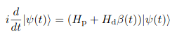
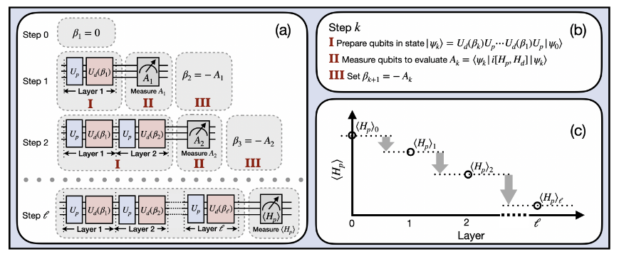

# Feedback-based ALgorithm for Quantum OptimizatioN - FALQON

Code at: [https://github.com/qiboteam/qibo/tree/master/examples/falqon](https://github.com/qiboteam/qibo/tree/master/examples/falqon)

Quantum Approximate Optimisation Algorithm (QAOA) is considered as one of the most important algorithms for optimisation in Quantum Computers, see [arXiv:1411.4028](https://arxiv.org/abs/1411.4028) by Farhi, Goldstone and Gutmann for more information.

In this QAOA algorithm, the aim is to have a problem Hamiltonian H_P and a mixer Hamiltonian H_B. Then, starting with the ground state of H_B, the goal is to repeatedly apply e^(i H_P c) and e^(i H_B b), where c and b are tunable parameters. The values of such parameters are to be found via classical optimization

In the FALQON algorithm, [arXiv:2103.08619](https://arxiv.org/abs/2103.08619) by Magann, Rudinger, Grace and Sarovan, they propose a similar although conceptually different algorithm. The proposal consists in evolving the initial state using the Schrödinger equation

This equation satisfies that the expectation value of H_P is monotonically decreasing. This feature is used to create a Hamiltonian evolution with 1 layer using  e^(i H_P c) and e^(i H_B b). In the first layer, b=0, and c is a parameter to be defined. Then, the quantity A = i[H_P, H_B] is measured. Its expectation value is then taken to be the parameter b for the next layer. As more layers are added, the
approximation to the ground state of the problem Hamiltonian H_P is more and more accurate.

### Running the code

This example contains just one file
- `main.py` is the file where the algorithm is run. The main class `FALQON` is now introduced in `QIBO`

The `FALQON` class behaves similarly to the `QAOA` one. It admits the following parameters:
- `hamiltonian`: problem Hamiltonian
            whose ground state is sought.
- `mixer`: mixer Hamiltonian.
            If ``None``, `qibo.hamiltonians.X` is used.
- `solver`: solver used to apply the exponential operators.
            Default solver is 'exp'.
- `callbacks`: List of callbacks to calculate during evolution.
- `accelerators`: Dictionary of devices to use for distributed
            execution. See `qibo.core.distcircuit.DistributedCircuit`
            for more details. This option is available only when ``hamiltonian``
            is a `qibo.abstractions.hamiltonians.TrotterHamiltonian`.
- `memory_device`: Name of device where the full state will be saved.
            Relevant only for distributed execution (when ``accelerators`` is
            given).

When performing the execution of the problem, the following variables are to be set:

- `delta_t`: initial guess for the time step. A too large delta_t will make the algorithm fail.
- `max_layers`: maximum number of layers allowed for the FALQON.
- `initial_state`: initial state vector of the FALQON.
- `tol`: Tolerance of energy change. If not specified, no check is done.
- `callback`: Called after each iteration for scipy optimizers.
- `options`: a dictionary with options for the different optimizers.
- `compile`: whether the TensorFlow graph should be compiled.
- `processes`: number of processes when using the paralle BFGS method.

The attached example provides an easy implementation of the FALQON method for a Heisenberg XXZ model.
