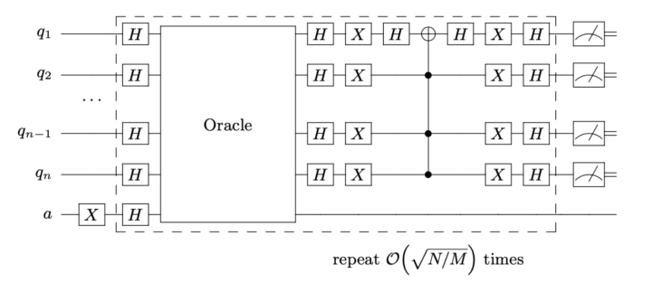

# Grover's Algorithm for solving Satisfiability Problems

Code at: [https://github.com/Quantum-TII/qibo/tree/master/examples/grover3sat](https://github.com/Quantum-TII/qibo/tree/master/examples/grover3sat)

## Introduction

Grover's Algorithm is an example of the advantages a quantum computer has over a classical computer in the task of searching databases. This program applies a Grover search on a Satisfiability problem, more precisely an Exact Cover instance of a 3SAT problem.


An Exact Cover instance of a 3SAT problem is characterized by a set of clauses containing 3 bits that are considered satisfied if one of them is in position 1, while the other remain at 0. The solution of this instance is bitstring that fulfills all the clauses at the same time.

## Grover's search algorithm

The algorithm proposed by Grover [arXiv:quant-ph/9605043](https://arxiv.org/abs/quant-ph/9605043) achieves a quadratic speed-up on a brute-force search of this satisfiability problem.

This program builds the necessary parts of the algorithm in order to simulate this algorithm. Crucially, Grover's algorithm requires an oracle that is problem dependent, which changes the sign of the solution of the problem.

### Oracle

The Exact Cover oracle is built using the same number of ancillary qubits as clauses are in the system, as to have a way to track that all clauses are satisfied. For each clause in the system, a CNOT gate from each of the qubits to its ancilla, followed by a multi-Toffoli gates controlled by the three qubits targeting the ancilla, activates the ancilla only if the clause is satisfied.

A multi-Toffoli gate on all "clause" ancilla targeting the Grover ancilla (qubit initialized by an X gate followed by a Hadamard gate) changes the sign of the solution of the system.

Then, all ancillas must be uncomputed for the oracle to be complete. This is a crucial step as these ancillas have to be decoupled from the system to be used in the next iteration of the Grover algorithm.

### Diffusion transform

After the sign change of the solution states, an inversion about average amplifies their amplitude. This is at the core of Grover's search algorithm. This operator, also known as Diffusion transform, can be constructed by a set of Hadamard gates on all qubits, a multi-qubit gate that changes the sign of the |0000...00> state, and another set of H gates.

### Building the algorithm

The quantum register is started with Hadamard gates on all qubits encoding the problem, and an X gate followed by a Hadamard gate on the Grover ancilla, used to change the sign of the solution.

Then the oracle and diffusion transform are applied (π/4)sqrt(N/M) times, where N is the total number of possible outcomes and M is the number of solutions.

After this has been applied, measuring the quantum registers outputs the solution of the problem.

The quantum circuit for the Grover search algorithm with any oracle takes the form:



## How to run the example?

Run the file `main.py` from the console to find the solution of an instance of 10 qubits.

Adding the argument `--nqubits` (int) allows for instances with different number of qubits.

The program returns:

- Number of qubits encoding the solution.
- Total number of qubits to define the problem. Including ancillary qubits used in the oracle.
- Most common bitstring measured after all iterations.
- Target solution of the problem (if included).

Initially supported instances are of [4, 8, 10, 12, 14, 16] qubits.

The functions used in this example, including gate by gate decompositions of both the oracle and diffusion transform are included in `functions.py`.

## Create your own instances

An example of an instance for 4 qubits reads:

```text
 4 3 1
0 1 0 0
 1 2 3
 2 3 4
 1 2 4
```

The first line includes:
- number of qubits
- number of clauses
- number of 1's in the solution

The second line is the solution of the instance.

The following lines correspond to the three qubits present in each clause.

Should the solution not be known, leave an empty line in place of the solution as well as remove the number of 1's in the solution.
