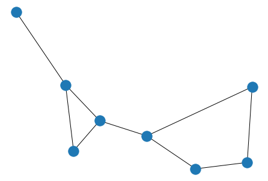
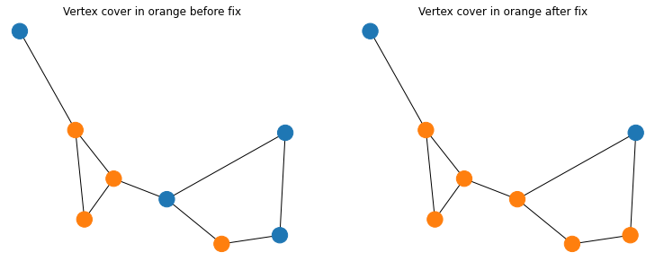

```python
import networkx as nx
import csv
import matplotlib.pyplot as plt

from mvc import qubo_mvc, qubo_mvc_penalty, mvc_feasibility, mvc_easy_fix, mvc_energy
```

# MVC Definition

Given an undirected graph with a set of nodes V and edges E, A vertex cover of a graph is a set of nodes that includes at
least one endpoint of every edge of the graph. The Minimum Vertex Cover (MVC) problem is an optimisation problem
that find smallest vertex cover of a given graph.

# Load graph from csv


```python
def load_csv(filename:str):
    """ Load graph from csv file
    """
    
    with open(filename, 'r', newline='') as f:
        reader = csv.reader(f)
        data = [[int(row[0]), int(row[1]), float(row[2])] for row in reader]
    
    nodes = [k0 for k0, k1, v in data if k0 == k1]
    edges = [[k0, k1] for k0, k1, v in data if k0 != k1]
    
    g = nx.Graph()
    g.add_nodes_from(nodes)
    g.add_edges_from(edges)
    
    node_weights = {k0: {'weight': v} for k0, k1, v in data if k0 == k1}
    edge_weights = {(k0, k1): {'weight': v} for k0, k1, v in data if k0 != k1}

    nx.set_edge_attributes(g, edge_weights)
    nx.set_node_attributes(g, node_weights)

    return g
```

csv Format:  

0,0,0.4696822179283675  
1,1,0.6917392308135916  
2,2,0.7130420958314817  
3,3,0.49342677332980056  
4,4,0.49661600571433673  
5,5,0.55601135361347  
6,6,0.2831095711244086  
7,7,0.18737823232636885  
0,1,0.98602725407379  
1,2,0.935853268681996  
2,3,0.23080434023289664  
4,5,0.25521731195623476  
5,6,0.37096743935296606  
6,7,0.04408120693490547  
0,2,0.5619060764177991  
4,7,0.48402095290884917  
1,6,0.7106584134580318  


```python
g = load_csv('mvc.csv')
```


```python
pos = nx.spring_layout(g, seed=1234)
nx.draw(g, pos)
```


    

    


```python
print(f'Number of node is {len(g.nodes)}')
print(f'Number of edge is {len(g.edges)}')
```

    Number of node is 8
    Number of edge is 9


# QUBO formulation

## Estimate penalty


```python
penalty = qubo_mvc_penalty(g)
print(f'The penalty is {penalty}')
```

    The penalty is 1.6548482220717595


## Formulate QUBO (weighted minimum vertex cover)


```python
linear, quadratic = qubo_mvc(g, penalty=penalty)
print(f'Number of linear terms: {len(linear)}')
print(f'Number of quadratic terms: {len(quadratic)}\n')
```

    Number of linear terms: 8
    Number of quadratic terms: 9
    


# Generate random solutions


```python
import numpy as np
rng = np.random.default_rng(seed=1234)
random_solution = {i: rng.integers(2) for i in g.nodes}
print(f'The random solution is {random_solution}\n')
```

    The random solution is {0: 1, 1: 1, 2: 1, 3: 0, 4: 0, 5: 1, 6: 0, 7: 0}
    


# Check feasibility


```python
feasibility = mvc_feasibility(g, random_solution)
print(f'The feasibility is {feasibility}\n')
```

    The feasibility is False
    


# Fix broken constraints


```python
fixed_solution = mvc_easy_fix(g, random_solution)
print(f'After fixation, the solution is {fixed_solution}\n')
```

    After fixation, the solution is {0: 1, 1: 1, 2: 1, 3: 0, 4: 1, 5: 1, 6: 1, 7: 0}
    


```python
feasibility = mvc_feasibility(g, fixed_solution)
print(f'The feasibility is {feasibility}\n')
```

    The feasibility is True
    


# Visualisation


```python
fig, (ax0, ax1) = plt.subplots(1, 2, figsize=(12.8,4.8))
colour_b4fix = ['C1' if random_solution[n] else 'C0' for n in g.nodes]
colour_fixed = ['C1' if fixed_solution[n] else 'C0' for n in g.nodes]
nx.draw(g, pos, node_color=colour_b4fix, ax=ax0)
ax0.set_title(f'Vertex cover in orange before fix')
nx.draw(g, pos, node_color=colour_fixed, ax=ax1)
ax1.set_title(f'Vertex cover in orange after fix')
```


    Text(0.5, 1.0, 'Vertex cover in orange after fix')


    

    


# Calculate energy


```python
energy = mvc_energy(g, fixed_solution)
print(f'The energy is {energy}')
```

    The energy is 3.2102004750256556

