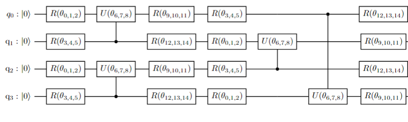

# Quantum Convolutional Neural Network Classifier

Code at: [https://github.com/qiboteam/qibo/tree/master/examples/qcnn_classifier]
(https://github.com/qiboteam/qibo/tree/master/examples/qcnn_classifier).

## Problem overview
This tutorial implements a simple [Quantum Convolutional Neural Network](https://www.nature.com/articles/s41567-019-0648-8) (QCNN), which is a translationally invariant algorithm analogous to the classical [convolutional neural network](https://proceedings.neurips.cc/paper_files/paper/2012/file/c399862d3b9d6b76c8436e924a68c45b-Paper.pdf). This example demonstrates the use of the QCNN as a quantum classifier, which attempts to classify ground states of a translationally invariant quantum system, the transverse field Ising model, based on whether they are in the ordered or disordered phase. The (randomized) statevector data provided are those of a 4-qubit system. Accompanying each state is a label: +1 (disordered phase) or -1 (ordered phase).

Through the sequential reduction of entanglement, this network is able to perform classification from the final measurement of a single qubit.

Workflow of QCNN model:

Schematic of QCNN model:

Convolutional layer for 4 qubits as an example:

Pooling layer for 4 qubits as an example:

where in the above, $R(\theta_{i,j,k}) = RZ(\theta_k) RY(\theta_j) RX(\theta_i)$:

$U_{q_a, q_b}(\theta_{i,j,k}) = RXX(\theta_k) RYY(\theta_j) RZZ(\theta_i)$ is a two-qubit gate acting on qubits $q_a$ and $q_b$:

and $R^{\dagger}(\theta_{i,j,k}) = RX(-\theta_i) RY(-\theta_j) RZ(-\theta_k)$:

## How to use the QCNN class
For more details on the QuantumCNN class, please refer to the documentation. Here we recall some of the necessary arguments when instantiating a QuantumCNN object:
- `nqubits` (int): number of quantum bits. It should be larger than 2 for the model to make sense.
- `nlayers` (int): number of layers of the QCNN variational ansatz.
- `nclasses` (int): number of classes of the training set (default=2).
- `params`: list to initialise the variational parameters (default=None).

After creating the object, one can proceed to train the model. For this, the `QuantumCNN.minimize` method can be used with the following arguments (refer to the documentation for more details)"
- `init_theta`: list or numpy.array with the angles to be used in the circuit
- `data`: the training data
- `labels`: numpy.array containing the labels for the training data
- `nshots` (int):number of runs of the circuit during the sampling process (default=10000)
- `method` (string): str 'classical optimizer for the minimization'. All methods from scipy.optimize.minmize are suported (default='Powell').
