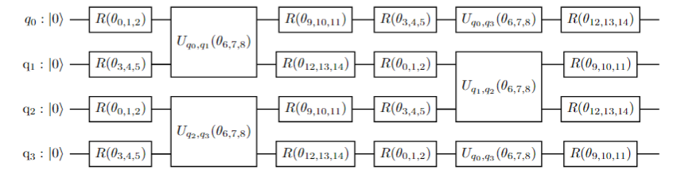

# Quantum Convolutional Neural Network Classifier

Code at: [https://github.com/qiboteam/qibo/tree/master/examples/qcnn_classifier]
(https://github.com/qiboteam/qibo/tree/master/examples/qcnn_classifier).

## Problem overview
This tutorial implements a simple Quantum Convolutional Neural Network (QCNN), which is a translationally invariant algorithm analogous to the classical convolutional neural network. This example demonstrates the use of the QCNN as a quantum classifier, which attempts to classify ground states of a translationally invariant quantum system, the transverse field Ising model, based on whether they are in the ordered or disordered phase. The (randomized) statevector data provided are those of a 4-qubit system. Accompanying each state is a label: +1 (ordered phase) or -1 (ordered phase).
Through the sequential reduction of entanglement, this network is able to perform classification from the final measurement of a single qubit.

Workflow of qcnn model:


Schematic of qcnn model:


Convolutional layer for 4 qubits as an example:


where $R(\theta_{i,j,k}) = RZ(\theta_k) RY(\theta_j) RX(\theta_i)$ and $U(\theta_{i,j,k}) = RXX(\theta_k) RYY(\theta_j) RZZ(\theta_i)$. 

Pooling layer for 4 qubits as an example:

where $R^{\dagger}(\theta_{i,j,k}) = RX(-\theta_i) RY(-\theta_j) RZ(-\theta_k)$.

## How to run an example
To run a particular instance of the problem, we have to set up the variables:
- `nqubits` (int): number of quantum bits. It must be larger than 1. 
- `nlayers` (int): number of layers of the varitional ansatz.
- `nclasses` (int): number of classes of the training set (default=2).
- `params`
- `init_theta`: list or numpy.array with the angles to be used in the circuit
- `data`
- `labels`: numpy.array with the quantum state to be Schmidt-decomposed
- `nshots` (int):number of runs of the circuit during the sampling process (default=10000)
- `method` (string): str 'classical optimizer for the minimization'. All methods from scipy.optimize.minmize are suported (default='Powell').

Here is how we create QuantumCNN object. The user should include necessary packages:

```bash
from qibo.models.qcnn import QuantumCNN
from qibo import gates
import random
import numpy as np

import qibo
qibo.set_backend("numpy")
```

Here we provide the ground states of 4-qubit TFIM in data folder. To define data and labels:

```
data = np.load('nqubits_4_data_shuffled_no0.npy')
labels = np.load('nqubits_4_labels_shuffled_no0.npy')
labels = np.transpose(np.array([labels])) # restructure to required array format
```

Structure of data and labels are like:


Define circuit:
```
test = QuantumCNN(nqubits=4, nlayers=1, nclasses=2)
testcircuit = test._circuit
testcircuit.draw()
```
draw() is used to visualize the circuit construction.

Initialize model parameters:
```
testbias = np.zeros(test.measured_qubits)
testangles = [random.uniform(0,2*np.pi) for i in range(21*2)]
init_theta = np.concatenate((testbias, testangles))
```
Train model with optimize parameters:
```
result = test.minimize(init_theta, data=data, labels=labels, nshots=10000, method='Powell')
```

Generate predictions from optimized model:
```
predictions = []
for n in range(len(data)):
    predictions.append(test.Predictions(testcircuit, result[1], data[n], nshots=10000)[0])
```

Result visualization:
```
from sklearn import metrics
actual = [np.sign(label) for label in labels]
predicted = [np.sign(prediction) for prediction in predictions]
confusion_matrix = metrics.confusion_matrix(actual, predicted)
cm_display = metrics.ConfusionMatrixDisplay(confusion_matrix = confusion_matrix, display_labels = [1, -1])
cm_display.plot()
plt.show()

test.Accuracy(labels,predictions)
```


In this example, we achieved an accuracy of 0.925. #0.969849.
