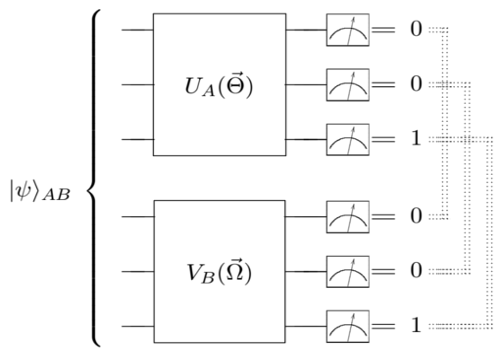
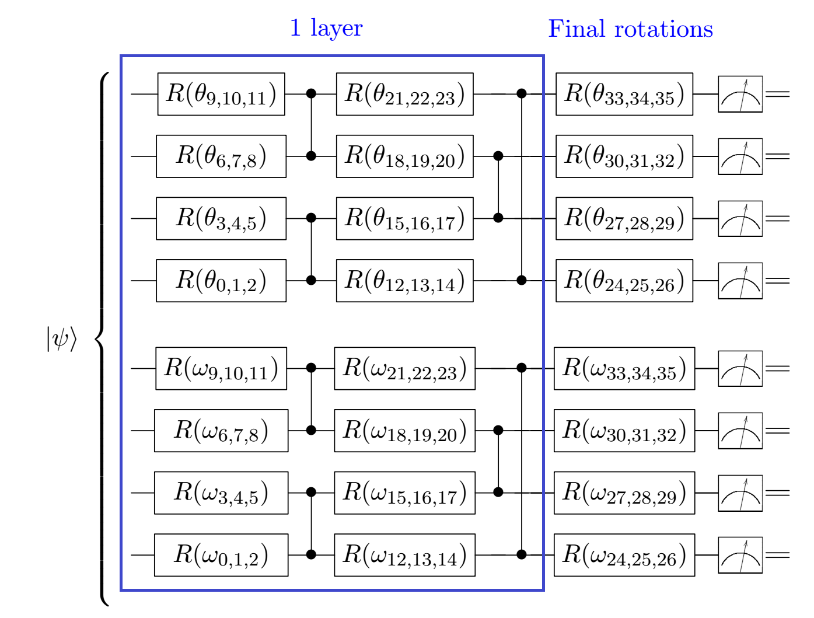
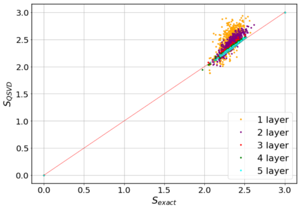
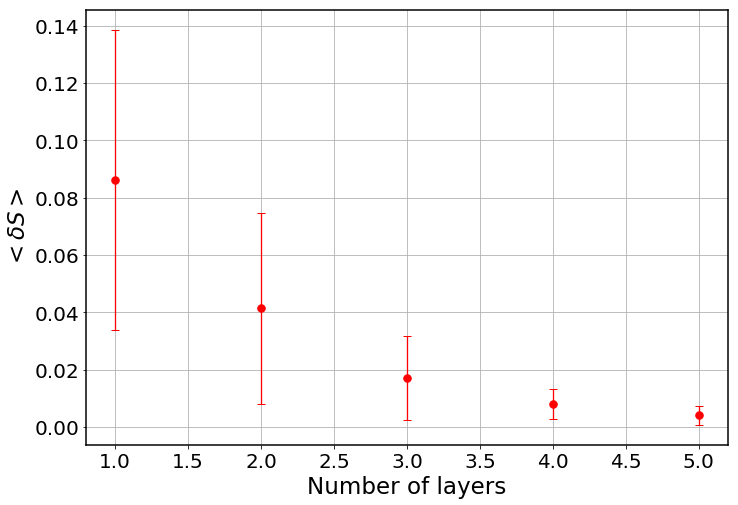

# Quantum Singular Value Decomposer

Code at: [https://github.com/Quantum-TII/qibo/tree/master/examples/qsvd](https://github.com/Quantum-TII/qibo/tree/master/examples/qsvd)

## Problem overview
Much progress has been made towards a better understanding of bipartite and multipartite entanglement of quantum systems in the last decades. Among the many figures of merit that have been put forward to quantify entanglement, the von Neumann entropy stands out as it finely reveals the quantum correlations between subparts of the system. Yet, the explicit computation of this entropy, as well as many other bipartite measures of entanglement, relies on a clever decomposition of the tensor that describes a two-party system, and in general, it demands a large investment of computational resources.

## Implementing the solution
The code herein aims at reproducing the results of the manuscript ["Quantum Singular Value Decomposer"](https://journals.aps.org/pra/abstract/10.1103/PhysRevA.101.062310). We are going to implement a quantum circuit that produces the Schmidt coefficients of the singular value decomposition of a pure bipartite state. In turn, these coefficients will be used to compute the von Neumann entropy. We call this circuit Quantum Singular Value Decomposer (QSVD). The QSVD is made of two unitaries, each acting on a separate subpart of the system, that are determined in a variational way. The frequencies of the outputs in the computational basis for the final state in the circuit deliver the eigenvalues of the decomposition (i.e. the Schmidt coefficients) without further treatment. From them, the von Neumann entropy readily follows. Moreover, the eigenvectors of the decomposition can be recreated from the direct action of the adjoint of the unitaries that conform the system on computational-basis states.

The key ingredient of the algorithm is to train the circuit on exact coincidence of outputs for both subsystems. This is a subtle way to force a diagonal form onto the state. It also provides an example of a quantum circuit which is not trained to minimize some energy, but rather to achieve a precise relation between the superposition terms in the state.



## How to run an example

To run a particular instance of the problem we have to set up the initial
arguments:
- `nqubits` (int): number of quantum bits. (default=6)
- `subsize` (int): size of the bipartition with qubits 0,1,...,subsize-1. (default=3)
- `nlayers` (int): number of ansatz layers. (default=5)
- `nshots` (int): number of shots used when sampling the circuit. (default= 100000)
- `RY` (bool): if True, Ry rotations are used in the ansatz. If False, RxRzRx are employed instead. (default=False)
- `method` (string): classical optimization method, supported by scipy.optimize.minimize. (default='Powell')


To run an example with default values, you should execute the following command:

```python
python main.py
```

To run an example with different values, type e.g.:

```python
python main.py --nqubits 5 --subsize 2 --nlayers 4 --nshots 10000
```

## Results
The variational approach to the QSVD can be verified on simulations. We can consider random states such that the amplitudes are *c* = *a* + i*b* where *a* and *b* are random real numbers between -0.5 and 0.5, further restricted by a global normalization. We can start, for instance, with 6 qubit states and natural bipartition, i.e. 3 qubits in each subsystem, disregarding the presence of experimental noise. We consider results for a diferent number of layers in our variational circuit. The structure of the quantum circuit is the following:



where R stants for RxRzRz rotations (if `RY==False`) or Ry rotations. The figure below shows the entanglement entropy computed from the trained QSVD circuit vs. the exact entropy:



We have analyzed 500 random states for the 1 and 2 layers case, and 200 random states for the 3, 4 and 5 layers case. The mean number of optimization steps is of the order of a few hundred. We can also plot the mean error and standard deviation for the different number of layers:



As suggested by the [Solovay-Kitaev theorem](https://arxiv.org/abs/quant-ph/0505030), we observe fast convergence of results for every instance we analyze. The variational circuit approaches the exact result as we increase the number of layers, whatever the entanglement is. In this respect, it is worth mentioning that we can also analyze [Absolute Maximally Entangled states](https://journals.aps.org/pra/abstract/10.1103/PhysRevA.100.022342), for which the convergence of the variational QSVD is fast and faithful.
