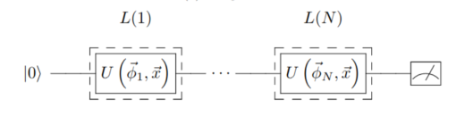
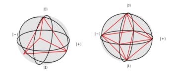
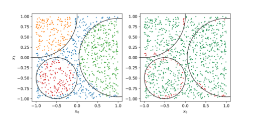
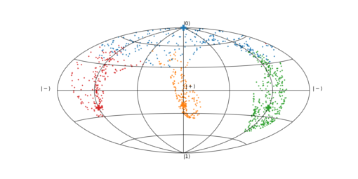

# Quantum unary approach to option pricing

Based in the paper [Quantum 4, 226 (2020).](https://quantum-journal.org/papers/q-2020-02-06-226/). In this `README.md` file you can see a short
set of instructions for the usage of the example. 

#### What this example does?

This example provides a variational algorithm for classifying classical data using only one qubit. There are two main ideas
in this work. The general idea is 
to create a single-qubit circuit where several different unitary gates are aplied
- Re-uploading: create a single-qubit circuit where several different unitary gates are applied. The exact gate 
 depends on the point to classify and on a set of parameters found by learning the classes of a training set.
- Separating classes: the Bloch sphere has plenty of room on its surface, thus it is possible to define a set of 
target states representing different labels. These states are chosen in such a way that they are maximally orthogonal 
among them.

The re-uploading works in circuits like the one below. For this example, we will classify datasets with dimension 2. 
The exact dependency of the unitary gates was chosen to be Rz(w x1 + b)Ry(v x0 + a), 
although other Ansätze are also useful. Notice that the Ry gates are connected to the x0 coordinate, 
while Rz gates are related to x1. Rotations around two different axis suffice to generate enough 
representativity to solve the problem. 

The goal is to find a set of parameters such that all points belonging to the same class are driven to be as close as
possible to a target state that depends on the class. These target states are chosen to be as orthogonal as possible. 
For binary classification, the states |0> and |1> are enough. Three classes require an equilateral triangle circumscribed
to an equator. More classes require polyhedra. For 4, 6, 8, 12 and 20 labels, platonic polyhedra may be used.

#### Usage
In this example there are only three files
- `datasets.py` contains the classical functions that create the datasets of the experiment and their representations. 
- `qlassifier.py` encodes all quantum circuits and procedures needed to run the circuits.
- `main.py` is the file calling all other functions. The action of every line of code is commented in the source code. 

The parameters to be fixed for a run of the experiment are
- name: problem to solve
- layers: layers of the classifier

Every time the `main.py` is run, it checks whether there is a solution to that particular problem. If it has been
already computed, then no minimization is done, only the results are saved. Otherwise, minimization is performed. 
A collection of solved examples is saved in `saved_parameters.pkl`. It is not mandatory, but it may save some time.

#### Results

Two different results are presented in this example. First, it is shown the labels that the algorithm guesses for every
point (left), together with which ones are right and wrong (right). This result is useful for quantifying the accuracy
of the classifier. The colors represent the **guessed** labels, while the area corresponding to each class is delimited
with a black line.

The second result represents the distribution of the test points on the Bloch sphere. In this case, the colors represent
the **actual** labels of the points. This plot is useful to see how the points in the same class get close to the target
state. 

Every time the `main.py` file is run, both results are saved in the folder 
`results/[name of the problem]/[number of layers]_layers`.
