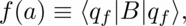
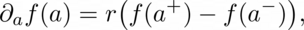
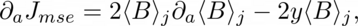
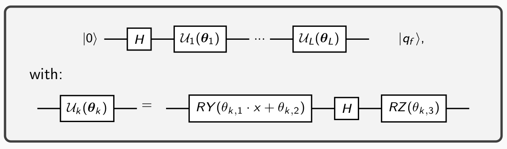

# Parameter Shift Rule for an hardware-compatible Variational Quantum Regressor

Code at: [https://github.com/qiboteam/qibo/tree/master/examples/vqregressor](https://github.com/qiboteam/qibo/tree/master/examples/vqregressor)

### Problem overview

We want to tackle a simple one dimensional regression problem using a single qubit Variational Quantum Circuit (VQC) as model,
initialized using a [re-uploading strategy](https://arxiv.org/abs/1907.02085). In particular, in this example we
fit the function y = sin(2x), picking the x points from the interval I=[-1,1].
The optimization is performed using an [Adam](https://arxiv.org/abs/1412.6980) optimizer.
It needs the circuit's gradients, which we evaluate through the [Parameter Shift Rule](https://arxiv.org/abs/1811.11184) (PSR).

A method like this is
needed because in quantum computation we can't perform the [Back-Propagation Algorithm](https://www.nature.com/articles/323533a0) on the hardware:
in that case the values of the target function in the middle of the propagation are needed, but for evaluating them on the hardware we have to measure,
and measuring we provoke the collapse of the system and the loss of all the information wealth. The PSR provide us with a numerical tool, with which we
can perform a gradient descent even on the physical qubit.

### The Parameter Shift Rule in a nutshell

Let's consider a parametrized circuit U, in which we build up a gate of the form G = exp [-i a A]
(which represents an unitary operator with at most two eigenvalues +r and -r), and an observable B.
Finally, let |qf> be the state we obtain by applying U to |0>.

We are interested in evaluating the gradients of the following expression:

where we specify that f depends directly on the parameter a. We are interested in this result because the expectation value of B is typically involved
in computing predictions in quantum machine learning problems. The PSR allows us to calculate the derivative of f(a) with respect to a evaluating
f twice more:

where the two new parameters involved in the evaluation of f are obtained by shifting a forward and backward by a shift parameter s and s = (pi/4)r. Finally, if we pick A from the rotations generators we can use s=pi/2 and r=1/2.

In the end, we have to use PSR into a gradient descent strategy. We choose an [MSE loss function](https://en.wikipedia.org/wiki/Mean_squared_error), which leads to the following explicit formula:

where we indicate with the subscript j the dipendence of J on the j-th input variable and y is the correct label of that specific x under the true law.

### This example

As mentioned above, we use a Variational Quantum Circuit based on a re-uploading strategy. In particular, we use the following architecture:

At the end of the circuit execution we perform a measurement on the qubit. After Nshots measurements, we use the difference of the probabilities
of occurrence of the two states |0> and |1> as estimator for y.

### How to use it?

In this example we use only two files:

- `vqregressor.py` contains the variational quantum regressor's implementation, with all the methods required for the optimization;
- `main.py` contains a commented example of usage of the regressor.

The user can change the target function modifying the method `vqregressor.label_points`, in which the true law is written and normalized. Once in the folder, one have to run a command like the following:

`python3 main.py --layers 1 --learning_rate 0.05 --epochs 200 --batches 1 --ndata 30 --J_treshold 1e-4`

for performing an optimization. At the end of the process it shows a plot containing true labels of the training sample and the predictions purposed
by the model in a form like the following:

